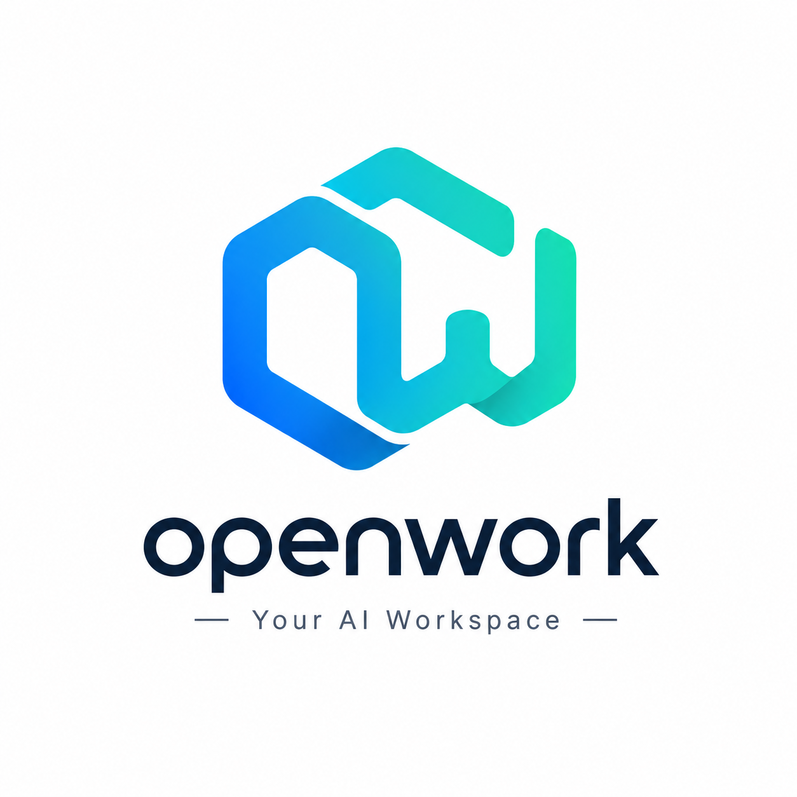

# OpenWork

<p align="center">
  
</p>

OpenWork is a local agent workbench experiment implemented in Rust. The current code supports multi-provider model calls, a session-owned agent loop, tool permissions, PostgreSQL persistence, Trace, and a Tauri desktop client.

中文版本: [README.md](README.md)

## Project Status

The current foundation includes:

- Rust workspace structure
- Tauri + React + TypeScript desktop shell
- Adapters for OpenAI, Anthropic, Kimi, DeepSeek, Qwen/DashScope, and GLM
- Vendor-neutral `ModelRequest`, `ModelResponse`, `ModelEvent`, `ModelError`, and `ModelPort`
- Error mapping that separates rate limits from exhausted quota, plus stream-aware transport retry
- Multi-step agent tool calls, approvals, cancellation, and doom-loop detection
- A single `SessionActor` path for Model → Tool/Permission → Model execution
- A Chat State actor that serializes model Conversation changes
- Direct PostgreSQL persistence for providers, models, sessions, turns, messages, and traces
- A single SQLx migration baseline and standalone migration command
- Encrypted PostgreSQL storage for provider API keys
- Per-session runtime views, one process-level event bridge, and runtime records under Settings

Not yet complete:

- Generated Rust → TypeScript Host Contracts and a drift check; the bridge DTOs remain handwritten for now
- A production Trace disable path and complete queue/database degradation verification
- OS-level sandboxing and reliable side-effect reconciliation
- Automated live-provider smoke tests

Cross-process resumption of unfinished turns, an Event Journal, checkpoints, memory, MCP, planning, skills, Git/Diff, and worktrees are outside the current V1 scope.

## Structure

```text
OpenWork/
  apps/
    desktop/                 # Tauri + React desktop app
  crates/
    openwork-core/           # Core facade, Session Actor, PostgreSQL storage, and Trace
    openwork-agent/          # Agent definition and system prompt
    openwork-chat-state/     # Conversation single-writer actor
    openwork-models/         # Model contracts, provider adapters, and transport
    openwork-tools/          # Tool catalog, permissions, and built-in execution
  docs/
    README.md                 # Documentation index
    local-postgres.md         # Local PostgreSQL and SQLx migrations
    redesign/                 # Authoritative architecture and refactor status
```

## Rust Crates

`openwork-core`

- `OpenWorkCore` is the single in-process entry point for providers, credentials, and sessions
- `SessionActor` owns the Model → Tool/Permission → Model loop, cancellation, and outcomes
- The PostgreSQL SQLx baseline persists providers, models, sessions, turns, messages, and traces
- Tauri manages one `OpenWorkCore` state and only adapts commands, events, and safe errors

`openwork-models`

- Defines messages, content blocks, `ModelPort`, and stream events
- Implements OpenAI, Anthropic, DeepSeek, Kimi, Qwen, and GLM adapters
- Owns HTTP/SSE transport, normalized vendor errors, and retries

`openwork-agent` / `openwork-chat-state`

- The agent crate owns only the agent definition, system prompt, and static tool set
- The Chat State actor serializes Conversation mutations and provides consistent model snapshots

`openwork-tools`

- Owns tool definitions, schemas, permission policy, working-directory context, and built-in filesystem/process execution
- It does not yet provide an OS-level sandbox; permission decisions cannot bypass `ToolSessionContext` path/process constraints
- The user always selects `providerId + model` explicitly; there is no automatic model selection or cross-model fallback

## Desktop App

OpenWork Desktop is the Tauri + React + TypeScript client for OpenWork.

Stack:

- Tauri 2
- React
- TypeScript
- Vite
- pnpm

## Requirements

- Rust stable
- Node.js
- pnpm
- Tauri system dependencies

Install pnpm if needed:

```bash
corepack enable
corepack prepare pnpm@latest --activate
```

## Install Dependencies

Desktop app:

```bash
cd apps/desktop
pnpm install
```

## Run Desktop App

> Desktop commands must run inside `apps/desktop`. The repository root only has `Cargo.toml` for the Rust workspace and does not have `package.json`, so running `pnpm tauri dev` from the root fails with `ERR_PNPM_NO_IMPORTER_MANIFEST_FOUND`.

```bash
docker compose up -d postgres
cargo run -p openwork-core --bin openwork-migrate
cd apps/desktop
pnpm tauri dev
```

`OpenWorkCore::bootstrap` applies pending migrations. The standalone command remains useful for provisioning and database diagnostics.

## Build Desktop App

```bash
cd apps/desktop
pnpm tauri build
```

## Rust Checks

From the repository root:

```bash
cargo test
cargo clippy --all-targets --all-features
cargo fmt
```

## API Keys

The desktop encrypts user-entered API keys into PostgreSQL `provider_credentials.api_key_encrypted`. Credential storage in `openwork-core` uses AES-256-GCM with a random nonce in a versioned envelope and binds the ciphertext to the provider ID as authenticated associated data.

The master key must be supplied through `OPENWORK_API_KEY_ENCRYPTION_KEY` as standard Base64 encoding of 32 random bytes. It must not be stored in PostgreSQL or committed to Git:

```bash
openssl rand -base64 32
```

For local development, generate the value once and put it in the repository-root `.env`, which is ignored by Git:

```dotenv
OPENWORK_API_KEY_ENCRYPTION_KEY=<value generated above>
```

The Debug build used by `pnpm tauri dev` loads the root `.env` automatically. Release builds do not load the development `.env` and still require deployment-time injection. Do not regenerate the master key while retaining the same database, or existing provider API keys will no longer decrypt.

This protects database files, backups, and SQL dumps. It does not protect secrets from an attacker who controls the application process and can read its environment and decrypted memory.

The project currently uses a clean development schema and does not migrate old plaintext values. Existing development databases must rebuild the provider tables and re-enter their API keys. Low-level adapters still accept caller-provided or environment-backed configuration. Common variable names:

```bash
OPENWORK_API_KEY_ENCRYPTION_KEY=...
OPENAI_API_KEY=...
ANTHROPIC_API_KEY=...
KIMI_API_KEY=...
DEEPSEEK_API_KEY=...
DASHSCOPE_API_KEY=...
```

Do not commit real secrets.

## Design Docs

- [Documentation index](docs/README.md)
- [Runtime redesign](docs/redesign/README.md)
- [Local PostgreSQL and SQLx migrations](docs/local-postgres.md)

## Next Steps

Recommended near-term work:

1. Complete automated coverage for cancellation, doom loops, Trace degradation, and startup interruption semantics.
2. Decide when to resume generated Rust → TypeScript Host Contracts.
3. Add a production Trace disable path and degradation tests, or formally revise the completion criteria.
