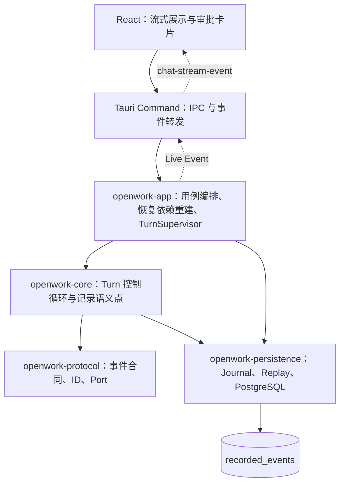
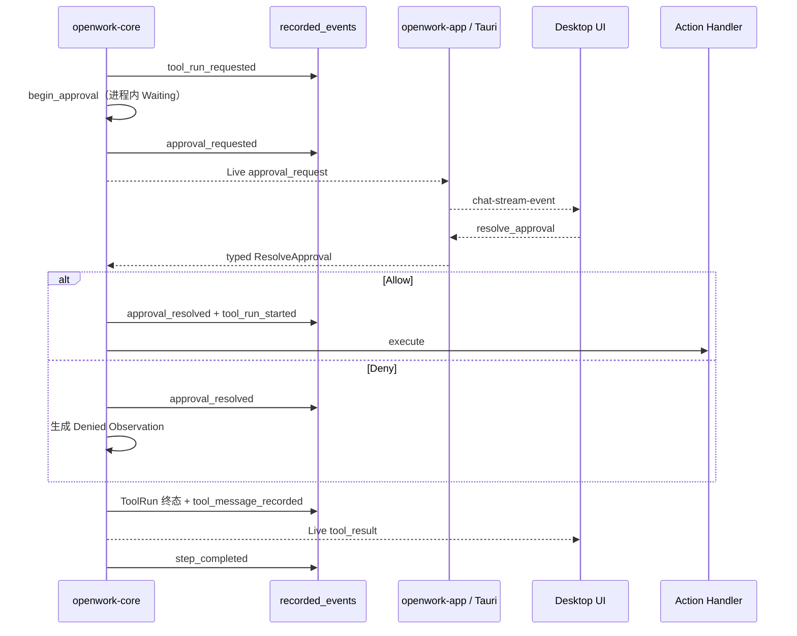

# 可持久化、可恢复的 Turn 生命周期

Last reviewed: 2026-07-15

> Status: historical Event Journal design. 当前 Runtime V2 不恢复未完成 Turn；本文仅保留旧恢复方案背景，不应作为当前代码说明。

## 1. 结论

OpenWork 已经完成了可持久化 Turn 生命周期的第一版主链：

- 在模型调用前持久化 `turn_started + user_message_recorded`；
- Core 在 Step、ToolRun、Approval 的真实语义点同步追加 Recorded Event；
- 任何工具副作用开始前，必须先成功写入 `tool_run_started`；
- ToolRun 终态与对应 Tool Message 在同一事务中追加；
- Session 查询通过重放 `recorded_events` 重建 Message 和 Turn 生命周期；
- 应用重启后，可以恢复尚未解决的审批并从当前 Step 继续；
- 已经开始但没有终态的工具不会自动重跑，而是投影成 `outcome_unknown`。

当前实现解决的是：

```text
进程内聊天循环
    ↓
拥有持久事实、可重建状态和有限恢复能力的 Turn Runtime
```

当前没有解决的是：

- 模型流中断后的自动续跑；
- 任意 Step 中断后的自动续跑；
- 工具副作用发生后、终态写入前崩溃的自动对账；
- 多进程同时恢复同一 Turn；
- ToolRun 的通用 Exactly Once；
- 独立的持久化查询 Projection、Checkpoint 或 Snapshot。

因此，这一版的准确名称是“可持久化、可重建、支持审批等待恢复的 Turn 生命周期 V1”，而不是“完整任务系统”或“完整 Durable Agent Harness”。

## 2. 设计目标与非目标

### 2.1 设计目标

1. **事实先于副作用**：执行工具前必须先记录执行意图。
2. **失败可见**：持久化失败不能悄悄退化为 best-effort 日志。
3. **状态可重建**：Session、Message、Turn、Step、ToolRun 和 Approval 的当前状态能够从事实日志重放得到。
4. **顺序可证明**：同一 Turn 内事件具有连续、唯一的 `aggregate_version`。
5. **恢复保持保守**：只有能够证明尚未开始外部副作用的状态才允许自动恢复。
6. **UI 与事实解耦**：流式 delta 服务当前界面，Recorded Event 服务恢复、审计和后续 Projection。

### 2.2 非目标

V1 明确不做：

- 把 `text_delta`、`reasoning_delta` 或原始 SSE 全量写入数据库；
- 为 Session、Message、Step、ToolRun、Approval 分别建立事实表；
- 在进程重启后无条件重放所有未结束 Turn；
- 通过事件重放猜测一个外部命令是否已经产生副作用；
- 把 Turn 提升为跨多个 Turn 的 Task、Plan 或 Workflow；
- 现在就引入 Event Snapshot、Compaction 或持久化 Projector Checkpoint。

## 3. 领域层级与身份

当前持久化层级是：

```text
Session
└── Turn
    ├── Step 1
    │   ├── Assistant Message
    │   ├── ToolRun A
    │   │   ├── Approval（可选）
    │   │   └── Tool Message
    │   └── ToolRun B（可选）
    └── Step 2...
```

各对象的职责：

| 对象 | 当前含义 | 持久化身份 |
| --- | --- | --- |
| Session | 持续对话，可包含多个 Turn | `session` aggregate |
| Turn | 一次用户输入触发的完整 Agent 控制循环 | `turn` aggregate；当前 `turn_id` 来自请求 ID |
| Step | 一次模型调用及其产生的零到多个工具调用 | Turn 事件 payload 中的 `stepId` |
| ToolRun | OpenWork 对一次工具执行的运行时身份 | Turn 事件 payload 中的 `toolRunId` |
| Approval | 一个 ToolRun 的人工决策点 | Turn 事件 payload 中的 `approvalId` |
| Provider Tool Call | 模型厂商返回的工具调用关联 ID | `providerToolCallId`，只用于协议关联，不是 OpenWork 运行时身份 |

Step、ToolRun 和 Approval 暂不作为独立 aggregate。它们必须跟随所属 Turn 的严格顺序，因此 V1 将它们记录在同一个 Turn 事件流中。

## 4. 分层职责



| 层 | 当前职责 | 不应承担的职责 |
| --- | --- | --- |
| `openwork-protocol` | `TurnRecordedEvent`、`TurnRecorderPort`、领域 ID、Approval 合同、Journal 合同 | SQL、Tauri、恢复依赖组装 |
| `openwork-core` | 控制 Step/ToolRun/Approval 状态；在语义点等待 Recorded Event 落库；恢复待审批 Step | 查询 PostgreSQL、定位 Desktop 组件 |
| `openwork-app` | 创建/结束 Turn；路由活跃审批；为非活跃 Turn 重建 Provider、Execution、Recorder 和历史消息 | 定义工具协议、直接执行 SQL |
| `openwork-persistence` | PostgreSQL Journal、Expected Version、事务追加、Session/Turn 内存投影 | 决定何时执行工具、向 UI 发流式 delta |
| `apps/desktop/src-tauri` | 将 Tauri command 转给 `openwork-app`，转发 `chat-stream-event` | 绕过 App 访问 Journal 或 Repository |
| `apps/desktop/src` | 消费 Live Event；加载 Session 时恢复审批卡片 | 成为 Durable 状态的唯一来源 |

关键代码位置：

```text
crates/openwork-protocol/src/turn/mod.rs
crates/openwork-protocol/src/journal/
crates/openwork-protocol/src/approval/mod.rs

crates/openwork-core/src/agent.rs
crates/openwork-core/src/approval.rs

crates/openwork-app/src/chat.rs
crates/openwork-app/src/turn_service.rs
crates/openwork-app/src/turn_supervisor.rs

crates/openwork-persistence/src/session/store.rs
crates/openwork-persistence/src/session/lifecycle.rs
crates/openwork-persistence/src/postgres/event_journal/

apps/desktop/src-tauri/src/commands/chat.rs
apps/desktop/src-tauri/src/commands/session.rs
apps/desktop/src/stores/sessionStore.ts
apps/desktop/src/stores/approvalStore.ts
apps/desktop/src/hooks/useChatStreamListener.ts
```

## 5. Recorded Event 与 Live Event

### 5.1 Recorded Event

Recorded Event 是恢复和审计依赖的持久事实。写入失败会返回 Core 或 App，并中止后续控制流。

当前 Turn 事实目录：

| 事件 | 产生时机 | 关键关联字段 |
| --- | --- | --- |
| `turn_started` | 接受一次新的用户请求 | `sessionId`、`providerId`、`model` |
| `user_message_recorded` | 与 `turn_started` 同批写入 | `sessionId`、`messageId`、`parts` |
| `step_started` | 每次模型调用前 | `stepId`、`stepIndex` |
| `assistant_message_recorded` | 模型完整响应累积完成后 | `stepId`、`messageId`、`parts` |
| `tool_run_requested` | Core 接受模型工具调用后 | `stepId`、`toolRunId`、`providerToolCallId`、工具名和输入 |
| `approval_requested` | Execution 策略要求人工审批 | `approvalId`、`turnId`、`stepId`、`toolRunId`、工具上下文 |
| `approval_resolved` | Core 接受用户 Allow/Deny 后 | 同一组关联 ID 与 `resolution` |
| `tool_run_started` | 即将调用 Action Handler 前 | `stepId`、`toolRunId` |
| `tool_run_completed` | Observation 为 `succeeded` | `stepId`、`toolRunId`、`observation` |
| `tool_run_failed` | Observation 为 `failed` | 同上 |
| `tool_run_denied` | Observation 为 `denied` | 同上 |
| `tool_run_cancelled` | Observation 为 `cancelled` | 同上 |
| `tool_run_outcome_unknown` | 明确记录无法确认的执行结果 | 同上 |
| `tool_message_recorded` | ToolRun 终态生成给模型的 Tool Message | `stepId`、`toolRunId`、`messageId`、`parts` |
| `step_completed` | 当前 Step 所有工具调用已经处理完毕 | `stepId`、`stepIndex` |
| `step_failed` | 当前 Step 因错误或取消停止 | `stepId`、`stepIndex`、错误信息 |
| `turn_completed` | Agent 返回最终答案 | 空对象 |
| `turn_cancelled` | Turn 被取消 | 空对象 |
| `turn_doom_loop_detected` | 连续重复工具调用达到阈值 | `repeated` |
| `turn_failed` | Turn 以错误结束 | `message` |

新写入的 `tool_message_recorded` 包含 `toolRunId`，使 Journal 事实能够把模型上下文中的 Tool Message 关联到唯一 ToolRun。Assistant Message 不包含该字段。修复前已经存在的历史 Tool Message 不做 backfill。

当前 `SessionMessage` 查询 DTO 尚未暴露 `toolRunId`，所以这一关联目前保留在原始 Recorded Event 中，供审计或后续 Message/ToolRun Projection 使用；前端暂时不能直接从普通消息查询取得它。

### 5.2 Live Event

Live Event 只用于当前 UI，包括：

- 文本、思考和工具调用 delta；
- Step/LLM 开始与结束提示；
- 审批卡片出现和消失；
- Tool Result、Done、Cancelled、Error、Doom Loop 等界面状态。

Live Event 通过 Tauri 的 `chat-stream-event` 发送。它可能因为页面刷新或应用退出而丢失，但丢失不能改变重放后的 Durable 状态。页面重新加载后，前端应以 Session 查询返回的 Message 和 Turn Snapshot 为准。

## 6. Event Journal 与数据库

### 6.1 当前表结构

显式 migration 后，当前业务库保持四张表：

| 表 | 作用 |
| --- | --- |
| `schema_migrations` | migration 记录 |
| `providers` | Provider 配置和加密 API Key |
| `provider_models` | 模型与 `lite/plus/pro` 用户配置 |
| `recorded_events` | Session 与 Turn 的 append-only 事实日志 |

Turn 生命周期不需要立即新增 `turns`、`steps`、`tool_runs` 或 `approvals` 表。当前状态由 `recorded_events` 在内存中重放；只有真实查询量和性能数据证明需要时，才增加可删除、可重建的 Projection 表。

### 6.2 事件信封

`recorded_events` 的关键字段：

| 字段 | 作用 |
| --- | --- |
| `global_position` | 全库严格递增位置，用于跨 aggregate 投影 |
| `event_id` | 事件幂等身份，全局唯一 |
| `aggregate_type` | 当前只允许 `session` 或 `turn` |
| `aggregate_id` | Session ID 或 Turn ID |
| `aggregate_version` | 单个 aggregate 内的连续版本 |
| `event_type` | 事实名称 |
| `event_version` | payload 合同版本，当前为 1 |
| `payload_json` | JSONB 事件数据，必须为对象 |
| `occurred_at` | 业务语义发生时间 |
| `recorded_at` | PostgreSQL 实际提交记录的时间 |

时间使用 `TIMESTAMP WITHOUT TIME ZONE` 存储东八区墙上时间；Rust Adapter 在 Unix 毫秒与 `Asia/Shanghai` 之间显式转换。时间字段不参与事件顺序判断，顺序只依赖 `aggregate_version` 或 `global_position`。

### 6.3 并发与事务

PostgreSQL Journal 当前保证：

1. 同一 aggregate 的 append 使用事务级 advisory lock 串行分配版本；
2. `ExpectedVersion::NoStream` 只允许创建不存在的事件流；
3. `ExpectedVersion::Exact(n)` 只在当前版本等于 `n` 时追加；
4. `(aggregate_type, aggregate_id, aggregate_version)` 唯一；
5. `event_id` 全局唯一；
6. 一次 `append(events)` 中的全部事件在同一个数据库事务提交。

因此以下事实对是原子的：

- `turn_started + user_message_recorded`；
- Allow 时的 `approval_resolved + tool_run_started`；
- ToolRun 终态 + `tool_message_recorded`。

Journal 没有单独的 aggregate head 表。`JournalTurnRecorder` 先读取当前 Turn 版本，再由 PostgreSQL Adapter 在锁内重新核对 Expected Version；并发写者中只有一个能够成功。

## 7. 正常执行流程

### 7.1 没有工具调用

```text
turn_started + user_message_recorded
  -> step_started
  -> invoke model / emit Live delta
  -> assistant_message_recorded
  -> step_completed
  -> turn_completed
  -> Live done
```

模型流式 delta 不落库。只有完整累积出的 Assistant Message 才成为 Recorded Event。

### 7.2 有工具调用且需要审批



核心顺序是：

```text
Persist Intent -> Execute Side Effect -> Persist Outcome
```

如果 `tool_run_started` 写入失败，Core 返回 `AgentError::Record`，不会调用工具。这个约束由 `a_tool_is_not_invoked_when_its_started_fact_cannot_be_recorded` 测试覆盖。

## 8. 应用重启后的审批恢复

### 8.1 可恢复条件

一个 Turn 只有同时满足以下条件才进入自动审批恢复路径：

1. 存在 `approval_requested`；
2. 该 Approval 尚无对应 `approval_resolved`；
3. 该 ToolRun 尚无 `tool_run_started`；
4. Turn 没有结束；
5. Session、Provider 和工具上下文仍可重新加载；
6. Assistant 历史中仍能找到相同的 `providerToolCallId`，且没有已有 Tool Result。

### 8.2 恢复调用链

```text
用户重新打开/选择 Session
  -> session_load
  -> SessionApplicationService::load
  -> 重放 messages + turns
  -> SessionLoadResult.turns[].pendingApproval
  -> sessionStore.restorePendingApprovals
  -> ApprovalDialog 重新出现

用户 Allow/Deny
  -> resolve_approval(turn_id, approval_id, allow)
  -> TurnApplicationService::resolve_approval
  -> TurnSupervisor 中没有活跃 Turn
  -> ChatRuntime::resume_approval
     -> load_turn_lifecycle
     -> 校验 pending approval
     -> 重建 Provider、Capability、Execution、Recorder
     -> 加载 Session Message 历史与 working directory
     -> Agent::resume_after_approval
     -> 记录 resolution（Allow 时同时记录 tool_run_started）
     -> 执行或拒绝 ToolRun
     -> 记录 ToolRun 终态与 Tool Message
     -> 完成当前 Step
     -> 从下一个 Step 继续模型循环
     -> 追加 Turn 终态
```

如果 Turn 仍在当前进程运行，`TurnSupervisor` 直接把 typed `ResolveApproval` 命令发送给拥有该 Turn 的 Core inbox，不走数据库恢复路径。

`TurnSupervisor` 本身只是进程内 `TurnId -> TurnCommandHandle` 路由表，不是持久化状态。真正的恢复依据始终是 `recorded_events`。

## 9. Replay 与状态推导

`replay_turn_lifecycle` 按 `aggregate_version` 重放同一 Turn，生成：

```text
TurnLifecycleSnapshot
├── status
├── session_id / provider_id / model
├── steps[]
│   ├── status
│   └── tool_runs[]
│       ├── status
│       └── observation
└── pending_approval
```

### 9.1 Turn 状态

```text
running
waiting_approval
outcome_unknown
interrupted
completed
cancelled
doom_loop
failed
```

### 9.2 Step 状态

```text
running
waiting_approval
outcome_unknown
completed
failed
```

### 9.3 ToolRun 状态

```text
requested
waiting_approval
running
succeeded
failed
denied
cancelled
outcome_unknown
```

### 9.4 保守恢复规则

重放完成后应用以下安全规则：

- 未解决 Approval 存在时，Turn 和当前 Step 为 `waiting_approval`；
- `tool_run_started` 后缺少任何 ToolRun 终态时，ToolRun、Step 和 Turn 都变为 `outcome_unknown`；
- 即使日志中已经存在 `turn_failed`，也不能覆盖未确认的工具结果；
- 没有 pending approval、但存在未完成 Step 时，Turn 为 `interrupted`；
- Turn 终态会清除 pending approval；
- `outcome_unknown` 不自动重跑工具。

这套投影是恢复模型，不是第二份事实源。它可以删除并从 Recorded Event 重新生成。

## 10. 当前一致性约束

当前代码已经建立以下约束：

1. 新 Turn 必须以 `turn_started` 开始；
2. `turn_started` 与用户消息同批提交；
3. `JournalTurnRecorder` 必须绑定正确的 Session；
4. 已有 Turn 终态后禁止继续追加生命周期事件；
5. Step 事件必须引用已经出现的 `stepId`；
6. ToolRun 后续事件必须引用已经出现的 `toolRunId`；
7. Approval 命令必须同时匹配 `turnId` 和 `approvalId`；
8. 同一审批的并发重复 resolution 在进入队列前被拒绝；
9. 恢复时 Provider Tool Call 的 ID、名称和历史 Tool Result 必须一致；
10. Tool Message 使用 `toolRunId` 关联到唯一 ToolRun；
11. Live Event 不能作为 Durable 状态来源。

## 11. 当前验证情况

### 11.1 自动化测试

| 层 | 已覆盖行为 |
| --- | --- |
| Protocol | Turn/Approval JSON 合同和 ID 字段 |
| Core | `tool_run_started` 无法落库时不执行工具 |
| Core | pending approval 恢复后只执行一次工具，并进入下一模型 Step |
| Core | 错误 Approval ID、取消和并发重复 resolution |
| Persistence Replay | pending approval 连同工具上下文重建 |
| Persistence Replay | 已开始但无终态的 ToolRun 投影为 `outcome_unknown` |
| PostgreSQL Journal | aggregate version 连续、并发 Expected Version 冲突、重复 event ID 拒绝 |
| Session Store | Message 与 pending approval 从同一 Turn 流重放 |
| Frontend | Session 重载后恢复审批卡片；Live Event 合同累积 |

PostgreSQL 集成测试依赖测试数据库配置；缺少配置时部分测试会跳过，因此“`cargo test` 通过”不能单独替代真实 PostgreSQL 验收。

### 11.2 当前人工验收

已经在本地 PostgreSQL 完成以下路径验证：

1. 发起需要审批的工具调用；
2. 停留在审批等待状态并退出应用；
3. 重启应用并重新加载 Session；
4. 审批卡片恢复；
5. Allow 后 ToolRun 继续执行；
6. ToolRun 只执行一次；
7. Turn 最终进入 `turn_completed`；
8. 单 Turn 的事件版本连续；
9. `tool_run_requested`、Approval、`tool_run_started`、ToolRun 终态和 Tool Message 使用相同 `toolRunId`。

这证明了 pending-approval 恢复主链，但不能外推为所有崩溃窗口都已验证。

## 12. 已知边界与风险

### 12.1 只恢复 pending approval

当前只有 `waiting_approval` 可以从数据库恢复并继续。普通 `interrupted` Turn 不自动续跑。

### 12.2 工具 Exactly Once 尚未成立

危险窗口是：

```text
tool_run_started 已提交
  -> 工具已经产生副作用
  -> 进程在 ToolRun 终态提交前崩溃
```

重放只能证明“工具可能执行过”，不能证明结果。当前正确地标记为 `outcome_unknown` 并停止自动恢复，但尚无通用对账或补偿机制。

### 12.3 模型流不能续传

流式 delta 不落库。如果进程在模型响应中途退出，最后事实通常是 `step_started`，重放后是 `interrupted`，需要用户重新发起操作或后续专门的恢复策略。

### 12.4 Turn 终态仍有提交窗口

Turn 终态由 App 在 Agent 返回后追加。如果最后一个 `step_completed` 已提交，但进程在 `turn_completed` 前退出，当前投影可能保留为 `running`，不会自动补写终态。这需要补充明确的 stale-running 判定或恢复规则。

### 12.5 Projection 仍是全量内存重放

Session 列表、Message 和 Turn Snapshot 当前分页读取全部 Recorded Event 后在内存中投影。开发期数据量可接受，但长期会遇到启动延迟、内存和查询放大问题。

### 12.6 Event schema 演进尚不完整

事件信封已经有 `event_version`，但当前没有通用 upcaster/decoder registry。以后修改 payload 时必须保持旧事件可读，不能直接假设数据库中只有最新版结构。

### 12.7 单进程 Supervisor

`TurnSupervisor` 是进程内路由表。当前没有 lease、owner、heartbeat 或分布式锁，不能支持多个应用实例同时认领和恢复同一 Turn。

### 12.8 Recorded payload 的敏感数据

ToolRun 输入和 Observation 会进入 `payload_json`。当前没有对这些字段做通用脱敏或字段级加密；Provider API Key 的加密机制不会自动保护事件中的其他敏感内容。

### 12.9 历史 Tool Message 不回填

新 `tool_message_recorded` 已保存 `toolRunId`，旧事件保持原样。后续查询或导出必须允许历史 Tool Message 缺少该字段。若 UI 需要从 Message 跳转到 ToolRun，还需要在查询 Projection 或 DTO 中显式暴露这一关联。

## 13. 下一阶段建议

### P0：冻结并验证崩溃一致性

- 为每个持久化边界增加 crash-window 集成测试；
- 覆盖 Allow、Deny、Cancel、错误 Approval ID 和重复提交；
- 覆盖 `step_started`、`tool_run_started`、ToolRun 终态、`step_completed`、Turn 终态之间的退出；
- 确认每种重放状态都不会误执行工具。

### P1：为 `outcome_unknown` 提供产品闭环

- UI 显示“工具结果未知”，而不是普通失败；
- 展示工具名、输入、工作目录和最后事实位置；
- 提供人工确认、重新检查或显式重跑入口；
- 对可幂等工具逐步增加 idempotency key 或结果探测接口。

### P1：处理 stale `running/interrupted`

- 定义应用启动后的 stale 判定；
- 区分“模型尚未完成”“Step 已完成但 Turn 终态缺失”；
- 只对能证明安全的状态自动补偿或恢复。

### P2：事件合同演进

- 为每种 event type 定义 payload schema 和 upcaster；
- 增加未知版本拒绝策略；
- 建立 replay golden cases，保证旧事件在新代码中仍得到相同投影。

### P2：按查询证据增加 Projection

只有全量重放出现可测量瓶颈后，再考虑：

```text
sessions_projection
messages_projection
turns_projection
tool_runs_projection
approvals_projection
```

这些表必须：

- 记录推进到的 `global_position`；
- 可以清空并从 `recorded_events` 重建；
- 不接受 Core 或 Provider 直接写入；
- 不成为新的事实来源。

## 14. 设计判断

当前使用一张 `recorded_events` 承载 Session/Turn 事实是合理的，因为 V1 的核心问题是先建立缺失的持久事实和安全恢复边界，而不是优化查询。

当前实现已经具备重大基础能力，但仍应保持以下判断：

```text
已实现：可持久化、可重建、pending approval 可恢复
未实现：任意状态可恢复、工具 Exactly Once、完整 Task 生命周期
```

后续工作的优先级应是验证崩溃一致性和补齐 `outcome_unknown` 处置，而不是立即增加更多业务表或扩大自动恢复范围。

## 15. 相关文档

- [Session、Message 与 Event Journal](./session-persistence-and-tracing.md)
- [权限与审批](./permissions-and-approvals.md)
- [Agent Runtime 与工具流程](./agent-runtime-and-tool-flow.md)
- [Desktop 流式调用流程](./desktop-streaming-flow.md)
- [Event Journal 与会话持久化重构设计](../plans/event-journal-persistence-refactor.md)
- [OpenWork Core 架构蓝图](../plans/openwork-core-architecture-blueprint.md)
