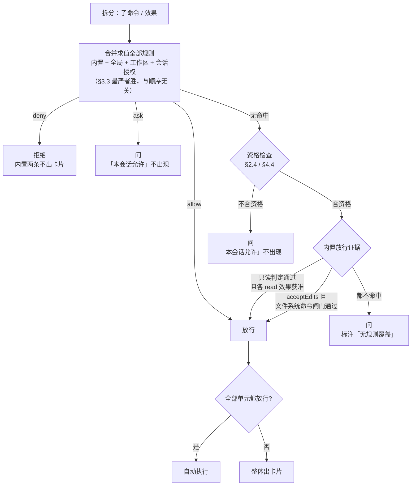

# 权限

工具执行的授权体系。本文描述目标状态。

模式与判定顺序参考 cc-haha 的 `default` / `acceptEdits`（行为基线见 [cc-haha-default-accept-edits-permissions.md](cc-haha-default-accept-edits-permissions.md)），但**不移植沙箱，也不移植 PowerShell 与 Windows 特有路径检查**；有意偏离的地方集中列在 §8。

工具契约见 [tools.md](tools.md)，Tool Call 生命周期见 [session-runtime.md](session-runtime.md)。

## 1. 问题与约束

### 1.1 要解决什么

模型每一轮会调很多次工具。

**每次都问，用户会疲劳到闭眼点同意**——那时审批名存实亡，比不问更糟，因为它制造了"有人把关"的错觉。**不问，又没有任何边界**，因为本项目不做 OS 沙箱（§1.4）。

> 真正的问题是：**在没有隔离手段的前提下，让审批既少又值得回答。**

"少"和"值得回答"是同一件事的两面，不是权衡。问得少，用户才会认真看；问得值，减少提问才不是在放水。

### 1.2 不可协商的事实

这几条是前提，不是选择：

1. **六个文件工具的边界能在进程内完整强制。** 全部经 `resolve_path` → `CheckedPath` → 文件系统 Backend，`CheckedPath` 字段私有，工具拿不到裸 `PathBuf`。
2. **`bash` 的边界在进程内不可能**对任意命令**强制。** 要在进程内约束任意 shell 脚本，等价于静态判定它的副作用：重定向能看见，变量展开、符号链接、子进程自身的写入看不见。
3. **不做 OS 沙箱**（§1.4）。
4. 但**"不可能对任意命令强制"不等于"对每一条命令都无从判断"。** 存在一个可以逐条论证、闭合枚举的命令子集，它的效果我们确实知道（§2.3）。对这个子集之外的一切，边界仍然只是审批卡片。

第 4 条是本次修订的核心，它把地基从"一句话"变成了"两句话"：

> **自动放行的部分，边界是我们那份判定的正确性；其余部分，边界是用户在卡片上看到的东西。**

两句话各有直接推论：**判定表写错一条，就是一次静默的自动执行**（§2.3 因此规定它必须是白名单且带 arity）；**卡片显示什么是安全问题，不是排版问题**（§5）。

### 1.3 成功长什么样

- 日常开发（读代码、看日志、`git status`、改代码）**基本不被打断**；
- 每一次打断都**值得回答**：用户能看清将要发生什么，而不是看到一坨原始命令；
- 重复的批准在**一次会话内**不再反复问；跨会话的固化由用户手写规则完成（§3.6），因而固化出来的东西他天然**看得懂、能审、能撤**；
- 出事之后能回答"**这条为什么没问我就跑了**"，且答案能精确到"命中了哪条规则 / 哪条只读判定 / 哪个模式闸门"（§7）。

### 1.4 明确不做

| 不做 | 原因 |
|---|---|
| **OS 沙箱**（Seatbelt / 容器 / 进程内 apply） | 它只解锁一件事——自动执行**任意** `bash`——而代价是持续的：Seatbelt 的规则优先级没有文档化契约，deny 是否生效取决于规则发射顺序、`/private` 别名、`literal` 与 `subpath` 的选择，这几类坑只能靠真机验证发现，**且失败是静默的**（规则没生效时沙箱仍报告自己已应用）。后果是真机 e2e 必须成为发布门禁，每次改 profile 都要重验 |
| **网络管控** | 依附于沙箱。没有隔离手段就没有可强制的网络边界，也**不做任何声称**——一个恒为"未强制"的免责声明只会训练用户忽略它 |
| **PowerShell 与非 POSIX shell** | 只支持一种 shell 语法。多一种 shell 就是多一套解析器、多一套只读判定表、多一套逃逸形态，而这三样都在承重墙上（§4）。cc-haha 的 ADS / 8.3 短名 / DOS 设备名 / UNC 可疑路径检查随之一并不移植 |
| **无人值守运行** | 当前阶段不是目标。人始终在环路里；被自动放行的是可证明只读与工作区内的文件改动，不是"整轮不看" |
| **`bypassPermissions` 一类的逃生门** | cc-haha 有 `bypassPermissions` / `dontAsk` / `plan`，我们只要两个模式。没有任何配置能让**不可证明**的命令自动执行 |
| **兼容外部权限配置格式** | 规则语言自己设计，不迁就 |
| **让正在干活的模型为自己的调用背书** | 独立审查模型是另一回事，但当前不做 |

代价写在明面上：**不可证明只读、又不属于 `acceptEdits` 文件系统命令集的 `bash` 调用，永远需要逐次确认；无人值守的长时间运行不在能力范围内。**

## 2. 效果模型

### 2.1 基本单位是效果，不是工具

按工具分类（"这是只读工具 / 这是写工具 / 这是进程工具"）在 `bash` 上失效：

```
bash("ls")           无害
bash("rm -rf /")     毁灭
```

两者是同一个工具、同一个类别。按工具分类只能一刀切，于是 `bash` 一律问，永远问。

因此判断的单位是**这次调用会产生什么效果**：

```
bash("cat src/main.rs")  →  读 src/main.rs
read("src/main.rs")      →  读 src/main.rs
                            ↑ 同等对待，走同一条规则
```

三类效果，不多不少：

| 效果 | 含义 |
|---|---|
| `read(路径)` | 读取一个路径 |
| `write(路径)` | 写入、创建、删除、改名一个路径 |
| `exec(程序 + 参数)` | 执行一个程序 |

**不单列"可撤销性"作为第四类。** 经过 `write` / `edit` 工具的修改会产生可 Undo 的 `file_change` Artifact，经过 `bash` 的不会——但这是"经不经过我们的工具"决定的，是 `exec` 的固有属性，不是一个独立维度。

### 2.2 `exec` 默认是一张空白支票

这是本模型最重要的诚实点。

理想情况下效果模型应该能推出一切，但对任意 `bash` 命令只能做到**部分知识**：

| 能推断 | 推不出来 |
|---|---|
| 显式路径参数（`cat foo.txt`） | 变量展开（`cat $F`） |
| 重定向目标（`> out.log`） | 程序自身的读写（`cargo test` 动了什么） |
| 子命令切分（`a && b`） | 子进程（`bash -c 'python x.py'` 里的 python） |

`cargo test` 会读源码、写 `target/`、读 `~/.cargo`、可能联网——这些从命令字面上一个都看不到。要知道它的效果，等于要静态分析 cargo 这个程序。

于是对这一类，唯一可行的模型是：

> **能推断的效果按效果处理；推不出来的部分，归结为对"执行某个程序"的信任。**

所以一条用户手写的 `exec(cargo test)` 规则，真实含义**不是**"我验证过它的效果"，而是：

> **"我信任 `cargo test` 这个程序，它干什么我不管。"**

**这一条必须在产品文案里也成立。** 卡片上不能让用户以为路径规则能约束 `exec` 内部的行为——`deny write(~/.ssh/**)` 挡不住 `bash("cargo run")` 里的写入，因为我们根本看不见它。

### 2.3 只读判定：唯一的例外，也是唯一由我们背书的东西

`default` 模式要想真的不打断人，就必须能自动放行 `ls` / `cat` / `rg` / `git status` 这一类。这**不能**靠 §2.2 的信任模型来解释——那样等于我们替用户签了一张空白支票。

只读判定是一个**性质不同**的断言：

| | `allow exec(cargo test)` | 只读判定放行 `git status` |
|---|---|---|
| 说的是什么 | "我信任这个程序" | "这个程序配上这组参数，效果只有 read" |
| 谁负责 | 用户 | **我们** |
| 错了会怎样 | 用户自己的授权范围问题 | **一次静默的自动执行** |

因为责任在我们这边，判定必须是**闭合的**，而不是"看起来安全就放行"。四条硬性构造要求：

**① 程序清单是白名单，按 `程序名` 或 `程序名 + 子命令` 精确键入。**

起步集合（可增长，但每加一条都要能逐条论证）：

```
文件读取    cat head tail nl tac rev wc od hexdump strings stat file readlink
文本处理    cut paste tr column fold expand unexpand fmt comm cmp sort uniq numfmt
搜索        rg grep diff
目录        ls find（受 ③ 约束） basename dirname realpath pwd
环境        whoami id uname hostname date uptime df du nproc locale groups which type
git         git status / diff / log / show / blame / ls-files / rev-parse /
            rev-list / merge-base / describe / cat-file / for-each-ref /
            shortlog / branch / tag / remote / stash list / stash show /
            worktree list / config --get / grep
无副作用    true false echo printf seq expr test getconf sleep
```

不在清单上的一律不可证明，包括看起来无害的。**"没听说过"和"危险"在这里是同一档。**

**② 每个程序配一张标志白名单，且必须记录每个标志的 arity。**

只记"哪些标志安全"不够，还必须记"这个标志吃不吃下一个 token"。cc-haha 在 `git diff` 上踩过这个坑并留下了注释：`-S` 实际需要一个参数，若判定表把它记成无参，则

```
git diff -S -- --output=/tmp/pwned
```

判定器认为 `-S` 不吃参数 → 前进一格 → 看到 `--` → 认为后面全是路径，停止检查标志；
而 git 认为 `-S` 必须吃参数 → 吞掉 `--` → 光标落在 `--output=...` → 按长选项解析 → **任意文件写入**。

这类失效叫 **parser differential**：判定器和真实程序对同一串 argv 的理解不同。它不是边角情况，是这套判定表最主要的失效模式。因此：

> **标志表的条目是 `(标志, arity)`，不是标志集合。任何未登记的标志 → 不可证明 → 问。**

**③ 逃逸标志按白名单天然排除，不靠黑名单去追。**

"某个良性程序的某个标志把它变成解释器"这一类形态，正是白名单的存在理由：

- `rg --pre=bash FILE` 会执行 `bash FILE`——`--pre` 不在 rg 的标志白名单上，自动落到"问"；
- `git -c core.pager=<cmd> log`、`git --exec-path=...`——`-c` / `--exec-path` 不在 `git log` 的标志白名单上；
- `find . -exec <cmd> \;`、`find -delete -fprintf`——`find` 只登记 `-name` / `-type` / `-maxdepth` 这类纯筛选标志。

§4.4 那张 (程序, 逃逸标志) 对照表**仍然保留**，但它的定位要说清楚：它服务于**用户手写的 `allow` 规则**（那里没有标志白名单可依），而不是只读判定的封闭性来源。只读判定的封闭性只来自 ①②。

**④ 任何无法静态求值的 token 一律不可证明。**

- token 含 `$`（变量展开、命令替换）——`git diff "$Z--output=/tmp/pwned"` 在判定器眼里是一个不以 `-` 开头的位置参数，在 bash 眼里是一个长选项；
- token 以 `~` 开头（波浪号展开）；
- token 同时含 `{` 与 `,` 或 `..`（大括号展开）；
- 含反引号；
- `rg` / `grep` 的模式里含换行或回车。

**分界线是"这个记号会不会改写路径前缀"，不是"它是不是展开"。** 两侧各举一例：

| 记号 | 判定 | 为什么 |
|---|---|---|
| `~/.ssh/id_rsa` | **不可证明** | `~` 重写整个前缀。按字面解析会得到 `<工作区>/~/.ssh/id_rsa`，落在工作区内 → 自动放行；而 bash 读的是 `$HOME/.ssh/id_rsa`。**`cat /etc/passwd` 会问，`cat ~/.ssh/id_rsa` 却不会**——同一个泄露，只是换了个写法 |
| `src/*.rs` | 可证明 | shell 的 `*` / `?` 不跨路径分隔符，展开结果必然还在 `<工作区>/src/` 之下，词法前缀仍然框得住。而 `cat /etc/*.conf` 的前缀在工作区外，照常要问 |

**这条分界线只对 `read` 成立。** 写操作的 glob 不作为一组安全目标自动接受（§5.5 / §4.5），因为"前缀框得住"不等于"用户预期删掉的就是这些"。

这一条与 §4.7 的 fail-closed 是同一件事，只是发生在更细的粒度上。

**只读判定证明的是"效果集合就是这些 read"，不是"这次调用被批准"。** 判定通过后，产出的效果仍要逐条过规则：

```
只读判定产出的效果集
  = 命令显式路径操作数的 read(...)
  + 一条隐式 read(<工作区>)
```

于是：

| 命令 | 结果 | 为什么 |
|---|---|---|
| `git status` | 自动执行 | 无显式操作数，隐式 `read(<工作区>)` 命中内置 allow |
| `cat src/main.rs` | 自动执行 | `read(<工作区>/src/main.rs)` 命中内置 allow |
| `cat /etc/passwd` | 问 | 判定通过，但 `read(/etc/passwd)` 在工作区外，无规则覆盖 |
| `rg foo ~/other` | 问 | 同上 |

这比 cc-haha 更严：那里只读分类通过基本就等于放行。把两件事拆开的收益是，**"这条命令干什么"和"允不允许对这个路径干"由不同机制回答，各自可以单独审查**。

### 2.4 派生约束：什么形态没有自动放行资格

`exec(X)` 的两种放行途径——用户的 `allow` 规则和我们的只读判定——共享同一个前提：**程序名代表了这条命令实际会执行的东西。**

有四类形态让这个前提不成立。它们看起来是四件事，其实是同一件：

| 形态 | 例子 | 前提为什么不成立 |
|---|---|---|
| **通用解释器作主语** | `exec(python)` `exec(sh)` `exec(node)` `exec(ssh)` `exec(npm run)` | 签给它等于签给所有东西：`exec(python) ≡ exec(*)` |
| **前置环境变量赋值** | `PATH=. cargo test`<br>`LD_PRELOAD=./x.so cargo test`<br>`GIT_SSH_COMMAND=... git fetch` | 程序名还是 `cargo`，但去哪找它、加载什么、怎么连出去全被换掉了 |
| **逃逸标志** | `git -c core.pager=<cmd> log`<br>`find . -exec <cmd> \;` | 程序本身是良性的，某个标志让它变成解释器 |
| **程序名解析自工作目录** | 模型刚写下的 `./cargo`、`./ls` | 程序名指向的是模型自己的产物 |

第二类最隐蔽。多数实现在提取"命令词"时会把变量赋值当配置跳过，于是 `cargo test` 和 `PATH=. cargo test` 在规则眼里长得一模一样——而后者的实际含义是"先把查找路径换成当前目录，再执行 `cargo`"。第四类在只读判定上同样致命：模型往工作区写一个叫 `ls` 的脚本，`./ls` 或 `PATH=. ls` 就变成了任意代码执行。

因此判断不是四套逻辑，而是**一道资格检查**（落地见 §4.4）：

> **不合资格的子命令既不查 `allow` 规则，也不进只读判定，必须问，「本会话允许」按钮不出现。**

资格检查**只作用于自动放行一侧**。`deny` 和 `ask` 照常匹配——方向与 §4.7 一致：拿不准就不自动放行，拿不准就按禁止处理。

对第一类，**这些程序在语法层就禁止成为 `allow exec(...)` 的主语**：用户手写了这样一条，加载时即拒绝并解释原因，**该条作废、其余规则照常生效**。

这与 §6.3 的"解析失败整份文件不生效"不冲突，两者方向一致：被作废的一定是 `allow`（这条限制只针对 `allow`），丢掉一条 `allow` 是收紧；而如果整份作废，用户的 `deny` 会跟着一起没，那才是放松。**两处都选了让边界更紧的那一侧。**

**轻量实现的取舍写在明面上：**

- **wrapper 不脱壳。** `timeout 300 cargo test` 的主语是 `timeout`，它在解释器清单里 → 不合资格 → 问一次。代价是这类命令固化不了 `allow`，不是安全问题。想让它固化，就得把 `timeout` / `env` / `nice` 的参数语法逐个吃透（`env` 还能用 `-C` 改工作目录），那是另一个量级的工作。
- **环境变量不做白名单。** 任何前置赋值一律不合资格，包括 `RUST_LOG=debug` 这种纯装饰的。维护"危险变量清单"（`PATH` `LD_PRELOAD` `DYLD_*` `NODE_OPTIONS` `PYTHONPATH` `BASH_ENV` `GIT_SSH_COMMAND` …）永远列不全，反过来做才封闭。
- **cwd 不追踪。** 脚本里出现 `cd` / `pushd` / `env -C` 之后，相对路径解析不出确定目标 → 整条脚本不合资格。

## 3. 规则

### 3.1 语法

规则是一个**效果表达式** + 一个**判定**。

```
read(src/**)              路径用 glob：* 不跨目录，** 跨目录
write(target/**)
exec(cargo test)          token 序列前缀：以这两个 token 开头即命中
exec("cargo test --lib")  加引号 = 逐字匹配整条命令，不做前缀
```

**`exec` 按 token 序列匹配，不是字符串通配。** 字符串通配的话 `cargo test*` 会匹配上 `cargo testsuite --exec rm -rf /`。写法上不带 `*`：`exec(cargo test)` 本身就表示前缀，少一个符号，用户不会误以为它是 shell 通配。

**规则语言不接受任意正则。** 正则规则的实际语义没人算得准，而这里算错的代价是自动执行任意命令。

### 3.2 三个判定值

| 值 | 含义 |
|---|---|
| `allow` | 不问，直接执行 |
| `ask` | **永远问一次**，哪怕它匹配了某条 `allow`，也哪怕只读判定认为它安全 |
| `deny` | 拒绝，不执行 |

`ask` 存在的理由：表达"这个我要保持知情"。比如 `ask exec(git push)`——你不想禁止它，但每次都要过眼。没有这一档的话，这个意图只能靠"不加 allow"来表达，而那样它会被更宽的规则顺带放行（比如你有一条 `allow exec(git)`），或者被只读判定顺带放行（比如你想对 `git log` 保持知情）。

**`ask` 有三个来源，判定相同但含义不同，卡片上必须分得开**（§5.3）：

| 来源 | 含义 |
|---|---|
| 用户显式写下的 `ask` 规则 | "我要求对它保持知情" |
| **内置敏感路径 `ask`**（§3.4） | "这个位置模式盖不住" |
| **没有任何规则命中，也没有内置放行证据**（§3.4 的默认） | "我们没有依据" |

区别的直接后果在 §5.2：前两种情况下，「本会话允许」按钮**不出现**（点了也不会生效，因为 `ask` 恒胜）；第三种情况下该按钮正常可用。

### 3.3 冲突解析：最严者胜，与顺序无关

一次调用可能命中多条规则。解析规则只有一句：

> **`deny` > `ask` > `allow`，命中最严的那个。**

**刻意不做"后声明覆盖先声明"。** 权限系统里的顺序依赖是常见漏洞来源——一条靠后的 `allow` 悄悄盖掉靠前的 `deny`，是这类系统最典型的失效方式。顺序无关也意味着规则集**可以并行求值，无需排序**。

代价是写不出"先 deny 一大片、再 allow 回来一小块"。要表达"除了 `target/` 都不可写"，得写成对 `target/` 之外的具体 deny，而不是靠覆盖。这是接受的：多写几行，换掉一整类漏洞。

**这条只管规则层。** 规则层判不出结果时，才轮到内置放行证据（模式、只读判定、文件系统命令闸门），顺序见 §4.1。

### 3.4 内置规则：三档

有一组规则**由代码提供、用户删不掉**：

```
硬拒绝（不出卡片）
  deny  write(<工作区>/**/.git/**)
  deny  write(<工作区>/**/.openwork/**)

敏感路径（出卡片，模式与 allow 都盖不住）
  ask   write(<工作区>/**/{.vscode,.idea}/**)
  ask   write(<工作区>/**/.gitconfig)
  ask   write(<工作区>/**/.gitmodules)
  ask   write(<工作区>/**/.env*)
  ask   write(<工作区>/**/.envrc)
  ask   write(<工作区>/**/{.bashrc,.bash_profile,.zshrc,.zprofile,.profile})

放行
  allow read(<工作区>/**)
  allow write(<工作区>/**)      ← 仅 acceptEdits 模式下启用，见 §3.5
```

**为什么 `.git` / `.openwork` 是硬拒绝而不是 `ask`：** `.openwork` 存放权限配置本身，允许模型写入即构成自我提权链；`.git` 里的 hook 和 config 同样能变成任意代码执行。这两处不能是"问一下"——**一次被说服的批准就是一条完整的提权链，可被批准的边界不是边界。** cc-haha 把整份敏感清单统一处理成 `ask`（safetyCheck），我们把最硬的两条单独提出来。

**读取仍放行。** `.env` 可读不可写，`.git/config` 可读不可写。保护目标是**不可篡改，不是保密**——模型本来就能通过 `read` 工具看到工作区里的一切，在这里假装拦住它只会制造错觉。

**敏感路径这一档可由用户手写 `deny` 升级，但不可由 `allow` 降级**（§3.3：`ask` 恒胜 `allow`）。代价是：一个真的在维护 `.vscode/settings.json` 的项目，每次改它都会被问。这是接受的——该集合很小，而它挡住的正是 `acceptEdits` 最容易出事的地方。

**工作区之外没有任何内置 `allow`，因此默认要问**：没有任何规则命中、也没有任何内置证据的调用一律弹卡片，而不是直接拒绝。

这一条是刻意的。"默认拒绝"会把两件不同的事混成一件：**"我们没有依据"和"这是被禁止的"**。读一个相邻仓库、读 `~/.cargo/config.toml`，属于前者而非后者；硬拒绝会让用户唯一的出路是去手写规则文件——在他正等着结果的时候。让他看一张卡片再决定，既没放松边界（仍然逐次确认），又消掉了这个死胡同。

**因此 `deny` 只有一个来源：用户手写。** 系统自己不产生 `deny`，除了内置那两条。

**内置规则同时驱动执行期强制。** `resolve_path` 查的就是这一套，不存在"档案"和"规则"两套东西——它们本来就是一套。这消除了旧式设计里"规则不能突破档案"那条需要额外论证的不变量。

**`<工作区>/**` 不覆盖工作区根目录本身。** 这不是 glob 语义的边角，是刻意的：`rm -rf .` / `rm -rf ./` 的效果是 `write(<工作区>)`，它落不进 `write(<工作区>/**)`，因此**即使在 `acceptEdits` 下也要问**。cc-haha 的危险删除目标检查只覆盖根目录、home、盘符根这类 critical root，删除项目自身不命中，在 `acceptEdits` 下会直接执行——这是我们有意不跟的一处（§8）。

### 3.5 两个模式：内置规则与 bash 闸门的开关

模式是**会话级的临时姿态**，一键切换，不改文件。名字与判定顺序对齐 cc-haha：

| 模式 | 文件工具 | bash |
|---|---|---|
| **`default`**（默认） | `read` 工作区内自动放行；`write` / `edit` 要问 | 通过只读判定的自动放行（§2.3）；其余要问 |
| **`acceptEdits`** | 在上面基础上，`write` / `edit` 工作区内非敏感路径自动放行 | 在上面基础上，打开**文件系统命令闸门**（§4.8）与**重定向 create**（§4.5） |

`acceptEdits` 打开的恰好是三条，全部受 §3.4 的硬拒绝、敏感路径 `ask` 和用户规则约束：

1. 内置 `allow write(<工作区>/**)`；
2. bash 的七个文件系统命令 `mkdir touch rm rmdir mv cp sed`；
3. bash 输出重定向目标按 `write` 效果参与放行。

**只读判定在两个模式下都启用。** 它不是 `acceptEdits` 的一部分——`default` 的可用性正建立在它之上。

**没有第三个模式。** 下一级"任意命令也不问"需要 OS 隔离才诚实，而我们不做，所以它不存在——不是灰置，是没有这个取值。一个永远选不中的选项比没有更容易误导。

**模式不是一根独立的轴，只是几个开关。** 它和规则的区别在生命周期：规则是持久约定（写在文件里，用户手写的），模式是临时姿态（想收紧时一键切换）。模式在界面上是常驻状态指示，让用户随时知道自己处在什么姿态——这个价值规则给不了。

### 3.6 规则从哪来：只能手写

**应用自己不写这个文件。** `allow` / `ask` / `deny` 全部只能由用户手工编辑产生。

审批卡片产出的**不是规则，是会话状态**（§6.4）：`exec` 类产出会话授权，`write` 类产出一次模式切换（§4.6.2）。两者都只在本次会话内有效，进程重启即消失，不落文件。

三个理由：

1. **应用不写权限文件，就不存在"模型间接让应用写规则"这条链。** 卡片是模型的调用触发的。哪怕归约（§4.6）和资格检查（§2.4）都正确，让一条模型触发的交互产出**持久**权限，这条链本身就得靠一整组不变量守着。不写，就没有这条链要守。
2. **打断时刻不是做持久决策的时刻。** 用户正等着结果，此刻按下的按钮承载不了"从今往后"的重量。`deny` 不进卡片就是这个道理——它的价值在覆盖面，而覆盖面正是打断时刻判断不了的东西，写窄了给人虚假安全感。`allow` 同理，只是没那么显眼。
3. **手写的东西天然满足 §1.3 的"看得懂、能审、能撤"**，因为就是他自己写的。

卡片上也没有"以后都问我"这个按钮——那本来就是默认行为（§3.4）。

代价是**跨会话的固化要手写**。缓解留在最后一期：规则管理界面把本会话累积的授权列出来，用户挑几条写进文件。那个时刻他不在等结果，能认真看——这正是打断时刻做不到的事。

### 3.7 作用域

规则**绑定工作区**。用户为 A 项目写下的 `allow exec(npm run deploy)`，在 B 项目不生效——同名脚本在不同项目含义可以完全不同。会话授权同理，它天然只活在这次会话的这个工作区里。

少数明显与项目无关的可以进全局段（`git status`、`ls`）。全局与工作区规则**合并求值**，仍按 §3.3 最严者胜。

**只读判定不受作用域约束**，它是代码里的常量，不是配置。

## 4. 决策与命令解析

### 4.1 决策顺序

一次工具调用先被拆成一组**子命令**（bash）或一个**效果**（文件工具），每个单元独立走下面这条流水线：



三个必须说清的点：

1. **规则层在前，内置证据在后。** 这与 cc-haha 的 `deny → ask → allow → mode → readonly` 顺序一致：用户写下的 `ask exec(git log)` 能盖住我们的只读判定，模式也盖不住 `ask`。
2. **规则层内部无顺序**（§3.3），内置证据之间也无顺序——它们是并列的证据来源，任一命中即放行。这一点与 cc-haha 不同：那里 `sed` 专项检查排在只读判定之前，导致只读的 `sed -n '1p' file` 反而进入审批。我们让两者并列，`sed -n '1p'` 由只读判定放行（§8）。
3. **只要有一个单元没放行，整次调用出卡片**，卡片上仍逐条列出所有单元（§5.1）。

### 4.2 用真正的语法解析器

效果导向对 `bash` 成立的前提是能把命令拆开。**解析器因此是承重墙，不是优化项。**

用 `tree-sitter-bash`，不自研 tokenizer。引号、转义、`$()`、heredoc——自研实现每漏一种形态就是一条绕过，而这里算错的代价是自动执行任意命令。依赖成本是一次性的，解析正确性是持续的。

**遍历语法树用节点白名单，不用黑名单。** 只认识一组固定的节点种类（`program` / `list` / `pipeline` / `command` / `command_name` / `word` / `string` / `raw_string` / `variable_assignment` / `file_redirect` …），遇到白名单之外的具名节点立即判定"拆不动"。

白名单比黑名单代码更短，方向也是封闭的：bash 里冒出任何没预料到的构造——进程替换 `<(...)`、算术展开 `$((...))`、大括号展开——自动落到拒绝一侧，不需要事先想到它。黑名单则是每漏一条就是一条绕过。

**"拆不动"和"解析失败"必须是同一件事**（§4.7）。`echo $(whoami)` 语法完全合法、解析完全成功，但里面藏着一条我们看不见效果的子命令。中间不能有"语法对但我们看不懂"这一档——用户看不出区别，代码里多一档就多一处会走偏的分支。

**解析用的 token 与只读判定用的 token 必须是同一批。** §2.3④ 那类 parser differential 的成因就是"两处对同一串 argv 的理解不同"；如果只读判定自己再切一次词，我们就在自己内部复制了这个失效模式。

### 4.3 拆成子命令是安全属性

```
rm -rf build && cargo test
        ↓
  ① rm -rf build     acceptEdits 下命中文件系统命令闸门 → 放行
                     default 下无证据 → 要问
  ② cargo test       无规则命中、不可证明只读 → 要问
        ↓
  只要有一条要问，整体就要问
```

管道、`&&`、`||`、`;`、子 shell、heredoc 里的命令**全部枚举，各自独立过规则**。把整串当一个字符串处理的话，一条 `allow exec(cargo test)` 会让 `rm -rf build` 搭顺风车。

### 4.4 资格检查落在哪里

§2.4 的四类形态在这里落地，加上一条只有拿到语法树才谈得上的（⑤）。检查在子命令拆分之后、查 `allow` 规则与进只读判定之前执行，任一命中即不合资格：

**① 前置环境变量赋值** —— 语法树上 `command` 节点带 `variable_assignment` 子节点。不区分变量名，一律不合资格。

**② 主语在解释器/wrapper 清单上** —— `sh` `bash` `zsh` `python*` `node` `ruby` `perl` `ssh` `xargs` `env` `timeout` `nice` `stdbuf` `npm run` …。按 basename 匹配，`/usr/bin/env` 同样命中。

**③ 命中逃逸标志** —— 一张 (程序, 标志) 对照表：

| 程序 | 标志 |
|---|---|
| `git` | `-c` `-C` `--config-env` `--exec-path` `--git-dir` `--work-tree` `--ext-diff` `--textconv` `--paginate` |
| `find` | `-exec` `-execdir` `-ok` `-okdir` `-delete` `-fprint` `-fprintf` `-fls` |
| `rg` | `--pre` `--pre-glob` `--hostname-bin` |
| `base64` | `-o` `--output` |

这张表**是黑名单，天然列不全**，这一点必须承认。**它服务的是用户手写的 `allow exec(...)` 规则**——那条路径上没有标志白名单可依，只能靠它兜住已知形态。**只读判定不依赖这张表**：那边每个标志都必须在程序自己的白名单上并登记 arity（§2.3②），上表里的标志天然不在白名单里。系统对只读判定的封闭性来自 ①②④ 和标志白名单，不来自这张表。

**④ 程序名解析自工作目录** —— 一条 `allow exec(cargo test)`，绝不能匹配到模型刚往工作区写的 `./cargo` 脚本；只读判定同样不能把工作区里一个叫 `ls` 的脚本当成 coreutils 的 `ls`。否则存在一条完整的自我提权链：模型写一个 shim → 请求执行 → 命中放行 → 任意代码执行。

> **从工作目录解析出的可执行文件，既不匹配任何 `allow` 规则，也不进只读判定。**

注意 ① 是 ④ 的前置条件：④ 依赖解析程序名时的 `PATH`，而 ① 拦的正是命令自己改写 `PATH`。少了 ①，④ 一句 `PATH=. ls` 就绕过去了。

**⑤ 脚本内出现 cwd 变更** —— `cd` / `pushd` / `env -C` 之后，相对路径操作数（重定向目标、文件参数）定位不到确定路径。不追踪 cwd，整条脚本不合资格。

### 4.5 重定向算进效果，不能被剥掉

`printf x > ~/.bashrc` 若被简化成 `printf x`，一条 `allow exec(printf)` 或"printf 是只读命令"的判定就放过了对 home 目录的写入。重定向目标作为 `write` 效果参与判断，**与内层命令是否只读无关**。

| 形态 | 效果 |
|---|---|
| `> f` `>> f` `&> f` `2> f` | `write(f)` |
| `> /dev/null` `2> /dev/null` | 特殊安全目标，不产生效果 |
| `2>&1` `>&2` 等 fd 复制 | 不产生效果 |
| 目标含变量 / 命令替换 | 拆不动 → 问（§4.7） |
| `< f` | `read(f)` |
| heredoc | 不产生文件效果，但其中的命令要枚举 |

于是 `default` 下 `cat a.txt > b.txt` 要问（`write(b.txt)` 无内置 allow），`acceptEdits` 下自动执行（命中 `allow write(<工作区>/**)`）。这正是 cc-haha 里"`echo x > file` 在 `acceptEdits` 下放行"的来源——它不来自那七个命令，而来自重定向按 `create` 验证。

推论：`cargo test` 与 `cargo test > /tmp/log` 是**两条不同的规则**，要分别批准。这是对的——重定向改变了这条命令实际做的事。

### 4.6 授权范围：`exec` 靠归约，`write` 靠模式

用户点卡片上那个"别再问了"的按钮时，这次批准该覆盖到哪儿？**两类效果的答案不同，因为只有一类存在天然的中间粒度。**

#### 4.6.1 `exec`：arity 归约

| 记法 | 结果 |
|---|---|
| 一字不差记整条 | 下次是 `cargo test -p foo`，又问。**等于没记** |
| 记成 `exec(cargo)` | 之后 `cargo publish` 也放行。**口子开太大** |
| 记成 `exec(cargo test)` | ✅ 刚好 |

归约的必要性不因授权只活一次会话而降低：一次会话里 `cargo test` 会跑几十遍，逐字匹配就是问几十遍。

靠一张"命令前缀 → 有意义 token 数"的字典，从最长前缀往回找第一个命中的：

```
git checkout main -b feat  → 命中 git(2)        → exec(git checkout)
npm run dev --silent       → 命中 npm run(3)    → exec(npm run dev)
git config user.name x     → 命中 git config(3) → exec(git config user.name)
```

标志位不计入 token。字典可以很小，因为规则是"**仅当更长前缀的数字不同时才单列**"：`git` 是 2，那 `git checkout` / `git commit` / `git diff` 都不用写，只有 `git config` 需要 3 才单列。

**"标志位不计入"只是归约规则，不是匹配规则。** 归约时跳过标志位，是为了从 `git checkout main -b feat` 得到 `git checkout`；判断资格时标志位仍然要逐个看——`git -c core.pager=X log` 必须因为 `-c` 而不合资格（§4.4 ③），不能因为"标志位不计入"就先归约成 `git log` 再去命中 `allow`。**资格检查在归约之前。**

**用户看到的不是一个要填的 pattern，而是一句"本会话内 `git checkout` 开头的命令都允许"。** 边界当场可判断——这正是打断时刻原本做不到的事，也是「本会话允许」能成为一个诚实选项的原因。

**兜底是逐字匹配整条命令，不是取第一个 token。** 字典查不到时若退化成第一个 token，`python script.py` 会生成 `exec(python)`——那正是 §2.4 禁止的东西。归约与资格检查**必须同时生效**，只做前者等于把归约做成了提权路径。

#### 4.6.2 `write`：没有中间粒度，因此提供的是模式切换

`exec` 能归约，是因为命令行本身带着层级结构：`cargo test -p foo` 的 `cargo test` 是一个用户当场判断得了的边界。`write(src/storage/time.rs)` 没有这种结构：

| 记法 | 结果 |
|---|---|
| `write(src/storage/time.rs)` | 下一个文件又问。一轮改 5 个文件就是 5 张卡。**等于没记** |
| `write(src/storage/**)` | 用户凭什么在这一刻判断"整个 storage 目录"是对的范围？他看到的只有一个文件 |
| `write(<工作区>/**)` | 这就是 `acceptEdits`，只是换了个名字说出来 |

中间那档是最危险的一档：**它看起来是个精确授权，实际上是一个用户在打断时刻判断不了的范围。** 第一档等于没有这个按钮。第三档是诚实的，那就直接用它的真名。

> **写入类卡片上的那个按钮，产出的不是范围授权，是一次会话级模式切换：`default` → `acceptEdits`。**

```
即将写入 1 个文件：

  1. src/storage/time.rs       写 src/storage/time.rs    无规则命中

  [允许一次]  [本会话不再询问文件改动（切到 acceptEdits）]  [拒绝]
```

按钮文案必须点破它比看上去更宽：切过去之后，**本会话内工作区里所有非敏感路径的写入都不再问，包括 `bash` 的七个文件系统命令和输出重定向**（§3.5）。它不是"允许改这个文件"。

**为什么这个宽度可以放在卡片上，而持久规则不行**（对照 §3.6）：

1. **它一直可见。** 模式是界面上的常驻指示器，用户随时知道自己处在什么姿态。一条写进文件的 `allow write(src/**)` 三天后没人记得。
2. **它随时能撤，且必然会撤。** 切回去是一次点击，进程重启自动回到 `default`——它活不过用户看得见的边界。
3. **它没有新增授权面。** `acceptEdits` 本来就是用户能一键切到的姿态；卡片只是把这个切换放到了他正需要它的时刻，没有创造任何原本不存在的权限。

这三条正是持久规则不满足的（不可见、要手动撤、创造新授权面），所以两者的结论相反并不矛盾。

#### 4.6.3 按钮只提供"能整体解开这次调用的最小会话变更"

一次调用可能有多个单元被卡住。硬性规则：

> **该按钮提供的会话变更，必须让这次调用的每一个被阻塞单元都获得放行。做不到就不出现这个按钮。**

否则用户点完发现卡片还在，那个按钮就成了噪音。落地成四种情况：

| 被阻塞的单元 | 按钮 |
|---|---|
| 全是 `exec`，且归约可用 | 「本会话允许 `<归约结果>`」 |
| 全是工作区内非敏感 `write`（文件工具，或 bash 产生的） | 「本会话不再询问文件改动（切到 acceptEdits）」 |
| `exec` + `write` 混合，但切到 `acceptEdits` 后**全部**能放行（如 `default` 下的 `mkdir src/x`） | 同上 |
| 其余（如 `rm -rf build && cargo test`：归约解不开 `rm`，模式解不开 `cargo test`） | **不出现**，只留「允许一次」「拒绝」 |

第三行值得单独说：`default` 下 `mkdir src/x` 同时缺 `exec` 证据和 `write` 证据，**一条 `allow exec(mkdir)` 的会话授权解不开它**——`write(src/x)` 仍然没有依据。若按 `exec` 那条路给按钮，用户点完卡片不会消失。切模式则两者同时解开（文件系统命令闸门 + `allow write(<工作区>/**)`），所以这里给的是模式切换。

**写入类卡片也受 §5.2 其余条件约束**：目标在工作区外，或命中内置敏感路径 `ask` 时，切模式解不开（`acceptEdits` 只开工作区内非敏感路径，且 `ask` 恒胜），按钮同样不出现。

### 4.7 不可判定时 fail-closed，两侧方向相反

| 情况 | 结果 |
|---|---|
| **语法解析失败**（引号不闭合等） | 自动放行**一律不命中**（含 `allow` 规则与只读判定），降级为问；「本会话允许」不可用 |
| **解析成功但拆不动**（节点白名单拒绝：`$(...)`、变量展开、控制流、进程替换） | **同上，走同一条路径** |
| **资格检查不通过**（§2.4 / §4.4 的五条） | 同上 |
| **只读判定遇到未登记的标志、未登记的程序、含 `$` 的 token** | 同上 |
| 命令不可判定 | 自动放行侧不命中（降级问），`deny` 侧命中（升级拒绝） |
| 归约不可用 | 逐字匹配整条命令，卡片说明"仅这一条命令" |

拿不准就不自动放行，拿不准就按禁止处理。

前四行**必须收敛到同一条代码路径**。它们的成因不同（语法坏了 / 语法好但推不动 / 能推动但主语不可信 / 主语可信但参数不认识），但结论完全一样，而且用户在卡片上看到的应当是同一件事："这条我们没把握，你来决定。"分成四档只会多出三处会走偏的分支。

### 4.8 `acceptEdits` 的文件系统命令闸门

`acceptEdits` 下额外放行七个命令，与 cc-haha 的 `ACCEPT_EDITS_ALLOWED_COMMANDS` 一致：

```
mkdir  touch  rm  rmdir  mv  cp  sed
```

**这不是"命令名在表里就放行"。** 闸门的职责是把命令翻译成效果，翻译不出来就不放行：

| 命令 | 产出效果 | 约束 |
|---|---|---|
| `mkdir` | 每个操作数 `write(p)` | 仅登记 `-p` / `-m MODE`；其余标志未登记即不放行 |
| `rmdir` | 每个操作数 `write(p)` | 仅登记 `-p` |
| `touch` | 每个操作数 `write(p)` | 登记 `-a` `-m` `-c`；`-r FILE` 额外产出 `read(FILE)` |
| `rm` | 每个操作数 `write(p)` | 登记 `-r` `-R` `-f` 及其组合 |
| `mv` | `write(源)` + `write(目标)` | 无法可靠解释的标志 → 不放行 |
| `cp` | `read(源)` + `write(目标)` | 同上；`-r` / `-R` 登记 |
| `sed` | `-i` → 每个文件操作数 `write(p)`；无 `-i` → 不走闸门，交给只读判定 | 见下 |

翻译完成后，产出的效果**照常过 §4.1 的流水线**——它们不是"已经批准的"，只是"已经知道是什么"。因此：

- `mkdir ../outside/new` 要问：`write` 落在工作区外，无内置 allow；
- `rm .env` 要问：命中内置敏感路径 `ask`；
- `rm -rf .git` 直接拒绝：命中内置硬 deny，不出卡片；
- `rm -rf .` 要问：效果是 `write(<工作区>)`，落不进 `write(<工作区>/**)`（§3.4）。

**`cp` 的源按 `read` 验证，不按 `write`。** cc-haha 当前对 `cp` 和 `mv` 都选 `write` operation type，于是源也要通过写权限检查。我们做精确的那一版：`cp` 只读源、只写目标。这不会放松边界——源在工作区外时 `read` 同样无内置 allow，照样问。

**`sed` 的约束单列，因为它是七个里唯一能变成解释器的：**

- `-i` 的脚本必须是**严格的替换/删除子集**：`[地址]s/…/…/flags` 与 `[地址]d`，可用 `;` 或多个 `-e` 串联，每一段都要能识别；
- 出现 `w` `W` `r` `R` `e` `E` `F` 任一动作即不放行——`w`/`W` 写任意文件，`r`/`R` 读任意文件，`e`/`E` 执行命令；
- `-f scriptfile` 不放行：脚本内容在文件里，我们看不见；
- `-i.bak` 这类备份后缀额外产出 `write(file.bak)`；
- 分隔符不限于 `/`，解析必须按 sed 的真实规则处理（`s|a|b|`、`s#a#b#`），**分隔符解析出错就是一次 parser differential**，按 §4.7 处理。

**七个命令之外的写操作不放行。** `chmod` `chown` `ln` `tee` `dd` `install` `truncate`、`git commit`、`npm install`、任意脚本解释器，都不在闸门里，也不可证明只读——`acceptEdits` 下仍然逐次确认。这与直觉不符的一点值得写在文案里：**`acceptEdits` 不等于"工作区内怎么写都行"。**

## 5. 审批卡片

**对没有自动放行的调用，这张卡片是唯一的安全边界（§1.2），因此它显示什么是安全问题。**

### 5.1 必须逐条呈现

```
即将执行 2 条命令：

  1. rm -rf build              写 build/          无规则命中
  2. cargo test                执行（信任该程序）  规则 exec(cargo test)

  原文：rm -rf build && cargo test

  [允许一次]  [本会话允许 cargo test]  [拒绝]
```

把 `rm -rf build && cargo test` 作为一整串显示，用户会盯着后半句点同意——这是不做沙箱后最现实的失效方式。

不合资格的调用长这样，注意「本会话允许」直接消失：

```
即将执行 1 条命令：

  1. PATH=. cargo test         执行（信任该程序）  无规则命中
     ⚠ 该命令自带环境变量 PATH=.，实际执行的 cargo 可能不是系统的那个

  原文：PATH=. cargo test

  [允许一次]  [拒绝]
```

`PATH=. cargo test` 的按钮里没有「本会话允许」——不是灰置，是没有这个选项（§5.2）。

这条命令与 `cargo test` 只差一个前缀，而这个前缀正是它的全部危险所在。如果卡片把它当"配置"省略，用户就是在为一条自己没看见的命令签字。

硬性要求：

- **逐条呈现**解析后的子命令，**原文始终可见**（用户最终批准的是那条命令本身）；
- **已被规则或内置证据放行的子命令仍然显示**，不因命中而隐藏——用户要看到这一次总共会发生什么；
- **三种把握程度要区分显示**：`写 build/` 是我们推断出的效果，`只读（已核对参数）` 是我们背书的判定（§2.3），`执行（信任该程序）` 是我们看不见的；
- **前置环境变量赋值必须显示在对应子命令上**，不能因为"看起来只是配置"而省略——`PATH=. cargo test` 与 `cargo test` 在卡片上必须一眼看得出区别，这是 §2.4 第二类形态在 UI 上的落点；
- **重定向目标必须单独显示成一条 `write` 效果**，不能只显示内层命令（§4.5）；
- **工作区外的路径标出来**；
- **不可判定显著标注**（§4.7 前四行），并去掉中间按钮（§5.2）；
- **无规则命中要说明是"没有规则覆盖"**，不能让卡片看起来像"系统认为可以，只是走个过场"（§5.3）。

### 5.2 按钮

中间那个按钮的形态由被阻塞的效果类型决定（§4.6.3），另外两个固定：

```
exec 类   [允许一次]  [本会话允许 cargo test]                        [拒绝]
write 类  [允许一次]  [本会话不再询问文件改动（切到 acceptEdits）]      [拒绝]
解不开    [允许一次]                                                [拒绝]
```

- **中间按钮的产物只活在本会话**，不写文件、进程重启即消失（§6.4）。无论是会话授权还是模式切换，卡片上都没有任何能产生持久权限的按钮——理由见 §3.6；
- `exec` 类的范围**只能由 §4.6.1 的归约生成**，不接受用户在卡片上手写 pattern；
- `write` 类**不提供范围授权，只提供模式切换**（§4.6.2）。不得出现 `[本会话允许 write(src/**)]` 这种形态——那是一个用户在打断时刻判断不了的范围；
- 按钮文案必须写明范围和生存期。`[本会话允许]` 这种没有宾语的写法不行；模式切换的文案还要点破它覆盖**本会话内工作区所有非敏感写入**，包括 bash 的七个文件系统命令与输出重定向，不能让它读起来像"允许改这个文件"；
- **点下去必须让这次调用整体放行**（§4.6.3）。做不到的情况下该按钮不出现——不是灰置，是没有这个选项；
- **任一子命令未通过 §2.4 的资格检查时，该按钮不出现**；
- 本次调用命中了**用户显式 `ask` 规则或内置敏感路径 `ask`** 时，该按钮**同样不出现**：点了也不会生效（§3.2 / §3.3），留着它只会让用户以为问题解决了；
- **模式切换后界面上的模式指示器必须立刻变化**——用户按下的是一个会持续到会话结束的姿态改变，他必须当场看见这件事发生了；
- **没有「总是拒绝」**——见 §3.6。

### 5.3 判定来源必须显示

卡片要说清这一次为什么会问，四种情况分开：

| 情况 | 卡片要说的 |
|---|---|
| 命中显式 `ask` 规则 | 展示该规则——用户曾经要求对它保持知情，现在兑现 |
| 命中内置敏感路径 `ask` | 说清是哪个受保护位置，以及当前模式盖不住它 |
| **无规则命中，也无内置证据**（§3.4 的默认） | 说清是"**没有规则覆盖**" |

**`deny` 不在这张表里，因为它不产生卡片。** 命中 `deny`（无论内置还是用户手写）走 §5.4 的规则拒绝路径：直接作为 tool result 回给模型，Turn 继续。规则标识与来源落在 tool result 与 Trace 里（§7 的 `permissionRuleId` / `permissionRuleScope`），不落在卡片上——**卡片是"请你决定"的界面，而 `deny` 没有什么可决定的。**

第三条最容易做错。默认从"拒绝"改成"问"之后，无规则命中的卡片和普通卡片长得一样，用户很容易读成"系统认为可以，走个过场"。它的真实含义是**我们没有任何依据**，而这恰恰是用户最该认真看的一类。文案不能含糊。

**自动放行不出卡片，但必须在 Trace 里留下同样详细的来源**（§7）。`default` 下大量 `bash` 调用会静默执行，这是设计意图；代价是事后复盘完全依赖 Trace，因此 §7 的字段不是可选的观测增强，而是这套模式的配套义务。

### 5.4 拒绝有两种语义，一次响应的审批串行

**规则拒绝与用户拒绝不是一回事：**

| 来源 | 行为 |
|---|---|
| **规则拒绝**（命中 `deny`，含内置那两条） | 作为 tool result 回给模型，说明这条路被封了。**Turn 继续**，模型可以换方案 |
| **用户拒绝**（卡片上点「拒绝」） | 用户明确表态。**Turn 停下** |

把两者都映射成通用 error，模型就无从判断该重试还是该停，用户也看不出区别。这个区分同时是 §7 里 `permissionDecisionSource` 为 `rule` 还是 `user` 的运行时对应物。

**一次模型响应里有多个 Tool Call 时，审批串行进行**，全部批准完再派发执行。并行弹卡片会让用户在竞争的窗口之间来回切换，而 §1.3 要求的是"每一次打断都值得回答"——看不清顺序就谈不上看得清将要发生什么。

## 6. 文件与持久化

### 6.1 位置与形状

事实来源是 `~/.openwork/permissions.toml`，**内容百分之百由用户手写**（§3.6）。

**不做项目级配置文件**：项目内的文件躺在模型正在编辑的仓库里，若它能提供 `allow`，一个恶意仓库（或一次成功的提示注入）只要写一行就完成自我提权——用户 clone 一个仓库、开一个会话，就把机器交出去了。

```toml
[global]
allow = [
  "exec(gh pr view)",
]

[workspace."/Users/xuenai/Code/OpenWork"]
allow = [
  "exec(cargo test)",
  "exec(cargo build)",
]
ask = [
  "exec(git push)",
  "exec(git log)",     # 只读判定会放行它，写这条把知情权拿回来
]
deny = [
  "write(**/.env)",    # 把内置的 ask 档升级成硬拒绝
]
```

注意示例里**没有** `exec(git status)` / `exec(ls)` 这类——它们由只读判定覆盖（§2.3），不需要用户手写。这是 `default` 相比旧设计最直接的收益：**常见只读命令不再需要出现在配置文件里。**

工作区用**绝对路径**识别。项目挪了位置规则失效、要重写——比维护一套稳定 ID 简单得多，而挪项目本来就不频繁。

### 6.2 应用不写这份文件

**规则管理界面落地之前，应用对这份文件只读。** 它百分之百是用户手写的内容（§3.6），审批卡片一个字节也不往里写。

这消掉了一整块本来要小心处理的东西：追加位置、并发写、字面去重、末尾换行、写入时的锁——都不存在了。用户在编辑器里改它，应用下次加载重新解析即可，**没有"应用的写"和"用户的写"打架这回事**。

规则管理界面如果要写，约束是：

- **只往对应段末尾追加**，不重排、不删除、不重写整份文件——整份重写会丢掉用户的注释和排版；
- **追加前读全文做整行比对**，已存在就不写；
- **文件末尾没有换行时先补一个**，否则新规则会粘到用户手写的最后一行上——那一行很可能正是一条 `deny`。

桌面端是单进程，届时一把进程内锁即可，不需要文件锁。

### 6.3 解析失败整体不生效

解析失败时**整个文件视为不可用，按"无用户规则"处理**（内置规则与只读判定仍然生效），同时在界面上显著提示。

**绝不部分应用一个半坏的权限文件**——那会产生一个用户以为存在、实际不存在的边界。

### 6.4 会话状态：卡片的唯一产物

卡片上的按钮都不落文件，区别在生存期和产物类型：

| 按钮 | 产物 | 生存期 | 范围 |
|---|---|---|---|
| 「允许一次」 | 无 | 仅这一次调用 | 这一次调用 |
| 「本会话允许 `<归约>`」 | 会话授权 | 本次会话 | §4.6.1 归约的结果 |
| 「本会话不再询问文件改动」 | 模式切换 → `acceptEdits` | 本次会话 | 本会话内工作区所有非敏感写入（§4.6.2） |

三者都只存在于 `SessionActor` 内存，进程重启即消失——**授权不应跨越用户看不见的边界存活**。

对会话授权，两条硬要求：

- 会话授权与文件规则用**同一套匹配器**，不做"输入 JSON 字符串相等"这种判断；
- 会话授权参与 §3.3 的合并求值，同样**最严者胜**：一条手写的 `deny` 或 `ask`、一条内置的敏感路径 `ask`，都盖得住本会话内的任何授权。会话授权是 `allow` 这一档的东西，不是凌驾于规则之上的开关。

对模式切换：

- **卡片切模式与用户在指示器上切模式，走同一条代码路径、产生同样的状态**，不存在"卡片切出来的 acceptEdits"这种第二种模式。它必须能被用户随后一键切回；
- 模式**只活在会话里**。`permissions.toml` 里没有 `defaultMode` 字段——cc-haha 有，我们不要，理由是模式是临时姿态（§3.5），把它持久化就等于把一个本该随时能看见、随时能撤的状态藏进配置文件；
- 模式盖不住 `deny` 和 `ask`（§3.3 / §3.4），因此"切模式"能解开的东西严格限于内置 `allow write(<工作区>/**)` 与文件系统命令闸门覆盖的范围——这正是 §4.6.3 判断该不该给这个按钮的依据。

## 7. 可追溯

事故复盘时唯一要回答的问题是"**这条命令为什么没问我就跑了**"。答不出这个，前面所有设计都无法验证。

`default` 下自动放行的比例会显著高于旧设计，这条要求因而从"有更好"变成"必须有"。

Tool Span 上记录：

| 属性 | 取值 | 用途 |
|---|---|---|
| `permissionMode` | `default` \| `accept_edits` | 调用发生时的姿态 |
| `permissionModeOrigin` | `session_default` \| `user_toggle` \| `approval_card` | **这个姿态是怎么来的**——卡片切过来的模式尤其要能认出来 |
| `permissionDecision` | `allow` \| `ask` \| `deny` \| `cancelled` | 最终决定 |
| `permissionDecisionSource` | `builtin` \| `rule` \| `session_grant` \| `readonly_proof` \| `mode_fs_command` \| `user` \| `default_ask` \| `system` | 决定来自哪里 |
| `permissionRuleId` | 规则标识 | 命中了哪条规则 |
| `permissionRuleScope` | `builtin` \| `global` \| `workspace` \| `session` | 规则属于哪一层 |
| `permissionEffects` | 效果摘要 | 推断出了什么 |
| `readonlyProofKey` | 判定表条目标识，如 `git log` | **命中了只读判定表的哪一条**——判定表出错时用它反查影响面 |
| `commandUnparsed` | bool | 解析是否失败 |
| `allowEligible` | bool | 是否通过 §2.4 资格检查 |
| `permissionWaitMs` | 毫秒 | 等待用户的累计耗时 |

`readonlyProofKey` 是新增的，理由直接来自 §1.2 第 4 点：只读判定表是我们自己背书的东西，它写错时唯一的补救是**按条目反查历史上哪些调用因它而自动执行**。没有这个字段，判定表就成了一个改错了也查不出来的地方。

`permissionModeOrigin` 同理。`acceptEdits` 下的文件写入来源统一是 `builtin`，但"用户主动切过去的"和"卡片上顺手点过去的"在复盘时是两件事——后者意味着那次批准的真实覆盖面远大于当时卡片上那一个文件（§4.6.2），必须能从 Trace 里认出来。

权限**不是独立 Span**：Tool Span 包围完整生命周期，等待时间作为属性记录。

Trace 是 best-effort，但上述字段缺失时 UI 应显示"来源未知"，而不是留白。

## 8. 与 cc-haha 的有意差异

参考的是模式划分与判定顺序，不是逐行移植。下表是**刻意不同**的地方，每条都写了方向（更紧 / 更松 / 等价但更精确）：

| # | 差异 | 方向 | 理由 |
|---|---|---|---|
| 1 | 不做 OS 沙箱 | 更紧（可自动化的面更小） | §1.4 |
| 2 | 不做 PowerShell、不移植 Windows 可疑路径检查（ADS / 8.3 / DOS 设备名 / UNC） | 不适用 | 只支持一种 shell；多一种就是多一套解析器 + 判定表 + 逃逸形态 |
| 3 | 只有 `default` / `acceptEdits` 两个模式，没有 `bypassPermissions` / `dontAsk` / `plan` / `auto` | 更紧 | 没有逃生门（§1.4） |
| 4 | `.git` / `.openwork` 写入是**硬 deny，不出卡片**；cc-haha 统一成 safetyCheck `ask` | 更紧 | 可被批准的边界不是边界（§3.4） |
| 5 | `write(<工作区>/**)` 不覆盖工作区根本身，`rm -rf .` 在 `acceptEdits` 下仍要问 | 更紧 | cc-haha 的危险删除检查只覆盖 critical root，删除项目自身会直接执行（其自身文档已指出这点） |
| 6 | 只读判定通过后，产出的 `read` 效果**仍要过路径规则**；`cat /etc/passwd` 判定通过但仍要问 | 更紧 | "这条命令干什么"与"允不允许对这个路径干"由不同机制回答，各自可单独审查（§2.3） |
| 7 | 资格检查（前置环境变量 / wrapper / 逃逸标志 / cwd 变更 / 工作区内可执行）统一成**一道闸**，同时把门于 `allow` 规则和只读判定 | 更紧 | cc-haha 把这些散在多处，且只读分类路径上覆盖不完整（§2.4） |
| 8 | 只读判定与 `sed` 闸门**并列**，不排序 | 更松，但更正确 | cc-haha 的 `sed` 分支排在只读判定之前，导致只读的 `sed -n '1p' file` 反而进入审批——那是当前代码的怪异行为，不是设计意图 |
| 9 | `cp` 的源按 `read` 验证，不按 `write` | 等价但更精确 | cc-haha 对 `cp`/`mv` 都选 `write` operation type；改成精确版不放松边界（源在工作区外时 `read` 同样要问） |
| 10 | 规则语言自己设计（效果表达式 + token 序列前缀），不兼容 `ToolName(content)` 语法 | 不可比 | §3.1；效果模型让 `bash("cat x")` 与 `read("x")` 命中同一条规则，工具名语法做不到 |
| 11 | `permissions.toml` 无 `defaultMode` 字段，模式不持久化 | 更紧 | 模式是临时姿态，藏进配置文件就撤不掉也看不见（§6.4） |
| 12 | 只读判定表的标志条目**必须登记 arity** | 更紧 | cc-haha 在 `git diff -S` 上踩过 parser differential（§2.3②） |
| 13 | Trace 增加 `readonlyProofKey` 与 `permissionModeOrigin` | 更紧 | 判定表写错、或模式被卡片顺手切开时，能反查影响面（§7） |
| 14 | 写入类卡片**只给模式切换，不给路径范围授权**；cc-haha 的 `addRules` 建议可以产生窄的路径 allow | 更紧，且更诚实 | 中间粒度的路径范围（`write(src/**)`）用户在打断时刻判断不了，看起来精确反而更危险（§4.6.2） |
| 15 | 按钮必须能**整体解开**这次调用，否则不出现；cc-haha 在无建议时会回退成"整工具 session allow" | 更紧 | 那个回退是全文最宽的一次授权，且发生在用户最不设防的时刻（§4.6.3） |
| 16 | 工作区外的写入**不提供任何会话级扩边界选项**，只能「允许一次」；cc-haha 会追加 `addDirectories` 把目标目录加进本会话工作目录 | 更紧 | 用户在卡片上看到的是一个文件，授出去的是一个目录，而且是往工作区外扩——比切模式更宽（切模式仍锁在工作区内）。代价是往 `/tmp` 写一批文件要逐次点 |

**没有差异、原样采纳的**：模式命名与语义划分、`deny → ask → allow → 模式/只读` 的顺序、`acceptEdits` 的七个文件系统命令、重定向目标按 `create` 验证、`/dev/null` 作为特殊安全目标、「本次会话允许」只产生 session 级更新不落盘、**文件写入的审批建议用 `setMode → acceptEdits` 而不是逐路径授权**。最后一条不是我们的发明：cc-haha 对工作区内的 `write` / `create` 本来就只产出 `setMode` 一项建议，整个写入路径上唯一的 `addRules` 是 `.claude/skills/{name}/` 那个窄例外。我们与它的差别只在**文案**（它的按钮是无宾语的"本次会话允许"，用户看不出自己切了模式，见 §5.2）和**工作区外的处理**（差异 #16）。

## 9. 分期与验收

### 9.1 分期

| 阶段 | 内容 |
|---|---|
| **P1** | 效果模型 + `tree-sitter-bash` 解析（含节点白名单）+ 子命令拆分 + 内置规则三档 + 两个模式的**文件侧** + 卡片逐条呈现 |
| **P2** | 资格检查 + 只读判定器（起步命令集 + 标志白名单含 arity）→ `default` 的 bash 自动放行 |
| **P3** | arity 归约 + 「允许一次」+ `exec` 类的会话授权 + `write` 类的卡片模式切换（§4.6.2） |
| **P4** | `acceptEdits` 的 bash 侧：七个文件系统命令闸门 + 重定向 create + `sed` 专项 |
| **P5** | `permissions.toml` **只读加载**、手写 `allow` / `ask` / `deny` 规则、解析失败提示 |
| **P6** | 规则管理界面（查看合并结果、来源、删除；把会话授权导出为规则） |

顺序上的硬约束：

- **P1 在 P2 之前**：没有解析就没有可判定的东西。
- **P2 内部，资格检查与只读判定不可拆分。** 只读判定是**第一个** `exec` 的自动放行来源；少了资格检查，`PATH=. ls`、`./ls`、`timeout 5 ls` 全都会被当成只读命令自动执行——判定器本身就成了提权路径。这两件事必须同一批落地。
- **P3 内部，归约与资格检查同样不可拆。** 只做归约，「本会话允许」会为 `python script.py` 授权到 `exec(python)`、为 `PATH=. cargo test` 授权到 `exec(cargo test)`。会话授权只活一次会话，不改变这一点：一次会话足够跑完任意命令。
- **P4 在 P3 之后不是必须，但排在后面是刻意的。** `acceptEdits` 的 bash 侧是这套设计里收益最小、单位实现量最大的一块（`sed` 一条就占了大半），而 P2 落地后 `default` 已经解决了打断频率的主要来源。
- **P3 与 P4 之间有一条必须守住的文案约束。** P3 的模式切换按钮说的是"切过去之后什么不再问"，而 P4 之前 `acceptEdits` 只打开内置 `allow write(<工作区>/**)`，七个文件系统命令与重定向都还没生效。因此 **P3 期间按钮文案只描述文件工具的写入，不得提前声称覆盖 bash**；`mkdir src/x` 一类（§4.6.3 第三行）在 P3 期间**不出现中间按钮**，因为切过去也解不开。文案随 P4 一并扩写——**否则第一版就违反了 §5 "卡片不得声称超出实际的边界"**。
- **P5 在 P3 之后是刻意的。** 会话授权先落地，用户在有文件规则之前就已经不被反复打断；等他确实攒出了固定模式，再手写进文件。反过来（先让用户手写文件才能不被打断）会把 P3 之前的体验压到不可用。

### 9.2 验收

**效果与规则**

1. `bash("cat src/main.rs")` 与 `read("src/main.rs")` 命中同一条 `read` 规则；
2. `deny` > `ask` > `allow`，且规则层求值结果与规则顺序无关；
3. 没有任何规则命中、也没有内置证据的调用**产生审批卡片**（默认 `ask`），既不自动放行也不静默拒绝；
4. 无规则命中的卡片标注"无规则覆盖"，与命中显式 `ask` 规则、命中内置敏感路径 `ask` 的卡片在文案上三者可区分；
5. 内置规则用户不可删除；
6. 内置的两条 `deny`（`.git` / `.openwork` 写入）**直接拒绝，不产生卡片**——没有任何交互路径能批准它们；
7. `.openwork` 与 `.env` 不可写但可读；
8. 内置敏感路径 `ask` 在 `acceptEdits` 下仍然出卡片，且用户手写的 `allow write(**)` 盖不住它；用户手写 `deny write(**/.env)` 能把它升级成硬拒绝；
9. A 工作区的规则在 B 工作区不生效；只读判定在两个工作区行为一致。

**模式**

10. `default` 下 `write` / `edit` 产生审批，`acceptEdits` 下工作区内非敏感路径不产生；
11. 两种模式下只读判定都启用：`git status` 在 `default` 下即自动执行；
12. 不存在任何自动放行任意 `exec` 的模式取值；`cargo test` 在两种模式下都要问；
13. 模式切换不写任何文件；`permissions.toml` 中出现 `defaultMode` 时按未知字段处理并提示。

**只读判定**

14. `pwd` / `ls src` / `cat README.md` / `rg foo src` / `git status` / `git diff` 在 `default` 下自动执行；
15. `cat /etc/passwd` 判定通过但仍要问——效果落在工作区外；
16. `git diff -S -- --output=/tmp/pwned` **不自动执行**：`-S` 登记为吃一个参数，`--output` 因此被看见并落到未登记标志；
17. `rg . --pre=bash FILE` 不自动执行：`--pre` 不在 `rg` 的标志白名单上；
18. `git diff "$Z--output=/tmp/x"` 不自动执行：token 含 `$`；
19. `git reflog expire` / `git tag -d` 一类写子命令不在判定表里，要问；
20. 任何未登记的标志一律导致该命令不可证明，不因"看起来无害"而放行；
21. 判定表条目在 Trace 中以 `readonlyProofKey` 记录，可按条目反查历史调用。

**命令解析**

22. `a && b | c` 产出三条各自过规则，一条 `allow` 不能放过整串；
23. 解析失败时任何自动放行都不命中（含只读判定），且「本会话允许」不可用；
24. `echo $(whoami)` 解析成功但拆不动，走与解析失败**完全相同**的路径；
25. `exec(cargo test)` 不匹配 `cargo testsuite`；
26. `cargo test` 与 `cargo test > /tmp/log` 是两条不同规则；
27. `cat a.txt > b.txt` 在 `default` 下要问、在 `acceptEdits` 下自动执行——重定向目标作为独立 `write` 效果参与判断，不因 `cat` 只读而被剥掉；
28. `ls > /dev/null` 在两种模式下都自动执行；
29. arity 归约不可用时退化为逐字匹配，卡片说明"仅这一条命令"。

**资格检查**

30. 解释器、包管理器与 wrapper 不能成为 `allow exec(...)` 的主语，手写规则时即拒绝；
31. `python script.py` 不产生 `exec(python)` 的会话授权；
32. `PATH=. cargo test` 不命中 `allow exec(cargo test)`；`PATH=. ls` **不进只读判定**；任何前置变量赋值同理，包括 `RUST_LOG=debug cargo test`；
33. `git -c core.pager=X log` 既不命中 `allow exec(git log)`，也不通过只读判定；
34. `timeout 300 cargo test` 不命中 `allow exec(cargo test)`；`timeout 5 ls` 不通过只读判定；
35. `cd /tmp && printf x > out` 整条脚本不合资格；
36. 工作区内的可执行文件不匹配任何 `allow` 规则，也不进只读判定：模型写下 `./ls` 后，`./ls` 与 `PATH=. ls` 都要问；
37. 以上各条中 `deny` / `ask` 侧仍然正常匹配——资格检查只关自动放行这一侧的门。

**`acceptEdits` 文件系统命令闸门**

38. `mkdir src/x` / `touch src/a.ts` / `rm src/tmp.txt` 在 `acceptEdits` 下自动执行，在 `default` 下要问；
39. `mkdir ../outside/new` 在两种模式下都要问；
40. `rm -rf .` 与 `rm -rf ./` 在 `acceptEdits` 下**要问**——效果是 `write(<工作区>)`，不落进 `write(<工作区>/**)`；
41. `rm -rf .git` 在两种模式下都直接拒绝且不出卡片；
42. `rm .env` 在 `acceptEdits` 下要问（内置敏感路径 `ask`）；
43. `cp src/a.ts src/b.ts` 自动执行；`cp /etc/passwd src/x` 要问（源的 `read` 落在工作区外）；
44. `sed -i 's/a/b/' src/a.ts` 自动执行；`sed -i 'w /tmp/x' src/a.ts`、`sed -i 'e id' src/a.ts`、`sed -i -f script.sed src/a.ts` 都要问；
45. `sed -n '1p' src/a.ts` 在 `default` 下即自动执行——由只读判定放行，不被 `sed` 闸门拦下；
46. `sed -i.bak 's/a/b/' src/a.ts` 的效果集包含 `write(src/a.ts.bak)`；
47. `chmod` / `chown` / `ln` / `tee` / `dd` / `git commit` / `npm install` 在 `acceptEdits` 下仍要问。

**审批卡片**

48. 逐条呈现子命令，原文始终可见；
49. 已被规则或内置证据放行的子命令仍然显示；
50. "推断出的效果" / "只读（已核对参数）" / "执行（信任该程序）" 三者在界面上可区分；
51. 前置环境变量赋值显示在对应子命令上，`PATH=. cargo test` 与 `cargo test` 在卡片上可区分；
52. 重定向目标显示为独立的 `write` 效果；
53. 工作区外路径被标出，且文案不声称该访问已被拦住；
54. `exec` 类卡片的「本会话允许」范围由归约生成，不接受手写 pattern；按钮文案写明范围与生存期；
55. 资格检查不通过时中间按钮不出现（非灰置）；命中显式 `ask` 或内置敏感路径 `ask` 时同样不出现；
56. 「总是拒绝」不出现在卡片上；卡片上不存在任何产生持久规则的按钮；
57. 规则拒绝作为 tool result 回给模型且 turn 继续，用户拒绝则 turn 停止；
58. 一次响应含多个 Tool Call 时，审批串行呈现。

**写入类卡片与模式切换**

59. `default` 下 `edit` 工作区内普通文件，卡片中间按钮是**模式切换**，不是任何形式的 `write(...)` 范围授权；界面上不存在 `[本会话允许 write(src/**)]` 这种按钮；
60. 该按钮文案写明它覆盖本会话内工作区所有非敏感写入，包括 bash 的七个文件系统命令与输出重定向；
61. 点下该按钮后：当次调用放行、模式指示器立即变为 `acceptEdits`、且用户能一键切回；
62. 卡片切出的 `acceptEdits` 与用户从指示器切出的**状态完全一致**，不存在第二种模式取值；
63. `edit` 目标在工作区外、或命中内置敏感路径 `ask` 时，模式切换按钮**不出现**——切过去也解不开；工作区外的写入也不提供"把该目录加入本会话"一类的扩边界选项，只有「允许一次」；
64. `default` 下 `bash("mkdir src/x")` 的中间按钮是**模式切换**而非 `exec(mkdir)` 授权——后者解不开 `write(src/x)`，点完卡片不会消失；
65. `default` 下 `bash("rm -rf build && cargo test")` **不出现**任何中间按钮：归约解不开 `rm`，模式解不开 `cargo test`；
66. 任何情况下，中间按钮被点击后这次调用都整体放行，不出现"点完卡片还在"。

**文件与会话状态**

67. P1–P5 全程应用不写 `permissions.toml`：跑完一整轮含多次「本会话允许」与多次模式切换的会话，文件字节数不变；
68. 解析失败时整份文件不生效并提示，内置规则与只读判定仍有效，不出现部分应用；
69. 会话授权与模式切换都不写文件，进程重启后消失且模式回到 `default`；
70. 会话授权盖不住手写的 `deny` 或 `ask`：已「本会话允许 `git`」后，`ask exec(git push)` 仍然逐次弹卡片；手写 `ask exec(git log)` 后，只读判定不再放行它；
71. 卡片切出的 `acceptEdits` 同样盖不住内置敏感路径 `ask` 与用户手写的 `deny` / `ask`。

**可追溯**

72. 每次自动放行都能从 Trace 还原出模式、来源、规则标识与规则层级；来源为 `session_grant` 时能还原出是哪一次批准授的权；来源为 `readonly_proof` 时能还原出命中的判定表条目；
73. `permissionModeOrigin` 能区分"用户主动切到 `acceptEdits`"与"卡片上点按钮切过去"；
74. 界面与结果中不出现任何网络限制或沙箱隔离的表述。
