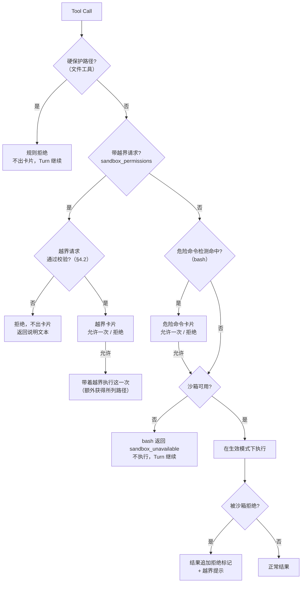

# 权限

工具执行的授权体系。本文描述目标状态。

模型与流程参考 deepseek-harness（下称 DSH）的"文件沙箱 + 被拒后一次性越界"、Codex 的可写根与受保护子路径、maka 的精确路径越界，**不参考**这之外的部分：没有审查模型，没有持久规则，没有网络管控。有意偏离的地方集中列在 §8。

工具契约见 [tools.md](tools.md)，Tool Call 生命周期见 [session-runtime.md](session-runtime.md)。

## 1. 问题与约束

### 1.1 要解决什么

模型每一轮会调很多次工具。**每次都问，用户会疲劳到闭眼点同意**；**不问，就必须有别的东西守住边界**。

一种看似自然的做法是"看命令文本，证明它只读就不问"。这条路有三个结构性问题，不是实现能补上的：

1. **文本看不见真实效果。** `$VAR` 展开、子进程、`build.rs`、测试代码写了什么，从命令字面上一个都看不到；
2. **"只读"本身靠不住。** 仓库配置能让 `git status` 执行任意辅助程序（fsmonitor、外部 diff）——Codex 因此在提交 `3b45c29062` 里不再把 git 当作天然安全，并在 `942af8447b` 里删掉了整份已知安全命令白名单；
3. **证明不了的一律要问。** `cargo test`、`python -m pytest`、`npm run build` 这些编码 agent 最核心的操作全都证明不了，于是打断集中在最常见的调用上。

> 真正的问题是：**让内核守住边界，让用户只在越过边界时被问。**

### 1.2 不可协商的事实

1. **内核能强制，文本推断不能。** 能约束任意 shell 命令文件效果的只有 OS 沙箱。沙箱内的命令一律直接执行，越界的操作由内核拒绝。
2. **沙箱拦得住越界，拦不住边界内的破坏。** `auto` 模式下 bash 可以写工作区，所以 `rm -rf src` 在沙箱里会成功。这一块由 §4.3 的危险命令检测**尽力**覆盖，它不是边界。
3. **已提交的历史由沙箱守住。** `.git` 在沙箱内只读：`git commit`、`git reset --hard`、`git checkout`、`git stash` 都要写 `.git`，会被内核拒绝后走越界审批（§4.1）。真正暴露的只有**未提交的改动和未跟踪的文件**。
4. **没有可用沙箱时 bash 不执行。** 不能约束就不运行，也不提供"这一次不用沙箱"的选项（§3.2）。**整个系统不存在不受约束的执行路径。**

### 1.3 成功长什么样

- 读代码、改代码、编译、跑测试、用 git 查看状态与历史——**全部不被打断**；
- 被问的只有两类：越过沙箱边界（包括写 `.git`）、命中危险命令检测。每一类都**值得回答**；
- 模型被拒绝时知道原因和出路，不会反复撞墙；
- 事后能回答"**这条命令在什么约束下跑的、为什么没问 / 为什么问了**"（§7）。

### 1.4 明确不做

| 不做 | 原因 |
|---|---|
| **命令文本的只读判定与资格检查** | §1.1。沙箱内一切命令都直接执行，"证明它安全"不再有使用者；且文本推断比内核弱，有时会猜反 |
| **网络管控** | 暂不接入。不管控，**也不声称**——一个恒为"未强制"的免责声明只会训练用户忽略它。凭据目录禁读（§2.3）是文件规则，不是网络规则 |
| **审查模型** | 不让另一个模型替用户批准。越界的最终门控是人看到的命令与理由 |
| **会话授权与持久规则** | 越界只批这一次（§4.1）。没有「本会话允许」，没有规则文件，没有「总是允许」。是否需要会话级授权，等 Trace 数据说明哪些越界反复出现再决定（§9.1 P3） |
| **完全放开的权限** | 没有 `full-access` / `danger-full-access` / `bypass` 一类的取值——既不是会话模式，也不是越界目标。越界只能列出具体路径（§4.1）；写入位置列举不出来的命令不在能力范围内，由用户自己执行 |
| **Linux 之外的非 macOS 平台** | 一期只做 macOS Seatbelt，Linux 在 P2（§9.1）。Windows 与 PowerShell 不做 |

## 2. 模型：沙箱是边界

### 2.1 边界由内核强制，不由文本推断

一次工具调用的判定只看两件事：**这次调用在什么模式下执行**，以及**它有没有命中危险命令检测**。命令做了什么，交给内核在执行时判断。


```mermaid
flowchart TD
  A["Tool Call"] --> B{"硬保护路径?<br/>（文件工具）"}
  B -- 是 --> X["规则拒绝<br/>不出卡片，Turn 继续"]
  B -- 否 --> C{"带越界请求?<br/>sandbox_permissions"}
  C -- 是 --> D{"越界请求<br/>通过校验?（§4.2）"}
  D -- 否 --> X2["拒绝，不出卡片<br/>返回说明文本"]
  D -- 是 --> E["越界卡片<br/>允许一次 / 拒绝"]
  C -- 否 --> F{"危险命令检测命中?<br/>（bash）"}
  F -- 是 --> G["危险命令卡片<br/>允许一次 / 拒绝"]
  F -- 否 --> H{"沙箱可用?"}
  G -- 允许 --> H
  H -- 否 --> I["bash 返回 sandbox_unavailable<br/>不执行，Turn 继续"]
  H -- 是 --> J["在生效模式下执行"]
  E -- 允许 --> J2["带着越界执行这一次<br/>（额外获得所列路径）"]
  J --> K{"被沙箱拒绝?"}
  K -- 是 --> L["结果追加拒绝标记<br/>+ 越界提示"]
  K -- 否 --> M["正常结果"]
```

三个必须说清的点：

1. **被沙箱拒绝不是权限判定，是结果事实。** 命令确实执行了，是内核拦下了其中某个文件操作。它和退出码正交，记在结果上（§3.3），不是 `Deny`。
2. **危险命令卡片批准后不放宽沙箱。** 它回答的是"要不要执行这条"，不是"要不要给它更多权限"。`rm -rf ~/x` 被批准后仍在沙箱里执行，照样被内核拒绝。
3. **越界卡片只能由模型显式请求触发。** 系统不会替模型猜"这条可能需要越界"——那又回到了文本推断。

`tree-sitter-bash` 只服务于 §4.3 的危险命令检测，不参与任何放行判断。

### 2.2 两个模式：`auto` 与 `accept-edits`

两个模式只在一件事上不同：**bash 能不能写工作区。**

| 模式 | 文件工具（`write` / `edit`）写工作区 | bash 写工作区 | 两者共同 |
|---|---|---|---|
| **`auto`**（默认） | 不问 | **不问** | 读：除凭据目录外处处可读。写：临时目录可写；受保护子路径、工作区外都要越界 |
| **`accept-edits`** | 不问 | **要越界**（被内核拒绝后申请） | 同上 |

- **`auto`** 面向日常开发：编辑、编译、测试、装依赖到工作区（`target/`、`node_modules/`）都不打断；
- **`accept-edits`** 更保守：代码改动只经 `write` / `edit` 进入工作区——它们生成可撤销的 `file_change`（[tools.md §10](tools.md)），而 bash 的写入不可撤销。bash 仍能读、能跑只读的命令、能写临时目录；一旦要写工作区（包括 `cargo build` 写 `target/`、`rm`、`git clean`），就被内核拒绝并走越界卡片。

**权限只有这两档。** 越界（§4.1）不是第三档，而是**单次调用**在当前模式之外额外获得几个**具体路径**的读或写，这一次执行完就回到原模式。不存在"这一次什么都能写"的越界。

**硬保护路径在任何模式与任何越界下都不可写**（§2.3）。

模式是**用户在界面上可见、随时可切**的会话姿态（§6.1），切换在下一次调用生效。

**子 Agent 也只用这两档。** 角色声明一个上限，生效模式取父会话模式与上限中较窄者（§6.6）；explorer 的上限是 `accept-edits`，它的工具面里又没有 `write` / `edit`，因此改不了工作区。两档从窄到宽：`accept-edits` < `auto`。

**工作区是主目录或主目录的上级时，bash 在两个模式下都不能写工作区**（相当于 bash 固定按 `accept-edits` 对待工作区，写入要越界）；文件工具不受影响。主目录里有大量会在沙箱外被执行的位置：`~/Library/LaunchAgents` 在下次登录时启动、`PATH` 里的 `~/.local/bin` 能冒充常用命令、许多工具的配置文件能指定启动命令。这些位置列举不全，所以不把它们逐个加进硬保护，而是在这种工作区下不给 bash 写权限。判断用规范化后的路径：工作区等于 `$HOME`，或是 `$HOME` 的祖先（如 `/Users`）。

"临时目录"指 `/private/tmp` 与 `$TMPDIR` 的真实路径（macOS 上位于 `/private/var/folders/...`）。在两个用户模式下它们对 bash 和文件工具**同样可写**——不存在"write 工具不能写 `/tmp` 而 bash 能"的不对称。

### 2.3 路径的四档

| 档 | 路径 | 两个模式下 | 越界后 |
|---|---|---|---|
| **硬保护** | `~/.openwork/**`<br>skill 根（`~/.agents/skills/**`）<br>`<工作区>/**/.git/hooks/**` | 可读，**不可写** | **仍不可写**，文件工具直接规则拒绝、不出卡片 |
| **敏感** | `<工作区>/**/.git/**`（hooks 以外）<br>`<工作区>/**/{.env*,.envrc}`<br>`<工作区>/**/{.vscode,.idea}/**`<br>`<工作区>/**/{.gitconfig,.gitmodules}`<br>`<工作区>/**/{.bashrc,.bash_profile,.zshrc,.zprofile,.profile}` | 可读，**不可写**（被拒后可越界） | 被越界请求列出的路径可写 |
| **凭据禁读** | `~/.ssh` `~/.aws` `~/.gnupg` `~/.kube` `~/.azure`<br>`~/.config/gh` `~/.config/gcloud`<br>`~/.docker/config.json` `~/.netrc` `~/.git-credentials`<br>`~/.npmrc` `~/.pypirc` `~/.cargo/credentials.toml`<br>`~/Library/Keychains` `~/Library/Cookies` `~/Library/Safari`<br>`~/Library/Application Support/{Google/Chrome,Firefox}` | **不可读**，不可写 | 被越界请求列出的路径可读 |
| 普通 | 其余 | 可读；临时目录可写；工作区可写（`accept-edits` 下的 bash、以及工作区包含主目录时的 bash 除外，§2.2） | 被越界请求列出的路径可写 |

**硬保护只收"一次批准就变成沙箱外持久执行、且没有正当用途"的路径：**

- `~/.openwork`：Agent home、runtime token、派生配置（[collaboration-data-model.md](collaboration-data-model.md)）。能写它就能改自己和其他 Agent 的运行环境；
- skill 根：能改 skill 就能让一次提示注入变成跨 Session 的持久提权（[skills.md §5.2](skills.md)）；
- `.git/hooks`：写进去的脚本会在用户下一次 `git commit` 时在沙箱外执行。编码 agent 的正常工作从不需要写它。越界请求里即使列出整个 `.git`，`hooks` 也仍被扣除。

**`.git` 的其余部分是敏感档**：`git add`、`git commit`、`git checkout`、`git stash`、`git push -u` 都要写它，每次都经一次越界审批。提交、改写历史、改 `.git/config`（`core.fsmonitor`、`core.hooksPath` 能让 git 在沙箱外执行程序）都是值得用户确认的动作；代价是提交类操作每次都要点一下。

**浏览器的 Cookie 与配置目录算凭据**：它们存着已登录会话，读到就等于拿到了登录态。

**名字按 ASCII 大小写不敏感匹配。** macOS 的默认文件系统不区分大小写：`.ENV` 与 `.env` 是同一个文件，`.GIT/hooks` 就是 `.git/hooks`。已存在的路径经 canonicalize 会还原成磁盘上的写法，但**新建**的路径保留调用方给的大小写——若按字面匹配，新建一个 `.ENV` 就绕过了敏感档。因此工作区内的档位名（`.git`、`hooks`、`.env*`、`.vscode` 等）在文件工具围栏与 Seatbelt 正则里都按大小写不敏感比较。

**敏感档可读。** 保护目标是不可篡改，不是保密——`.env` 在工作区里，模型读得到它是编码工作的一部分。真正需要保密的是凭据目录，那是另一档。

**凭据禁读档可以被越界解开**，因为 `git push`（经 ssh 读 `~/.ssh`）、`gh pr create`（读 `~/.config/gh`）这类用户会批准的操作需要它们。越界只列出那一个目录（§4.1），用户在卡片上看到的是那条具体命令和那个具体路径。

### 2.4 同一个策略驱动 bash 与文件工具

```rust
pub struct SandboxPolicy {
    pub mode: SandboxMode,              // Auto | AcceptEdits
    pub workspace_root: PathBuf,        // canonical
    pub path_grants: Vec<PathGrant>,    // 本次调用批准的路径越界；平时为空
    // 以下由上面三项推导，不单独配置
    // writable_roots(actor)  临时目录 + 工作区（accept-edits 下、或工作区包含主目录时 bash 不含）+ 写授权
    // protected_subpaths()  硬保护 + 敏感（写授权从敏感中扣除；硬保护永不扣除）
    // read_denied_paths()   凭据目录（读授权从中扣除）
}

pub struct PathGrant {
    pub path: PathBuf,                  // canonical 绝对路径
    pub access: GrantAccess,            // Read | Write（Write 蕴含 Read）
    pub scope: GrantScope,              // Exact | Subtree
}
```

`path_grants` 只存在于**单次调用**的策略里（[tools.md §5](tools.md)）。会话状态里没有它。

`SandboxPolicy`、四档路径的推导函数、Seatbelt profile 生成、自检与拒绝识别都在 **`openwork-sandbox`** crate 里（[architecture.md §2](architecture.md)）。它不依赖任何其他 OpenWork crate，不启动进程，也不做审批决定。

同一个 `SandboxPolicy` 同时产出：

- **Seatbelt profile**：约束 bash 及其全部子进程（§3.1），`actor = Bash`；
- **文件工具的路径围栏**：`resolve_path` → `CheckedPath` 在规范化之后按同一组可写根、受保护子路径、禁读路径判断（[tools.md §8](tools.md)），`actor = FileTool`。

两者**必须由同一组函数推导**，并有一个对等测试钉住：同一组路径在两侧得到同样的可读 / 可写结论。**有意的差异只有一类**：工作区对 bash 不可写、对文件工具可写。它出现在 `accept-edits` 下，以及工作区是主目录或其上级时（§2.2）；对等测试把这一格写成显式期望，其余每一格两侧必须相同。路径规则只有这一份，不存在第二处持有路径知识的地方。

文件工具的围栏是**策略边界而非内核边界**：威胁面是模型选定的路径参数，而工具代码本身是可信的，"先规范化再判包含"覆盖得了这个面。对不可信代码的内核级隔离只由 bash 的沙箱承担。

**读取不限于工作区。** 除凭据目录外处处可读，与 bash 在沙箱里能 `cat` 的范围一致。读依赖源码（`~/.cargo/registry`、Go 模块缓存、系统头文件）不打断。

### 2.5 网络

不管控，也不声称。界面、卡片、工具结果、模型可见的策略描述里都**不出现任何网络限制或隔离的表述**。

这是一个写在明面上的风险：沙箱内的命令可以联网，因此工作区内能读到的东西理论上能被发出去。凭据禁读档（§2.3）的作用就是把最值钱的那部分从"能读到"里拿掉。

## 3. 沙箱实现

### 3.1 macOS Seatbelt

bash 以 `sandbox-exec -p <profile> -- bash -c <command>` 执行。执行 shell 是 `bash` 而不是 `sh`，与 §4.3 解析所用的语法一致。

profile 只管文件效果，形态与 DSH 一致。文本里只有参数名，路径与正则全部经 `-D` 传入（`P0=<工作区>`、`P1=^<转义后的工作区>/(.*/)?\.git/hooks(/.*)?$` ……）：

```scheme
(version 1)
(allow default)
(deny file-write*)
(allow file-write* (literal (param "P0")) ... (regex (param "P5")) ...)   ; 设备，见下
(allow file-write*                                                     ; 每个可写根一条
  (require-all (subpath (param "P7"))
               (require-not (subpath (param "P8")))                    ; ~/.openwork、skill 根
               (require-not (regex (param "P9")))                      ; <工作区>/**/.git/hooks
               (require-not (regex (param "P10"))) ...                 ; 敏感档
               (require-not (subpath (param "P13"))) ...))             ; 凭据档
(allow file-write* (require-all (subpath (param "P30")) ...))          ; 每个写授权一条
(deny file-read* (subpath (param "P13")))                              ; 每个凭据路径一条，读授权以 require-not 扣除
```

构造约束：

- **所有路径先 canonicalize。** Seatbelt 按真实路径匹配，`/tmp` 是 `/private/tmp` 的符号链接，写 `/tmp` 不会命中；
- **路径与正则都经 `-D` 参数传入，profile 里只用 `(param "Pn")` 引用**：`(subpath (param ..))` 与 `(regex (param ..))` 在开发机上都已验证。profile 文本因此与路径无关——一个名字里带引号或括号的目录改变不了规则结构，同一策略换一个工作区只有参数值不同。嵌进正则的路径统一经过一个正则转义函数，只负责让正则引擎把每个字符当字面量；
- **受保护子路径用 `require-not` 从可写根里扣掉**，不依赖"后写的规则覆盖先写的"——Seatbelt 的规则优先级没有文档化的契约；
- 敏感档里的 glob 形态（`**/.env*`）在 profile 里展开为 `regex` 或逐个 `literal`，展开规则与文件工具围栏共用同一份定义（§2.4）；
- 路径越界用同一套生成器：写授权追加为可写根，读授权从凭据禁读的 `deny` 中以 `require-not` 扣除；**硬保护路径在任何授权下都以 `require-not` 扣除**，所以即使越界请求列出整个 `.git`，`.git/hooks` 仍不可写；
- **授权只解开它自己点名的敏感 / 凭据路径**：授权路径本身是敏感路径（如 `<工作区>/.git`）时，这条授权不再扣除敏感档；否则照常扣除。所以 `accept-edits` 下为 `cargo build` 批准整个工作区的写，并不顺带打开 `.git` 与 `.env`。凭据档同理；
- **可写的字符设备**：`/dev/null`、`/dev/zero`、`/dev/tty`、`/dev/fd/<n>`、`/dev/ttys<n>`。`/dev/stdout`、`/dev/stderr` 是指向 `/dev/fd/1`、`/dev/fd/2` 的符号链接，Seatbelt 按解析后的路径判断，由 `/dev/fd/<n>` 覆盖，不单列。只放 `/dev/null` 时，`echo x > /dev/stdout`、`tee /dev/stderr`、`> /dev/fd/3` 与进程替换 `tee >(cat)` 会失败（开发机实测）；`>&3` 这类复制文件描述符的写法不经过路径，不受影响。在 `/dev` 下创建文件仍被拒绝。

本仓库在开发机上验证过这个形态（2026-09-24，`openwork-sandbox/tests/matrix.rs` 与 `parity.rs`，每次 `cargo test` 都在真实内核上重跑）：`auto` 下 `cargo build` / `cargo test`、`git status` / `log` / `diff`、`git clean -fd` 成功；`git add` / `commit` / `reset --hard` / `stash` 被拒且工作区不变，以 `<工作区>/.git` 越界后 `git commit` 成功而 `.git/hooks` 仍不可写；写 `$HOME`、`~/.openwork`、skill 根与读 `~/.ssh`、`~/Library/Cookies` 被拒；写 `/private/tmp` 与 `$TMPDIR` 成功。`accept-edits` 下 bash 的 `cargo build` 被拒——cargo 经工作区根下的临时目录创建 `target/` 并写 `Cargo.lock`，所以它的越界是整个工作区的写（上一条保证这不会打开 `.git`）。

**工具链缓存放进临时目录，不扩大可写范围。** Go 默认把编译缓存写到 `~/Library/Caches/go-build`，沙箱内 `go build` / `go test` 因此被拒（开发机实测）。bash 启动时把 `GOCACHE` 设为 `$TMPDIR` 真实路径下 OpenWork 私有的目录，覆盖用户环境里的同名变量。不把用户自己的缓存目录加入可写根：沙箱内的进程若能写它，就能让用户日后在沙箱外的编译取到被篡改的产物。代价是这份缓存与用户的缓存不共享，首次编译更慢，系统清理临时目录后要重建。

`sandbox-exec` 被 Apple 标记为已弃用但仍随系统提供，DSH 与 Codex 都依赖它。它若在未来某个系统版本上被移除，会表现为自检失败，落到 §3.2 的 fail-closed，而不是静默不受限。

### 3.2 自检与 fail-closed

**进程启动时**做一次**功能性自检**：在沙箱里尝试写一个本应被拒绝的探针路径，只有拿到 `EPERM` 才认定沙箱可用。结论在进程生命周期内缓存。放在启动时而不是第一次调用 bash 时，是为了让界面和模型在第一次调用之前就知道 bash 能不能用。

"命令能跑起来"不等于"沙箱生效了"——自检要证明的是**拒绝真的会发生**。沙箱配置失效时它照样报告"已应用"，这类静默失败只能靠这一步发现。

沙箱不可用时（自检失败、平台不支持、`sandbox-exec` 启动失败）：

| 对象 | 行为 |
|---|---|
| bash（交互式与非交互 Session 相同） | **不执行**，返回 `sandbox_unavailable`，Turn 继续。不出卡片，不提供"这一次不用沙箱" |
| 文件工具 | 不受影响——它们的围栏在进程内（§2.4） |
| 界面 | 常驻显示"沙箱不可用，bash 已停用"及原因（自检失败的具体输出），直到下次启动自检通过 |
| 模型 | `runtime/sandbox-policy` 上下文 section 写明 bash 当前不可用（§4.6），避免它反复尝试 |

bash 的失败文本要可操作：`bash is unavailable because the macOS sandbox failed its self-check. Use read / grep / glob / edit for file work, and tell the user which command you need them to run.`

**不提供逃生口是刻意的**：一个"沙箱坏了就临时放开"的选项，在沙箱真的坏掉时恰恰是最常被点下的按钮，而那时用户最难判断风险。沙箱故障应当被修好，而不是被绕过。代价是沙箱故障期间 bash 完全不可用——与 DSH、maka 相同。

### 3.3 拒绝识别

一次 bash 调用以非零退出结束、且输出含 Seatbelt 的拒绝特征（`Operation not permitted`，**不区分大小写**——Go 与 Node 写作 `operation not permitted`）时，结果标记 `sandbox.denied = true`。bash 的 stdout 与 stderr 合并为一路（[tools.md §10](tools.md)），特征在哪一路都算。

- 它是**推断**，不是证明：别的原因产生的 `EPERM` 也会被标上。误标的后果只是模型多得到一次越界提示，最终仍由用户在卡片上判断；
- 命令吞掉了错误并以 0 退出时不会被标上。模型从输出里仍看得到原始报错；
- **沙箱基础设施失败与命令被拒绝要区分**：`sandbox-exec` 本身没能启动时，结果是 `sandbox_unavailable`（§3.2），不是 `denied`；命令没有执行。判定：退出码是 `sandbox-exec` 自己的 64（用法）/ 65（profile 错误）/ 71（无法执行命令），**且**输出以 `sandbox-exec:` 或它的用法说明开头——它在命令启动之前打印；命令自己以 64 退出不会被误判。

### 3.4 平台范围

| 平台 | 一期 | 之后 |
|---|---|---|
| macOS | Seatbelt | — |
| Linux | 视为沙箱不可用，bash 停用（§3.2） | P2：bwrap，不可用时 Landlock（§9.1） |
| Windows | 不支持 | 不做 |

**已知限制：**

- **沙箱不能嵌套。** 已在 Seatbelt 里的进程无法再调用 `sandbox-exec`；自己会套沙箱的工具在里面会失败。SwiftPM 解析 manifest 时可能属于这一类（未验证），需要时用 `--disable-sandbox`；
- **不占磁盘。** `sandbox-exec` 随系统提供（约 100 KB），规则是内存里的字符串，强制发生在内核里；没有镜像、虚拟机或缓存。唯一的磁盘写入是 macOS 统一日志里的拒绝记录，由系统自己轮转。

## 4. 越界与危险命令

### 4.1 越界：被拒后一次性重试

流程：

1. 命令在当前模式下执行，某个文件操作被内核拒绝；
2. 结果末尾追加拒绝标记与越界提示（§4.6）；
3. 模型用**同一条命令**重试，带上 `sandbox_permissions`（刚好够用的越界）与 `justification`（直接给用户看的一句话）；
4. 卡片展示命令、理由、越界内容。用户选择**允许一次**或**拒绝**；
5. 允许：这一次调用带着越界执行。下一次调用回到会话的生效模式。

**授权只作用于这一次调用，不留任何状态。** 同一条命令下次还需要越界，就再问一次。

**越界只能列出具体路径：**

```json
{
  "sandbox_permissions": {
    "paths": [
      { "path": "/Users/me/.cargo/registry", "access": "write", "scope": "subtree" }
    ]
  },
  "justification": "新增了 serde_yaml 依赖，需要把它下载到 Cargo 的本地缓存。"
}
```

| 字段 | 取值 | 含义 |
|---|---|---|
| `paths[].path` | 绝对路径 | 规范化后参与判断 |
| `paths[].access` | `read` \| `write` | `write` 蕴含 `read` |
| `paths[].scope` | `exact` \| `subtree` | 一个文件，或一个目录及其下全部 |

**为什么只有路径，没有"更宽的模式"。** 新增依赖后的 `cargo build` 只需要写 `~/.cargo/registry`；如果越界能给出"任意位置可写"，这一次执行里的 `build.rs` 就能写任何地方。只允许列路径，越界的范围就等于真正需要的范围，卡片上也容易看懂——用户判断的是"允许写这个目录吗"，而不是"允许这条命令做任何事吗"。写入位置列举不出来的命令（比如会往多处系统目录安装东西的脚本）不在能力范围内，模型应当把命令交给用户自己执行。

这一点借鉴 maka 的路径形态，但**不跟随它的持久化**：maka 批准的路径会累加进会话边界、一直有效；这里批准的路径只作用于这一次调用（§1.4）。

**模型可以不等拒绝就直接请求越界**——比如它知道 `git push` 必然要读 `~/.ssh`。系统不把重试硬匹配到先前的拒绝：命令字符串的同一性很脆弱（引号、`workdir`、环境变量前缀），硬匹配要么误拒诚实的重试，要么被轻易满足。真正的门控是用户看到的命令、路径和理由。

典型的正当越界：

| 场景 | 被拒的操作 | 越界 |
|---|---|---|
| 新增依赖后的 `cargo build` 首次拉包 | 写 `~/.cargo/registry` | `paths`: 该目录，`write`，`subtree` |
| 新增依赖后的 `npm install` | 写 `~/.npm` | `paths`: 该目录，`write`，`subtree` |
| `git add` / `git commit` / `git stash` / `git checkout` / `git reset` | 写 `.git` | `paths`: `<工作区>/.git`，`write`，`subtree`（`hooks` 仍被扣除） |
| `git push`（ssh） | 读 `~/.ssh` | `paths`: 该目录，`read`，`subtree` |
| `git push -u` / `git remote add` | 写 `.git` 与读 `~/.ssh` | 两条都列出 |
| 改 `.env` | 写 `.env` | `paths`: 该文件，`write`，`exact` |
| `accept-edits` 下 `cargo build` | 写 `target/` 与 `Cargo.lock` | `paths`: 工作区根，`write`，`subtree`（cargo 经工作区根下的临时目录创建 `target/`，只列 `target/` 不够，§3.1）；这不会打开 `.git` 与 `.env` |
| `accept-edits` 下 `npm install` | 写 `node_modules/` 与锁文件 | `paths`: 所需路径，`write`（未在真机矩阵中验证具体需要哪些路径） |
| `accept-edits` 下用 bash 改工作区文件（`sed -i`、代码生成） | 写工作区 | `paths`: 那几个文件，`write`，`exact`；或工作区根，`write`，`subtree` |

依赖已缓存时的构建不需要越界。Go 的编译缓存已指向 OpenWork 私有的临时目录（§3.1），不需要越界；其余工具链缓存（Go 模块缓存 `~/go/pkg/mod`、npm / pnpm 缓存等）要不要默认加入可写根，是 §9.1 P3 用 Trace 数据回答的问题——在那之前，首次下载依赖时需要越界。

### 4.2 越界请求的校验

以下任一不满足时直接拒绝、不出卡片，返回说明文本，Turn 继续：

- `justification` 非空；
- `paths` 最多 16 条，每条是规范化的绝对路径；
- **每条路径都必须带来新的权限**：已经被当前策略覆盖的条目（例如在 `auto` 下申请写工作区里的普通文件）不构成越界；
- **不能申请硬保护路径**，也不能申请包含硬保护路径的写授权后借此写进去——硬保护在生成的 profile 里始终以 `require-not` 扣除；
- **`subtree` 不能落在 `/`、`$HOME` 或它们的祖先上**。这种宽度等于"几乎任何位置都可写"，正是不提供的那种权限（§1.4）。

bash、`write`、`edit` 三个工具都带这两个参数。文件工具在敏感路径、工作区外写入时同样返回拒绝标记，走同一条越界流程；文件工具的越界通常就是那一个目标文件的 `exact` 写授权。

**这两个参数只在沙箱可用时出现在工具 schema 里。** 沙箱不可用时公布它们，就是公布一个系统兑现不了的选项。

### 4.3 危险命令检测

沙箱允许在工作区里删除，而 bash 做的删除**不可撤销**——`file_change` 撤销只覆盖 `write` / `edit`。危险命令检测补的就是这一块：

> **会批量丢弃未提交工作、且沙箱不会拦下的命令，执行前先问一次。**

检测命中时出危险命令卡片；批准后在**当前生效模式**下执行（§2.1 第 2 点）。

**只在 `auto` 下单独出卡。** `accept-edits` 下 bash 本来就写不了工作区，`rm -rf src` 会被内核拒绝后走越界卡片——再单独问一次只是重复。此时检测结果只作为**越界卡片上的额外标注**：如果越界请求要写工作区、而命令又命中清单，卡片同时写明"这条命令会删除文件"。

**清单是封闭的：**

| 键 | 命中条件 |
|---|---|
| `rm_recursive_or_force` | `rm` 带 `-r` / `-R` / `-f` / `--recursive` / `--force`（含 `-rf` 等组合） |
| `find_delete` | `find` 带 `-delete`，或 `-exec` / `-execdir` 的命令是 `rm` |
| `git_clean_force` | `git clean` 带 `-f` / `--force`——删除未跟踪文件，不写 `.git` |

**丢弃改动的其余 git 命令不在清单上，因为沙箱已经拦下它们。** 本仓库在开发机上验证过（2026-09-24）：`.git` 只读时，`git restore <file>`、`git checkout -- .`、`git reset --hard`、`git checkout -f`、`git stash` 都因拿不到 `.git/index.lock` 以 128 / 1 退出，**工作区一个字节都没有改**；只有 `git clean -fd` 成功删除了未跟踪文件。前者会走写 `.git` 的越界卡片，用户在卡片上看到的就是那条命令——再让危险命令检测问一遍只是重复。

不在清单上的还有：单文件 `rm a.txt`（影响有限）、`mv` 覆盖、`> file` 截断。

**加一条的标准只有一个：它在沙箱允许的范围内，能批量丢弃未提交的工作。** 这份清单不能慢慢长成一份"可疑命令"黑名单——那条路的终点是按命令文本判断安全（§1.1），打断会重新回来。maka 在代码注释里记录过同一个教训：它反复枚举危险形态八轮后，结论是"从字符串判定 shell 命令的运行时效果是不可判定的"，于是危险分类只用于给出更准确的确认理由。

### 4.4 检测是尽力而为，不是边界

| 情况 | 行为 |
|---|---|
| 程序名与标志是静态字面量，操作数含 `$VAR` / glob | **照常检测**：`rm -rf $DIR` 命中。判断只依赖程序名和标志 |
| 程序名本身是动态的（`$CMD -rf x`） | 不检测，直接在沙箱里执行 |
| 语法错误、解析失败 | 不检测，直接在沙箱里执行（bash 自己会报语法错误） |
| 包装器：`sudo` `env` `xargs` `timeout` `nice` `nohup` `time` `command` | 剥掉包装器及其选项、变量赋值后，对内层命令递归检测 |
| `bash -c '<字面量>'` / `sh -c '<字面量>'` | 把字面量当脚本再解析一次，递归检测 |
| 递归深度超过 8 层 | 视为命中（与 Codex 一致） |

**看不懂就不问。** 这是刻意的：检测不是安全边界，边界是沙箱。看不懂就问，会把打断重新带回 `for f in *.rs; do ...; done` 这类最常见的形态上。

检测的漏报后果被沙箱限定在"工作区内未提交的工作"；误报的后果是多一张卡片。两者都不会越过边界。

### 4.5 拆成子命令

检测用 `tree-sitter-bash` 拆出脚本里的**每一个** `command` 节点逐个判断——管道、`&&` / `||` / `;`、子 shell、`$(...)`、控制流、函数体都要下降进去。

它的目的只是发现明显的删除、多问一句，所以：

- **遇到不认识的节点继续下降**，尽量多找到 `command`，而不是整条放弃；
- **错了的后果有界**：漏报是一次沙箱内的删除，误报是多一张卡片。

`echo rm -rf x` 不命中：`rm` 在这里是 `echo` 的参数，不是命令。只有语法树上处在命令名位置的 `rm` 才算。

### 4.6 模型看到什么

**拒绝标记与越界提示在工具结果里给，在决策点上教。** 被沙箱拒绝的结果末尾追加：

```
[sandbox: file access denied under auto mode]
[sandbox: to proceed, retry this exact command once with sandbox_permissions listing only the paths it needs, and a one-sentence justification; the user will be asked. If the paths cannot be listed, ask the user to run the command instead]
```

文件工具碰到硬保护路径：

```
[sandbox: <path> is protected and cannot be written in any mode; do not retry]
```

**当前策略作为上下文消息给出，不写进系统提示词。** 用 world state 的一个 section（`runtime/sandbox-policy`）描述当前模式、工作区根，以及 bash 当前是否可用（§3.2），模式变化时按现有的 diff 机制追加新快照，不作废系统前缀的缓存。

不写进系统提示词是有实测依据的：DSH 早期在系统提示词里写"bash 运行在只读沙箱中"，第一次人工测试的 12 个回合里有 5 个以零工具调用结束——模型直接放弃了本可以被拒后越界的工作。**标记在相关的时刻指出边界，比事先声明更不容易让模型退缩。**

工具描述里说明：拒绝是策略，不是命令缺陷；不要换一种写法绕过去；唯一被认可的出路是带理由的越界重试。

## 5. 审批卡片

### 5.1 两种卡片

| 卡片 | 触发 | 必须显示 |
|---|---|---|
| **越界** | 模型带 `sandbox_permissions` 请求 | 命令原文、模型的理由；**逐条列出申请的路径**（读 / 写、单个文件 / 整个目录、属于哪一档：敏感 / 凭据 / 工作区外）；若此前同一 Turn 有被拒结果，显示被拒的路径 |
| **危险命令** | §4.3 命中 | 命令原文；**命中的是哪一个子命令、哪一条（键）**；说明"批准后仍在当前模式的沙箱内执行" |

一张卡片可以同时是越界与危险命令（`auto` 下 `rm -rf ~/old-build` 带对 `~/old-build` 的写越界，或 `accept-edits` 下 `rm -rf build` 带对工作区的写越界）：两种原因都显示，一次批准覆盖两者。

**命令原文始终完整显示。** 危险命令卡片要把命中的那一段高亮，但不能只显示那一段——用户批准的是整条命令。

### 5.2 按钮

```
[允许一次]  [拒绝]
```

只有这两个：

- **没有「本会话允许」**，没有「总是允许」，没有「总是拒绝」（§1.4）；
- **卡片不切换模式。** 模式只能从界面上常驻的指示器切换——卡片是"这一次要不要"的界面，模式是会话姿态，两者分开；
- 文案写明作用范围：越界卡片写"这一次，额外允许写 `~/.cargo/registry`"，危险命令卡片写"这一次，仍在沙箱内"。

### 5.3 拒绝有两种语义，一次响应的审批串行

| 来源 | 行为 |
|---|---|
| **规则拒绝**（硬保护、越界请求校验失败、非交互 Session） | 作为 tool result 回给模型，**Turn 继续** |
| **用户拒绝**（卡片上点「拒绝」） | 用户明确表态，**Turn 停下** |
| **沙箱拒绝** | 不是拒绝，是结果事实（§2.1）。Turn 继续 |

**一次模型响应里有多个 Tool Call 时，审批串行进行。** 并行弹卡片会让用户在竞争的窗口之间来回切换，看不清顺序就谈不上看清将要发生什么。

## 6. 会话状态

### 6.1 模式

模式是会话的属性。新会话从 `auto` 开始；用户在指示器上在 `auto` 与 `accept-edits` 之间切换，下一次调用生效。

### 6.2 越界不留痕

越界批准只作用于那一次调用，不产生任何会话状态。`SessionActor` 不持有任何授权列表。

### 6.3 模式随会话持久化

模式与会话一起落库，进程重启后恢复为该会话最后的模式。

默认是较宽的 `auto`：如果模式不落盘、重启回到默认，就会**悄悄放宽**一个用户刻意切到 `accept-edits` 的会话。模式在界面上常驻可见，把它持久化不会藏起任何东西。

### 6.4 回看：自动执行必须在 Trace 里认得出来

绝大多数调用不出卡片，所以用户当场看不见它们。回看的地方是 **Trace**，不另建面板。

时间线上必须一眼分得出：

| 类别 | 判据 |
|---|---|
| 沙箱内自动执行 | `permissionDecisionSource = sandbox` |
| 被沙箱拒绝 | `sandboxDenied = true` |
| 用户批准的越界 | `escalationPaths` 非空 + 来源 `user` |
| 用户批准的危险命令 | `dangerMatch` 非空 + 来源 `user` |
| 沙箱不可用而未执行 | `permissionDecisionSource = sandbox_unavailable` |
| 规则拒绝 | 来源 `builtin` / `non_interactive` |
| 用户拒绝 | `deny` + `user` |

**所有被执行的调用都在沙箱内**：`sandboxMode` 只有 `accept_edits`、`auto` 两个取值，时间线上不存在"无沙箱执行"这一类。

### 6.5 缺口必须可见

Trace 是有损的（[trace.md](trace.md) §10）。完整度由 `turns.tool_call_count` 这个独立参照物算出（trace.md §12），`partial` / `none` 在界面上必须显著区别于 `complete`——一个会漏报的回看视图如果看起来是完整的，比没有更糟。

### 6.6 非交互 Session：没有人可问时

子 Agent（[multi-agent.md](multi-agent.md)）没有人在环路里。`SessionApproval::NonInteractive` 只改变"需要问"的落地方式：

| 环节 | 非交互 Session |
|---|---|
| 生效模式 | **父会话生效模式与角色上限中较窄的那个**，在派生时取快照。explorer 角色的上限是 `accept-edits` |
| 沙箱内执行 | 与交互式完全相同——可以编译、跑测试（在模式允许的范围内） |
| 越界请求 | 直接拒绝，不出卡片 |
| 危险命令 | 直接拒绝，不出卡片 |
| 沙箱不可用 | bash 不执行，与交互式相同（§3.2） |

拒绝文本必须**可操作**：说明这是子 Agent 无法请求授权所致，告诉它在当前模式内能做什么，或者把做不到的事报告给父 Agent。否则模型会反复重试同一条命令直到耗尽 `max_model_calls`。

**生效模式取两者较窄的那个**，是为了让委派不能变成放宽权限的途径：用户把会话切到 `accept-edits`，它派出的子 Agent 不能回到 `auto`。

## 7. 可追溯

事故复盘时要回答的问题从"这条为什么没问我就跑了"变成了：**这条在什么约束下跑的？为什么问了 / 没问？**

Tool Span 上记录：

| 属性 | 取值 | 用途 |
|---|---|---|
| `sandboxMode` | `accept_edits` \| `auto` | 这次调用执行时的模式（子 Agent 是父会话模式与角色上限中较窄者）。没有执行的调用（规则拒绝、沙箱不可用、用户拒绝）不记 |
| `sessionMode` | `auto` \| `accept_edits` | 调用发生时会话的模式 |
| `sessionModeOrigin` | `session_default` \| `user_toggle` \| `inherited` | 这个模式是怎么来的；`inherited` 表示子 Agent 从父会话取快照 |
| `escalationPaths` | `[{path, access, scope}]` 或空 | 模型请求的精确路径越界 |
| `escalationJustification` | 文本或空 | 模型给用户的理由 |
| `dangerMatch` | 清单键或空，如 `rm_recursive_or_force` | **命中了危险命令清单的哪一条**——清单调整时按键反查影响面 |
| `sandboxDenied` | bool | 是否被内核拒绝（§3.3） |
| `permissionDecision` | `allow` \| `ask` \| `deny` \| `cancelled` | 最终决定 |
| `permissionDecisionSource` | `sandbox` \| `user` \| `builtin` \| `non_interactive` \| `sandbox_unavailable` \| `system` | 决定来自哪里 |
| `permissionWaitMs` | 毫秒 | 等待用户的累计耗时 |

**权限不是独立 Span**：Tool Span 包围完整生命周期，等待时间作为属性记录。字段缺失时 UI 显示"来源未知"，而不是留白。

`escalationPaths` 与 `sandboxDenied` 同时是 §9.1 P3 的数据来源：**哪些路径反复被申请、被拒的是哪些路径**，决定以后要不要把工具链缓存加进可写根、要不要做会话级授权。越界只有路径形态，这份数据可以直接按路径聚合。

## 8. 与参照实现的差异

| # | 差异 | 对照 | 方向 | 理由 |
|---|---|---|---|---|
| 1 | 不做网络管控，也不声称 | Codex 默认断网 + 代理白名单 | 更松 | 暂不接入（§2.5）；凭据禁读补上最值钱的部分 |
| 2 | 增加凭据目录禁读（含浏览器 Cookie 与配置目录） | DSH 与 Codex 默认全盘可读 | 更紧 | 网络不管控时，数据外泄的最主要目标是凭据（§2.3） |
| 3 | 读取默认放开（allow default），只禁凭据目录 | maka / Codex 默认拒绝一切（deny default），读取限于工作区与系统目录 | 更松 | 读依赖源码、工具链不应被打断；deny default 的允许清单需要随系统版本维护。接入网络管控时重新评估 |
| 4 | 硬保护 `~/.openwork`、skill 根、`.git/hooks`，越界也解不开；`.git` 其余为敏感档，写入需越界 | DSH 无受保护子路径；Codex 整个 `.git` 只读；maka 支持保护 `.git` 但默认 profile 不启用 | 与 Codex 相同，另加 hooks 硬保护 | 提交与改写历史是值得确认的动作；代价是提交类 git 操作每次都要批准（§2.3） |
| 5 | 没有任何"完全放开"的取值：不是会话模式，也不是越界目标 | DSH / Codex 有 `danger-full-access`，maka 有 `bypass`，三者都能单次或整体放开 | 更紧 | 越界只能列路径，范围等于真正需要的范围；列不出路径的命令交给用户执行（§1.4、§4.1） |
| 6 | 危险命令检测，在沙箱内也先问 | DSH 无；Codex 仅 `rm -f` 一类；maka 的危险分类只用于确认理由 | 更紧 | 工作区内的删除不可撤销，沙箱不管（§4.3） |
| 7 | 越界只能是具体路径，只批这一次 | maka 路径越界但累加进会话边界、持续有效；DSH 只有模式、只批一次；Codex 可存持久前缀规则 | 更紧 | 形态取 maka 的路径，生存期取 DSH 的单次（§4.1） |
| 8 | 沙箱不可用时 bash 不执行，没有任何逃生口 | maka / DSH 同样拒绝，但允许切到完全放开的模式继续 | 更紧 | 沙箱故障应当被修好而不是被绕过；我们没有任何完全放开的取值（§3.2） |
| 9 | 文件工具的边界是进程内路径围栏 | maka 把文件工具放进同一个 Seatbelt 下的独立 worker 进程，由内核强制 | 更弱，接受 | 文件工具的代码可信、只有路径参数不可信，围栏覆盖得了；独立进程需要维护 worker 生命周期与进程间协议。以后若文件工具开始执行不可信逻辑，再改为 maka 的做法 |
| 10 | 子 Agent 模式取父会话与角色上限中较窄者 | DSH 继承父会话；maka 要求子边界包含于父边界 | 与 maka 等价 | explorer 这类只读角色不因父会话是 `auto` 而获得写权限 |
| 11 | 模式随会话持久化 | DSH 经会话日志恢复；maka 边界带修订号落库 | 等价 | 默认档较宽，重启回默认会悄悄放宽（§6.3） |
| 12 | 没有审查模型 | Codex 有 Guardian；maka 保留 `auto_review` 审批者取值 | 更紧 | 最终门控是人 |

**原样采纳的：** 沙箱只管文件效果（DSH）；`allow default + deny file-write*` 形态的 Seatbelt profile（DSH）；受保护子路径用 `require-not` 从可写根扣除（Codex）；被拒绝是结果事实而非权限判定；越界需模型带理由、只批一次（DSH）；越界参数仅在沙箱可用时公布；路径形态的越界（maka）；策略用上下文消息而非系统提示词传达（DSH）。

## 9. 分期与验收

### 9.1 分期

| 阶段 | 内容 |
|---|---|
| **P1（macOS 切换）** | 新建 `openwork-sandbox` crate：`SandboxPolicy` 与四档路径 + Seatbelt profile 生成 + 自检与 fail-closed + bash 在沙箱内以 `bash -c` 执行 + 文件工具围栏改用同一策略 + 拒绝识别与标记 + 越界参数与越界卡片 + 危险命令检测与卡片 + 沙箱不可用时停用 bash 与界面提示 + 子 Agent 模式快照 + `runtime/sandbox-policy` 上下文 section + 模式持久化 + Trace 新字段 + **删除 §10 列出的现有判定机制** |
| **P2（Linux）** | bwrap 后端；bwrap 不可用（容器、禁用了非特权 userns）时退到 Landlock。功能性探测在两者之间仲裁 |
| **P3（按数据决定）** | 用 `escalationPaths` / `sandboxDenied` 的 Trace 数据回答：工具链缓存是否默认可写；是否需要会话级越界授权，以及它的范围按什么界定 |

顺序上的硬约束：

- **P1 必须整体落地，不能拆开发布。** 只上沙箱不上越界，新增依赖、`git push` 就再也做不成；只删现有判定不上沙箱，bash 就失去了边界。AGENTS.md 的"不拿能工作的产品换未完成的复杂度"在这里的含义是：切换是原子的；
- **删除与新增在同一批里完成，不保留两套判定并行。** 没有"沙箱不可用时退回命令文本判定"这种降级路径（沙箱不可用时 bash 直接停用，不存在任何降级）；
- **P3 不预设结论。** 它可能得出"都不需要"。

### 9.2 验收

**模式与路径**

1. 新会话的模式是 `auto`，界面上常驻可见；用户只能在 `auto` 与 `accept-edits` 之间切换，代码中不存在第三个模式；
2. `auto` 下，依赖已缓存的 `cargo build`、`cargo test`、`git status`、`git log`、`git diff`、`rg`、`ls` **全部不出卡片**；
3. `git add` / `git commit` / `git stash` / `git reset --hard` 在两个模式下都被内核拒绝且工作区不变；以 `<工作区>/.git` 的 `write` + `subtree` 越界重试后成功，且 `.git/hooks` 仍不可写；
4. `accept-edits` 下，`write` / `edit` 改工作区文件不出卡片；bash 写工作区（`cargo build` 写 `target/`、`touch src/x`）被内核拒绝并带越界提示，以对应路径越界后成功；bash 读工作区、写临时目录不受影响；
5. 工作区外的写入（bash 与文件工具）在两种模式下都被拒绝；`/private/tmp` 与 `$TMPDIR` 在两个模式下对两者都可写；
6. 读工作区外的普通文件（`~/.cargo/registry/...`）不出卡片，bash 与 `read` 工具行为一致；
7. 读凭据目录（`cat ~/.ssh/id_ed25519`、`read ~/.aws/credentials`、读 `~/Library/Cookies`）在两种模式下都被拒绝，bash 与 `read` 工具行为一致；
8. 写 `.env`、`.vscode/settings.json` 在两个模式下都被拒绝，以该路径的越界重试后成功；
9. 写 `.git/hooks/pre-commit`、`~/.openwork/...`、skill 根在**任何模式与任何越界下**都失败（含把它们或它们的上级目录列进 `paths`）；文件工具对它们返回规则拒绝、不出卡片；
10. 文件工具围栏与 Seatbelt profile 由同一组函数推导，对等测试覆盖四档路径的每一档；
11. 界面、卡片、工具结果、策略上下文中不出现任何网络限制或隔离的表述。

**沙箱与 fail-closed**

12. 自检在沙箱里写探针路径并确认拿到 `EPERM`；自检失败时认定沙箱不可用；
13. 沙箱不可用时，bash 在交互式与非交互 Session 中都不执行、返回可操作的 `sandbox_unavailable`，不出卡片；**代码中不存在任何不经 Seatbelt 启动 bash 的路径**；文件工具不受影响；界面常驻提示；`runtime/sandbox-policy` section 写明 bash 不可用；
14. 沙箱不可用时，bash / `write` / `edit` 的 schema 里不出现 `sandbox_permissions` 与 `justification`；
15. `sandbox-exec` 启动失败归为"沙箱不可用"，不归为 `sandboxDenied`；
16. Linux 上（P2 之前）行为与第 12 条相同。

**越界**

17. 被沙箱拒绝的结果末尾带拒绝标记与越界提示，退出码照常报告；
18. 带 `sandbox_permissions` + `justification` 的重试出越界卡片，显示命令、理由，并逐条列出申请的路径（读写、范围、所属档）；
19. 批准后**只有这一次**带着越界执行；紧接着的同一条命令再次需要越界、再次出卡片；
20. 新增依赖后的 `cargo build` 以 `~/.cargo/registry` 的 `write` + `subtree` 越界成功；同一次执行中写 `$HOME` 下其他位置仍被内核拒绝；
21. `git push` 以 `~/.ssh` 的 `read` + `subtree` 越界可以执行；`.git/hooks` 在任何越界下仍不可写；
22. 以下请求直接拒绝、不出卡片、Turn 继续：`justification` 为空；`paths` 超过 16 条或含非绝对路径；条目已被当前策略覆盖；条目指向硬保护路径；`subtree` 落在 `/`、`$HOME` 或其祖先上；
23. 工具 schema 中不存在任何"完全放开"的取值：`sandbox_permissions` 只有 `paths`；
24. 用户拒绝越界后 Turn 停止；
25. 进程重启后不存在任何残留的越界授权。

**危险命令检测**

26. `rm -rf src`、`rm -f a.log`、`find . -name '*.o' -delete`、`find . -exec rm {} +`、`git clean -fdx` 在执行前出危险命令卡片，卡片标出命中的子命令与键；
27. `cargo build && rm -rf target`、`for d in a b; do rm -rf "$d"; done`、`xargs rm -rf < list`、`sudo rm -rf x`、`env FOO=1 rm -rf x`、`bash -c 'rm -rf src'` 均命中；
28. `rm -rf $DIR` 命中（程序名与标志是字面量）；`$CMD -rf x` 不命中，直接在沙箱内执行；
29. `rm a.txt`、`echo rm -rf x` 不命中；`git reset --hard`、`git restore`、`git checkout -- .` 不命中危险命令检测，而是因写 `.git` 被内核拒绝后走越界卡片；
30. 语法错误的命令不命中，直接在沙箱内执行；
31. 危险命令卡片批准后仍在当前模式的沙箱内执行：`rm -rf ~/x` 批准后被内核拒绝；
32. `accept-edits` 下 `rm -rf src` 不单独出危险命令卡片，而是被内核拒绝；带越界重试时，越界卡片同时标注危险命令；
33. 非交互 Session 中命中直接拒绝，拒绝文本说明原因与出路；
34. Trace 以 `dangerMatch` 记录命中的键。

**子 Agent**

35. 子 Agent 的生效模式是父会话生效模式与角色上限中较窄者，派生时取快照；父会话之后切换模式不影响已派生的子 Agent；
36. explorer 在父会话为 `auto` 时仍是 `accept-edits`：bash 写工作区被内核拒绝，写临时目录可以；
37. 角色上限为 `auto` 的子 Agent 在父会话为 `auto` 时可以跑 `cargo test`；越界请求直接拒绝，拒绝文本可操作。

**模型沟通**

38. 系统提示词中不出现沙箱模式；当前模式通过 `runtime/sandbox-policy` 上下文 section 给出，模式切换后追加新快照而不改写系统前缀；
39. 硬保护路径的拒绝文本明确说明"任何模式下都不可写，不要重试"。

**卡片与会话状态**

40. 卡片上只有「允许一次」与「拒绝」；不存在任何会话级或持久的授权按钮，卡片不切换模式；
41. 一次响应含多个 Tool Call 时审批串行呈现；
42. 模式随会话持久化，进程重启后恢复为该会话最后的模式；
43. 磁盘上不存在任何权限规则文件，也没有读取它的代码路径。

**可追溯**

44. 每次调用都能从 Trace 还原 `sandboxMode`、`sessionMode` 与其来源、`escalationPaths`、`dangerMatch`、`sandboxDenied`、决定与来源；
45. `sandboxMode` 只有 `accept_edits`、`auto` 两个取值；
46. 完整度为 `partial` / `none` 时，界面显著区别于 `complete`。

**移除**

47. 代码中不存在任何依据命令文本自动放行的路径：只读判定表、资格检查、`sed` 分析器、文件系统命令闸门、arity 归约、会话规则均已删除；
48. `tree-sitter-bash` 只被危险命令检测使用。

**主目录与工具链**

49. 工作区为 `$HOME` 或其祖先时，`auto` 下 bash 写工作区（含 `~/Library/LaunchAgents`）被内核拒绝，文件工具仍可写；工作区为普通项目目录时行为不变；
50. bash 的环境中 `GOCACHE` 指向临时目录下 OpenWork 私有的缓存目录，`auto` 下 `go build` / `go test` 不需要越界即可成功。

## 10. 尚未实施

本文描述目标状态。当前代码与目标的差距如下，P1（§9.1）整体落地后删除本节。

| 当前代码 | 目标 |
|---|---|
| bash 以 `sh -c` 直接启动，没有任何 OS 沙箱 | 经 `openwork-sandbox` 在 Seatbelt 内以 `bash -c` 启动（§3） |
| `crates/openwork-tools/src/permission/` 按命令文本判定能否放行：只读判定表与标志 arity 表（`readonly/`）、`sed` 分析器、文件系统命令闸门（`bash/filesystem.rs`）、资格检查（`eligibility.rs`）、重定向与 `cd` 的效果推断、arity 归约与会话授权（`grant.rs`）、`Effect` / `Rule` / 规则合并求值（`engine.rs`、`rule.rs`、`effect.rs`）、逐单元审批卡片（`card.rs`），以及 `tests/permissions_p1–p4.rs` | 整块删除，不保留兼容路径；`tree-sitter-bash` 只留给危险命令检测 |
| 模式是 `default` / `acceptEdits`，不落盘 | `auto` / `accept-edits`，随会话持久化（§2.2、§6.3） |
| 文件工具只允许读写工作区与 skill 根，工作区外读取要问 | 四档路径，除凭据目录外处处可读（§2.3） |
| 内置规则硬拒绝 `<工作区>/**/.openwork/**` 写入 | 无此规则；硬保护是 `~/.openwork`、skill 根、`.git/hooks` |
| 卡片提供「本会话允许」与「切到 acceptEdits」 | 只有「允许一次」与「拒绝」（§5.2） |
| Trace 属性 `permissionRuleId`、`permissionRuleScope`、`permissionEffects`、`readonlyProofKey`、`commandUnparsed`、`allowEligible`、`permissionModeOrigin = approval_card` | 删除；改用 §7 的属性 |
| 子 Agent 需要问时一律拒绝，只能跑可证明只读的命令 | 在 `accept-edits` 沙箱内执行任何命令（§6.6） |
