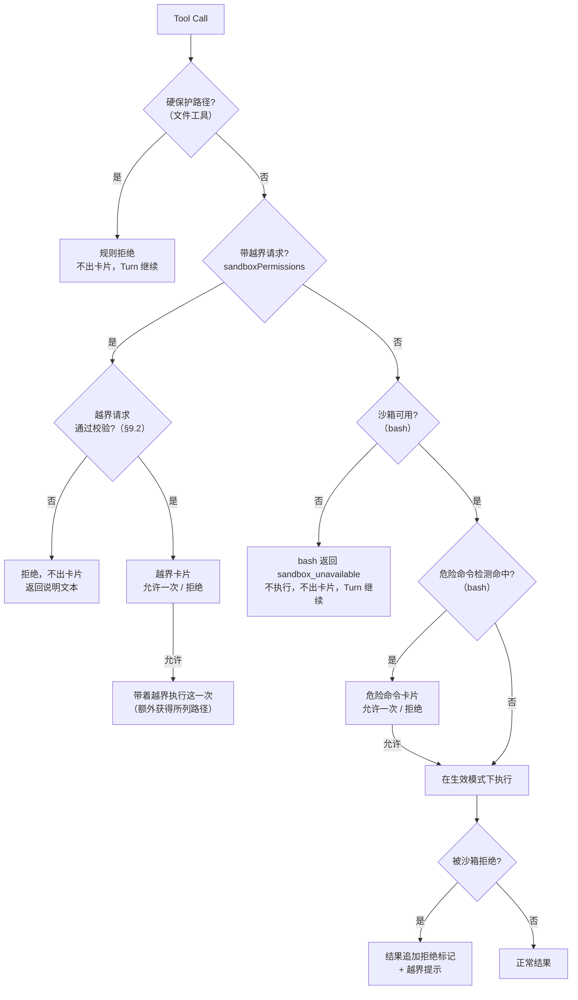

# 权限

本页描述一次 Tool Call 能读写什么、什么时候问用户。路径规则与 Seatbelt profile 由 [`openwork-sandbox`](../../crates/openwork-sandbox/README.md) 定义；审批与卡片归 `openwork-core`；工具执行归 `openwork-tools`。工具契约见 [tools.md](tools.md)，Tool Call 的生命周期见 [session-runtime.md](session-runtime.md)。

边界由内核强制，不由命令文本推断。理由见 [Agent Note：内核边界](../../.agents/notes/implemented/architecture/2026-07-11-kernel-boundary-instead-of-command-text.md)。

## 1. 判定流程

一次 Tool Call 的判定只看两件事：调用在什么模式下执行，以及它有没有命中危险命令检测。命令实际做了什么，由内核在执行时判断。



- 被沙箱拒绝是结果事实，不是权限判定。命令已经执行，内核拦下了其中某个文件操作。它与退出码相互独立（§7）。
- 危险命令卡片批准后不放宽沙箱。命令仍在当前模式的沙箱内执行。
- 只有模型的显式请求触发越界卡片。系统不替模型判断某条命令可能需要越界。
- `tree-sitter-bash` 只用于危险命令检测（§10），不参与放行判断。

## 2. 模式

| 模式 | 文件工具（`write` / `edit`）写工作区 | bash 写工作区 | 两者共同 |
|---|---|---|---|
| `auto`（默认） | 不问 | 不问 | 读：除凭据目录外处处可读。写：临时目录可写；受保护子路径与工作区外要越界 |
| `accept-edits` | 不问 | 要越界（内核拒绝后申请） | 同上 |

- 只有这两个模式。越界（§9）不是第三个模式。
- 模式从窄到宽：`accept-edits` < `auto`。
- 用户在界面上随时切换模式，切换在下一次调用生效。
- `accept-edits` 下，bash 能读、能运行不写工作区的命令、能写临时目录。bash 写工作区（包括 `cargo build` 写 `target/`、`rm`、`git clean`）时，内核拒绝它，之后它走越界卡片。
- 子 Agent 的模式见 §13.3。

工作区等于 `$HOME` 或是 `$HOME` 的祖先（例如 `/Users`）时，bash 在两个模式下都不能写工作区，写入要越界。文件工具不受影响。判断用规范化后的路径。理由见 [Agent Note：主目录工作区](../../.agents/notes/implemented/architecture/2026-09-24-home-workspace-bash-cannot-write.md)。

“临时目录”指 `/private/tmp` 与 `$TMPDIR` 的真实路径。两个模式下，它们对 bash 与文件工具都可写。

两个模式的理由见 [Agent Note：两个权限模式](../../.agents/notes/implemented/architecture/2026-09-24-two-permission-modes.md)。

## 3. 路径的四档

| 档 | 路径 | 两个模式下 | 越界后 |
|---|---|---|---|
| 硬保护 | `~/.openwork/**`<br>skill 根（`~/.agents/skills/**`）<br>`<工作区>/**/.git/hooks/**` | 可读，不可写 | 仍不可写。文件工具直接规则拒绝，不出卡片 |
| 敏感 | `<工作区>/**/.git/**`（hooks 以外）<br>`<工作区>/**/{.env*,.envrc}`<br>`<工作区>/**/{.vscode,.idea}/**`<br>`<工作区>/**/{.gitconfig,.gitmodules}`<br>`<工作区>/**/{.bashrc,.bash_profile,.zshrc,.zprofile,.profile}` | 可读，不可写 | 越界请求列出的路径可写 |
| 凭据禁读 | `~/.ssh` `~/.aws` `~/.gnupg` `~/.kube` `~/.azure`<br>`~/.config/gh` `~/.config/gcloud`<br>`~/.docker/config.json` `~/.netrc` `~/.git-credentials`<br>`~/.npmrc` `~/.pypirc` `~/.cargo/credentials.toml`<br>`~/Library/Keychains` `~/Library/Cookies` `~/Library/Safari`<br>`~/Library/Application Support/{Google/Chrome,Firefox}` | 不可读，不可写 | 越界请求列出的路径按授权可读；写授权也解开写 |
| 普通 | 其余 | 可读；临时目录可写；工作区可写（§2 的两种例外除外） | 越界请求列出的路径可写 |

- 越界请求列出整个 `.git` 时，`.git/hooks` 仍被扣除。
- 工作区内的档位名（`.git`、`hooks`、`.env*`、`.vscode` 等）按 ASCII 大小写不敏感匹配。文件工具围栏与 Seatbelt 正则都这样比较。理由见 [Agent Note：大小写不敏感](../../.agents/notes/implemented/architecture/2026-09-24-case-insensitive-protected-names.md)。
- `.git` 在沙箱内只读，所以 `git add`、`git commit`、`git checkout`、`git stash`、`git reset --hard` 都会被内核拒绝，之后走越界卡片。

各档的收录标准见 [Agent Note：路径四档与凭据禁读](../../.agents/notes/implemented/architecture/2026-08-01-path-tiers-and-credential-read-deny.md)。

## 4. 策略

```rust
pub struct SandboxPolicy {
    pub mode: SandboxMode,                  // AcceptEdits | Auto
    pub workspace_root: PathBuf,            // canonical
    pub path_grants: Vec<PathGrant>,        // 本次调用批准的路径越界；平时为空
    environment: Arc<SandboxEnvironment>,   // 主目录、临时目录、skill 根
}

pub struct PathGrant {
    pub path: PathBuf,                  // canonical 绝对路径
    pub access: Access,                 // Read | Write（Write 蕴含 Read）
    pub scope: GrantScope,              // Exact | Subtree
}
```

- `path_grants` 只存在于单次调用的策略里（[tools.md §5](tools.md)）。会话状态里没有它。
- `check(path, access, actor)` 判断一个路径是否可读写，`tier(path)` 返回路径所属的档。
- 同一个 `SandboxPolicy` 推导出 bash 的 Seatbelt profile（`Actor::Bash`，§5）与文件工具的路径围栏（`Actor::FileTool`，[tools.md §6.2](tools.md)）。
- 两者用同一组函数推导。`openwork-sandbox/tests/parity.rs` 固定这一点：同一组路径在两侧得到同样的可读与可写结论。唯一有意的差异是工作区对 bash 不可写、对文件工具可写，出现在 §2 的两种情况下。
- 文件工具的围栏在进程内，先规范化路径再判断包含关系。理由见 [Agent Note：进程内围栏](../../.agents/notes/implemented/architecture/2026-08-01-file-tool-fence-in-process.md)。
- 除凭据目录外处处可读，与 bash 在沙箱里的读取范围一致。

撤销与重新应用文件改动（[tools.md §8](tools.md)）是用户在界面上的操作。这类操作的策略取会话模式，再为每个涉及的文件加一条 `Write` + `Exact` 授权。硬保护路径仍不可写。理由见 [Agent Note：撤销授权](../../.agents/notes/implemented/architecture/2026-09-24-undo-reapply-grants.md)。

## 5. Seatbelt

bash 以 `sandbox-exec -p <profile> -D P0=... -- /bin/bash -c <command>` 执行。

profile 只约束文件效果。profile 文本里只有参数名 `Pn`，路径与正则全部经 `-D` 传入。参数按登记顺序编号：先是可写设备，再是可写根与扣除项、写授权、凭据。下面的编号只是示意：

```scheme
(version 1)
(allow default)
(deny file-write*)
(allow file-write* (literal (param "P0")) ... (regex (param "P3")) ...)   ; 设备
(allow file-write*                                                     ; 每个可写根一条
  (require-all (subpath (param "P7"))
               (require-not (subpath (param "P8")))                    ; ~/.openwork、skill 根
               (require-not (regex (param "P9")))                      ; <工作区>/**/.git/hooks
               (require-not (regex (param "P10"))) ...                 ; 敏感档
               (require-not (subpath (param "P13"))) ...))             ; 凭据档
(allow file-write* (require-all (subpath (param "P30")) ...))          ; 每个写授权一条
(deny file-read* (subpath (param "P13")))                              ; 每个凭据路径一条，读授权以 require-not 扣除
```

- 所有路径先 canonicalize。Seatbelt 按真实路径匹配。
- 嵌入正则的路径经过正则转义，每个字符都按字面量匹配。
- 受保护子路径用 `require-not` 从可写根中扣除。
- 写授权追加为可写根；读授权以 `require-not` 从凭据禁读中扣除。硬保护路径在任何授权下都被扣除。
- 授权只解开它自己点名的敏感或凭据路径。例如为 `cargo build` 批准整个工作区的写，不会同时打开 `.git` 与 `.env`。
- 可写的字符设备：`/dev/null`、`/dev/zero`、`/dev/tty`、`/dev/fd/<n>`、`/dev/ttys<n>`。理由见 [Agent Note：可写设备](../../.agents/notes/implemented/architecture/2026-09-24-writable-device-list.md)。
- bash 启动时，`GOCACHE` 指向最后一个临时根下的 `openwork/go-build`，覆盖用户环境中的同名变量。`SandboxEnvironment::detect` 把 `$TMPDIR` 排在最后；`$TMPDIR` 未设置时，这个目录是 `/private/tmp/openwork/go-build`。理由见 [Agent Note：Go 编译缓存](../../.agents/notes/implemented/architecture/2026-09-24-go-build-cache-redirect.md)。

沙箱不限制网络。界面、卡片、工具结果与模型可见的策略描述中，都不出现网络限制或隔离的表述。理由见 [Agent Note：不做网络管控](../../.agents/notes/implemented/architecture/2026-08-01-no-network-control-and-no-claim.md)。

## 6. 自检与沙箱不可用

进程启动时，`Seatbelt::probe` 在沙箱里写一个本应被拒绝的探针路径。只有得到 `EPERM`，才认定沙箱可用。结论在进程生命周期内缓存。

沙箱不可用时（自检失败、平台不支持、`sandbox-exec` 运行后报告自身失败，见 §7）：

| 对象 | 行为 |
|---|---|
| bash（交互式与非交互 Session 相同） | 不执行，返回 `sandbox_unavailable`，Turn 继续。不出卡片 |
| 文件工具 | 不受影响，它们的围栏在进程内 |
| 界面 | 常驻显示“沙箱不可用，bash 已停用”及自检失败的原因，直到下次启动自检通过 |
| 模型 | `runtime/sandbox-policy` section 写明 bash 当前不可用（§11） |
| 危险命令检测 | 不执行（§10） |

bash 返回：`[sandbox: unavailable, so bash cannot run commands in this session (<reason>). File tools still work; ask the user to run the command in their own terminal if it is needed.]`

`runtime/sandbox-policy` section 写：`bash: unavailable, because the macOS sandbox failed its self-check. Use read / grep / glob / edit for file work, and tell the user which command you need them to run.`

`sandbox-exec` 进程本身无法启动时（例如自检之后二进制被移走），结果是普通的执行错误，不是 `sandbox_unavailable`。

没有“这一次不用沙箱”的选项。理由见 [Agent Note：fail-closed](../../.agents/notes/implemented/architecture/2026-09-24-sandbox-fail-closed-without-escape-hatch.md)。

## 7. 拒绝识别

`openwork_sandbox::classify` 按退出码与输出区分三种结果：

- bash 以非零退出，且输出含 `Operation not permitted`（不区分大小写）：结果标记 `sandbox.denied = true`。stdout 与 stderr 合并为一路，特征出现在哪一路都算。
- 退出码是 `sandbox-exec` 自己的 64、65 或 71，且输出以 `sandbox-exec:` 或它的用法说明开头：结果是 `sandbox_unavailable`，命令没有执行。
- 其余：正常结果。

识别作用在截断后的输出上：bash 输出只保留开头 2 KB 与结尾 14 KB，特征落在省略的中间部分时，结果没有标记。

这个标记是推断。别的原因产生的 `EPERM` 也会得到它；命令吞掉错误并以 0 退出时，结果没有它。

## 8. 平台

| 平台 | 行为 |
|---|---|
| macOS | Seatbelt |
| Linux | 视为沙箱不可用，bash 停用（§6） |
| Windows | 不支持 |

Linux 后端是提议中的设计，见 [Agent Note：Linux 沙箱后端](../../.agents/notes/proposed/architecture/2026-09-24-linux-sandbox-backend.md)。

已知限制：沙箱不能嵌套。已在 Seatbelt 里的进程无法再调用 `sandbox-exec`，自己会套沙箱的工具在里面会失败。

## 9. 越界

### 9.1 流程

1. 命令在当前模式下执行，内核拒绝其中某个文件操作。
2. 结果末尾追加拒绝标记与越界提示（§11）。
3. 模型用同一条命令重试，带上 `sandboxPermissions` 与 `justification`。
4. 卡片展示命令、理由与越界路径。用户选择“允许一次”或“拒绝”。
5. 允许时，这一次调用带着越界执行。下一次调用回到会话的生效模式。

- 授权只作用于这一次调用，不留任何状态。
- 模型可以不等拒绝就直接请求越界。系统不把重试匹配到先前的拒绝。

```json
{
  "sandboxPermissions": {
    "paths": [
      { "path": "/Users/me/.cargo/registry", "access": "write", "scope": "subtree" }
    ]
  },
  "justification": "新增了 serde_yaml 依赖，需要把它下载到 Cargo 的本地缓存。"
}
```

| 字段 | 取值 | 含义 |
|---|---|---|
| `paths[].path` | 绝对路径 | 规范化后参与判断 |
| `paths[].access` | `read` \| `write` | `write` 蕴含 `read` |
| `paths[].scope` | `exact` \| `subtree` | 一个文件，或一个目录及其下全部 |

典型的越界：

| 场景 | 被拒的操作 | 越界 |
|---|---|---|
| 新增依赖后的 `cargo build` 首次拉包 | 写 `~/.cargo/registry` | 该目录，`write`，`subtree` |
| 新增依赖后的 `npm install` | 写 `~/.npm` | 该目录，`write`，`subtree` |
| `git add` / `commit` / `stash` / `checkout` / `reset` | 写 `.git` | `<工作区>/.git`，`write`，`subtree`（`hooks` 仍被扣除） |
| `git push`（ssh） | 读 `~/.ssh` | 该目录，`read`，`subtree` |
| `git push -u` / `git remote add` | 写 `.git` 与读 `~/.ssh` | 两条都列出 |
| 改 `.env` | 写 `.env` | 该文件，`write`，`exact` |
| `accept-edits` 下 `cargo build` | 写 `target/` 与 `Cargo.lock` | 工作区根，`write`，`subtree`。cargo 经工作区根下的临时目录创建 `target/`，只列 `target/` 不够 |
| `accept-edits` 下用 bash 改工作区文件 | 写工作区 | 那几个文件，`write`，`exact`；或工作区根，`write`，`subtree` |

依赖已缓存时，构建不需要越界。Go 模块缓存（`~/go/pkg/mod`）与 npm / pnpm 缓存不可写，首次下载依赖时需要越界。是否改变这一点，见 [Agent Note：按 Trace 数据决定缓存与会话授权](../../.agents/notes/proposed/architecture/2026-09-24-trace-driven-cache-and-session-grants.md)。

理由见 [Agent Note：只按路径、只批一次](../../.agents/notes/implemented/architecture/2026-09-24-path-only-single-use-escalation.md)。

### 9.2 校验

`SandboxPolicy::validate_grants` 与 Core 的校验拒绝以下请求，不出卡片，返回说明文本，Turn 继续：

- `justification` 为空；
- `paths` 为空或超过 16 条（`MAX_GRANTS`），或含相对路径。绝对路径先经规范化（`..` 被消去），再参与判断；
- 条目没有带来新的权限，即当前策略已经允许；
- 条目指向硬保护路径；
- `subtree` 落在 `/`、`$HOME` 或它们的祖先上。

bash、`write`、`edit` 三个工具都带这两个参数。文件工具的越界通常是目标文件的 `exact` 写授权。这两个参数只在沙箱可用时出现在工具 schema 里。

## 10. 危险命令检测

### 10.1 规则

在 `auto` 下，命中检测的 bash 命令先出危险命令卡片。批准后，命令在当前生效模式下执行。

- `accept-edits` 下不单独出卡片。内核会拒绝写工作区，之后命令走越界卡片。带越界请求的命令命中清单时，越界卡片同时写明“这条命令会删除文件”，不论模式与越界路径。
- 沙箱不可用时不检测。理由见 [Agent Note：沙箱不可用时不检测](../../.agents/notes/implemented/architecture/2026-09-24-sandbox-unavailable-skips-danger-detection.md)。

清单是封闭的（`openwork-tools/src/permission/danger.rs`）：

| 键 | 命中条件 |
|---|---|
| `rm_recursive_or_force` | `rm` 带 `-r` / `-R` / `-f` / `--recursive` / `--force`（含 `-rf` 等组合） |
| `find_delete` | `find` 带 `-delete`，或 `-exec` / `-execdir` 的命令是 `rm` |
| `git_clean_force` | `git clean` 带 `-f` / `--force` |
| `nesting_too_deep` | `bash -c` / `sh -c` 嵌套超过 8 层 |

不在清单上：`git reset --hard`、`git restore`、`git checkout -- .`、`git stash`（它们要写 `.git`，被内核拒绝）；单文件 `rm a.txt`；`mv` 覆盖；`> file` 截断。

清单的收录标准见 [Agent Note：封闭的危险命令清单](../../.agents/notes/implemented/architecture/2026-09-24-closed-danger-command-list.md)。

### 10.2 解析不了时

| 情况 | 行为 |
|---|---|
| 程序名与标志是字面量，操作数含 `$VAR` / glob | 照常检测：`rm -rf $DIR` 命中 |
| 程序名本身是动态的（`$CMD -rf x`） | 不检测，直接在沙箱里执行 |
| 语法错误、解析失败 | 不检测，直接在沙箱里执行 |
| 包装器：`sudo` `env` `xargs` `timeout` `nice` `nohup` `time` `command` | 剥掉包装器及其选项、变量赋值后，对内层命令递归检测 |
| `bash` / `sh` / `zsh` / `dash` / `ksh` 带 `-c '<字面量>'`（含 `-lc` 这类合写） | 把字面量当脚本再解析一次，递归检测 |
| `command -v` / `command -V` | 不执行命令，不检测 |
| 递归深度超过 8 层 | 视为命中，键为 `nesting_too_deep` |

### 10.3 拆成子命令

检测用 `tree-sitter-bash` 拆出脚本里的每一个 `command` 节点，逐个判断。检测下降进管道、`&&` / `||` / `;`、子 shell、`$(...)`、控制流与函数体。遇到不认识的节点，继续下降。

只有语法树上处在命令名位置的 `rm` 才算。`echo rm -rf x` 不命中。

## 11. 模型看到什么

bash 被内核拒绝时，结果末尾追加：

```
[sandbox: file access denied under auto mode]
[sandbox: to proceed, retry this exact command once with sandboxPermissions listing only the paths it needs, and a one-sentence justification; the user will be asked. If the paths cannot be listed, ask the user to run the command instead]
```

文件工具的路径被当前模式拒绝时（敏感、凭据、工作区外）：

```
[sandbox: <access> access to <path> denied under <mode> mode]
[sandbox: to proceed, retry this call once with sandboxPermissions listing <path> (<access>, exact), and a one-sentence justification; the user will be asked]
```

文件工具碰到硬保护路径时：

```
[sandbox: <path> is protected and cannot be written in any mode; do not retry]
```

当前策略作为 world state 的 `runtime/sandbox-policy` section 给出，不写进系统提示词。它描述当前模式、工作区根，以及 bash 当前是否可用。模式变化时，按 diff 机制追加新快照。理由见 [Agent Note：sandbox-policy section](../../.agents/notes/implemented/architecture/2026-09-24-sandbox-policy-world-state-section.md)。

工具描述说明：拒绝是策略，不是命令缺陷；不要换一种写法绕过；唯一认可的出路是带理由的越界重试。

## 12. 审批卡片

### 12.1 两种卡片

| 卡片 | 触发 | 显示 |
|---|---|---|
| 越界 | 模型带 `sandboxPermissions` 请求 | 命令原文、模型的理由；逐条列出申请的路径（读或写、单个文件或整个目录、所属档）；同一 Turn 此前有被拒结果时，显示含 `operation not permitted` 的那一行输出，没有时显示第一行 `[sandbox:` 标记 |
| 危险命令 | §10 命中 | 命令原文；命中的子命令与键；说明“批准后仍在当前模式的沙箱内执行” |

一张卡片可以同时是两种卡片，一次批准覆盖两者。命令原文始终完整显示，危险命令卡片高亮命中的那一段。

### 12.2 按钮

只有“允许一次”与“拒绝”。卡片不切换模式。文案写明作用范围：越界卡片写“这一次，额外允许写 `~/.cargo/registry`”，危险命令卡片写“这一次，仍在沙箱内”。

### 12.3 拒绝与串行

| 来源 | 行为 |
|---|---|
| 规则拒绝（硬保护、越界请求校验失败、非交互 Session） | 作为 tool result 回给模型，Turn 继续 |
| 用户拒绝（卡片上点“拒绝”） | Turn 停下 |
| 沙箱拒绝 | 结果事实（§1），Turn 继续 |

一次模型响应里有多个 Tool Call 时，审批串行进行。

理由见 [Agent Note：两个按钮与串行审批](../../.agents/notes/implemented/architecture/2026-08-01-two-button-cards-and-serial-approvals.md)。

## 13. 会话状态

### 13.1 模式

模式是会话的属性。新会话从 `auto` 开始。模式与会话一起落库，进程重启后恢复为该会话最后的模式。

### 13.2 越界不留痕

越界批准只作用于那一次调用。`SessionActor` 不持有授权列表。磁盘上没有权限规则文件。

### 13.3 非交互 Session

子 Agent（[multi-agent.md](multi-agent.md)）的环路里没有人。`SessionApproval::NonInteractive` 只改变“需要问”时的处理方式：

| 环节 | 非交互 Session |
|---|---|
| 生效模式 | 父会话生效模式与角色上限中较窄的那个，在派生时取快照。目前只有 explorer 一个角色，上限是 `accept-edits` |
| 沙箱内执行 | 与交互式相同 |
| 越界请求 | 直接拒绝，不出卡片 |
| 危险命令 | `auto` 下直接拒绝，不出卡片；`accept-edits` 下照常执行，由内核拒绝写工作区 |
| 沙箱不可用 | bash 不执行，与交互式相同 |

拒绝文本说明原因是子 Agent 无法请求授权，并告诉它在当前模式内能做什么，或让它把做不到的事报告给父 Agent。`set_permission_mode` 对子 Agent 返回 `SubAgentModeFixed`。

## 14. Trace

### 14.1 时间线类别

| 类别 | 判据 |
|---|---|
| 沙箱内自动执行 | `permissionDecisionSource = sandbox` |
| 被沙箱拒绝 | `sandboxDenied = true` |
| 用户批准的越界 | `escalationPaths` 非空，来源 `user` |
| 用户批准的危险命令 | `dangerMatch` 非空，来源 `user` |
| 沙箱不可用而未执行 | `permissionDecisionSource = sandbox_unavailable` |
| 规则拒绝 | 来源 `builtin` / `non_interactive` |
| 用户拒绝 | `deny` + `user` |
| Core 控制工具（`update_plan`、子 Agent 工具） | 来源 `control_tool` |

所有执行过的调用都在沙箱内。控制工具不访问主机文件与进程，不经沙箱，也不记 `sandboxMode`。类别的取舍见 [Agent Note：Trace 权限类别](../../.agents/notes/implemented/architecture/2026-09-24-trace-permission-categories.md)。

### 14.2 Tool Span 属性

| 属性 | 取值 | 含义 |
|---|---|---|
| `sandboxMode` | `accept_edits` \| `auto` | 这次调用执行时的模式。没有执行的调用不记 |
| `sessionMode` | `auto` \| `accept_edits` | 调用发生时会话的模式 |
| `sessionModeOrigin` | `session_default` \| `user_toggle` \| `inherited` | 模式的来源；`inherited` 表示子 Agent 从父会话取快照 |
| `escalationPaths` | `[{path, access, scope}]` 或空 | 模型请求的路径越界 |
| `escalationJustification` | 文本或空 | 模型给用户的理由 |
| `dangerMatch` | 清单键或空 | 命中了危险命令清单的哪一条 |
| `sandboxDenied` | bool | bash 被内核拒绝（§7），或文件工具被围栏拒绝 |
| `permissionDecision` | `allow` \| `deny` \| `cancelled` | 最终决定 |
| `permissionDecisionSource` | `sandbox` \| `user` \| `builtin` \| `non_interactive` \| `sandbox_unavailable` \| `control_tool` \| `system` | 决定来自哪里 |

权限不是独立 Span。Tool Span 包围完整生命周期。等待用户的累计耗时记在 Span 的 `permissionWaitMs` 列，不在属性里。字段缺失时，界面显示“来源未知”。

### 14.3 完整度

Trace 是有损的（[trace.md](trace.md) §10）。完整度用 `turns.tool_call_count` 算出（trace.md §8）。界面上 `partial` / `none` 与 `complete` 显著区别。

## 15. 验收

编号沿用原设计文档 §9.2，代码与测试注释按这些编号引用。测试路径相对 `crates/`，前端测试写出文件与用例名。

带 Postgres 的测试需要 `TEST_DATABASE_URL`；`matrix.rs` 中依赖 go 或凭据目录的用例，在缺少它们时跳过。

1. 新会话的模式是 `auto`，界面上常驻可见；用户只能在 `auto` 与 `accept-edits` 之间切换，代码中不存在第三个模式。
   - 测试：`openwork-core/tests/postgres_core_host_flow.rs::acc_01_35_42_session_modes_persist_and_sub_agents_keep_their_snapshot`；`openwork-core/tests/session_runtime.rs::acc_01_13_the_snapshot_carries_the_mode_and_sandbox_availability`；`desktop/src/features/chat/components/ChatInput.test.tsx › "shows the session permission mode selected by Core"`
   - 缺口：模式菜单只有两项（`PermissionModeSelect.tsx`）没有测试；“没有第三个模式”只由 `SandboxMode` 枚举与数据库 CHECK 保证。
2. `auto` 下，依赖已缓存的 `cargo build`、`cargo test`、`git status`、`git log`、`git diff`、`rg`、`ls` 全部不出卡片。
   - 测试：`openwork-sandbox/tests/matrix.rs::auto_builds_and_reads_but_git_writes_need_an_escalation`；`openwork-core/src/session/approval.rs::ordinary_calls_run_without_asking`
   - 缺口：`rg`、`ls` 没有逐条走审批；“不出卡片”只对 `cargo test` 断言。
3. 两个模式下，内核都拒绝 `git add` / `git commit` / `git stash` / `git reset --hard`，工作区不变；以 `<工作区>/.git` 的 `write` + `subtree` 越界重试后，命令成功，且 `.git/hooks` 仍不可写。
   - 测试：`openwork-sandbox/tests/matrix.rs::auto_builds_and_reads_but_git_writes_need_an_escalation`；`openwork-sandbox/tests/parity.rs::acc_10_file_tool_fence_and_seatbelt_agree_on_every_path`；`openwork-sandbox/src/policy.rs::protected_tiers_hold_in_every_mode`
   - 缺口：真实 git 命令只在 `auto` 下运行；`accept-edits` 只有路径级断言。
4. `accept-edits` 下，`write` / `edit` 改工作区文件不出卡片。bash 写工作区时，内核拒绝它，结果带越界提示；以对应路径越界后，命令成功。bash 读工作区、写临时目录不受影响。
   - 测试：`openwork-tools/tests/sandbox_calls.rs::acc_10c_bash_runs_under_the_policy_of_this_call`；`openwork-sandbox/tests/matrix.rs::accept_edits_denies_bash_workspace_writes_until_escalated`；`openwork-tools/src/notice.rs::bash_denial_names_the_mode_and_offers_escalation_only_when_available`；`openwork-sandbox/tests/matrix.rs::protected_locations_stay_closed_and_temp_stays_open`
5. 两个模式下，工作区外的写入（bash 与文件工具）都被拒绝；`/private/tmp` 与 `$TMPDIR` 在两个模式下对两者都可写。
   - 测试：`openwork-sandbox/src/policy.rs::modes_differ_only_in_whether_bash_may_write_the_workspace`；`openwork-sandbox/src/policy.rs::protected_tiers_hold_in_every_mode`；`openwork-sandbox/tests/matrix.rs::protected_locations_stay_closed_and_temp_stays_open`；`openwork-sandbox/tests/parity.rs::acc_10_file_tool_fence_and_seatbelt_agree_on_every_path`
6. 读工作区外的普通文件（`~/.cargo/registry/...`）不出卡片，bash 与 `read` 工具行为一致。
   - 测试：`openwork-sandbox/src/policy.rs::protected_tiers_hold_in_every_mode`；`openwork-sandbox/tests/parity.rs::acc_10_file_tool_fence_and_seatbelt_agree_on_every_path`
7. 两个模式下，读凭据目录都被拒绝，bash 与 `read` 工具行为一致。
   - 测试：`openwork-tools/tests/sandbox_calls.rs::acc_10b_credential_directories_are_unreadable_for_file_tools_and_bash`；`openwork-sandbox/tests/matrix.rs::protected_locations_stay_closed_and_temp_stays_open`；`openwork-sandbox/tests/parity.rs::acc_10_file_tool_fence_and_seatbelt_agree_on_every_path`
   - 缺口：`matrix.rs` 在凭据目录不存在时跳过该目录。
8. 两个模式下，写 `.env`、`.vscode/settings.json` 都被拒绝；以该路径越界重试后，写入成功。
   - 测试：`openwork-sandbox/src/tiers.rs::sensitive_directories_cover_their_subtree_at_any_depth`；`openwork-sandbox/src/tiers.rs::sensitive_files_match_the_final_component_only`；`openwork-sandbox/src/policy.rs::a_broad_grant_does_not_open_protected_paths_it_merely_contains`；`openwork-sandbox/tests/parity.rs::acc_10_file_tool_fence_and_seatbelt_agree_on_every_path`
   - 缺口：没有测试直接断言“两个模式下被拒、以该路径 `exact` 越界后成功”；`parity.rs` 只断言两侧一致。
9. 写 `.git/hooks/pre-commit`、`~/.openwork/...`、skill 根在任何模式与任何越界下都失败（含把它们或它们的上级目录列进 `paths`）；文件工具对它们返回规则拒绝、不出卡片。
   - 测试：`openwork-sandbox/src/policy.rs::protected_tiers_hold_in_every_mode`；`openwork-sandbox/src/policy.rs::grants_unlock_what_they_name_but_never_hard_protected_paths`；`openwork-sandbox/src/policy.rs::escalation_requests_are_validated`；`openwork-sandbox/tests/matrix.rs::protected_locations_stay_closed_and_temp_stays_open`；`openwork-tools/tests/sandbox_calls.rs::acc_10_an_escalation_widens_only_this_call_and_never_hard_protected_paths`；`openwork-core/tests/session_runtime.rs::acc_09_39_a_protected_write_target_is_refused_and_the_turn_continues`
10. 文件工具围栏与 Seatbelt profile 由同一组函数推导，对等测试覆盖四档路径的每一档。
   - 测试：`openwork-sandbox/tests/parity.rs::acc_10_file_tool_fence_and_seatbelt_agree_on_every_path`；`openwork-sandbox/tests/parity.rs::bash_and_file_tools_differ_only_on_the_workspace_under_accept_edits`；`openwork-sandbox/tests/parity.rs::case_variants_of_protected_names_are_not_writable`
11. 界面、卡片、工具结果、策略上下文中不出现任何网络限制或隔离的表述。
   - 测试：`openwork-tools/src/builtins/process/bash.rs::acc_11_bash_output_makes_no_network_or_isolation_claim`；`openwork-core/src/context/world_state/sandbox_policy.rs::auto_mode_tells_the_model_bash_can_write_the_workspace`
   - 缺口：界面与卡片没有自动检查。手动：在 `desktop/src` 检索“网络”“network”“隔离”。
12. 自检在沙箱里写探针路径，并确认拿到 `EPERM`；自检失败时，认定沙箱不可用。
   - 测试：`openwork-sandbox/tests/probe.rs::acc_12_the_real_sandbox_passes_its_self_check`；`openwork-sandbox/tests/probe.rs::a_sandbox_that_does_not_deny_fails_the_self_check`；`openwork-sandbox/tests/probe.rs::a_missing_sandbox_exec_is_unavailable_with_a_reason`；`openwork-sandbox/tests/probe.rs::concurrent_self_checks_do_not_share_a_directory`
13. 沙箱不可用时，bash 在交互式与非交互 Session 中都不执行，返回可操作的 `sandbox_unavailable`，不出卡片。代码中不存在任何不经 Seatbelt 启动 bash 的路径。文件工具不受影响；界面常驻提示；`runtime/sandbox-policy` section 写明 bash 不可用。
   - 测试：`openwork-tools/tests/sandbox_calls.rs::acc_10d_bash_does_not_run_when_the_sandbox_is_unavailable`；`openwork-tools/src/prepare.rs::an_unavailable_sandbox_reports_no_dangerous_command`；`openwork-core/tests/session_runtime.rs::acc_13_an_unavailable_sandbox_never_asks_about_a_dangerous_command`；`openwork-core/tests/session_runtime.rs::acc_13_38_the_sandbox_policy_reaches_the_model_as_world_state`；`openwork-core/src/context/world_state/sandbox_policy.rs::an_unavailable_sandbox_says_bash_is_unavailable`；`desktop/src/features/chat/components/SandboxUnavailableNotice.test.tsx › "shows that bash is disabled and the self-check reason"`
   - 缺口：非交互 Session 下的不可用、“文件工具不受影响”没有测试。“不经 Seatbelt 启动 bash 的路径不存在”靠检索确认：唯一的启动点在 `bash.rs`，经 `SandboxBackend::wrap`。
14. 沙箱不可用时，bash / `write` / `edit` 的 schema 里不出现 `sandboxPermissions` 与 `justification`。
   - 测试：`openwork-tools/src/builtins/mod.rs::escalation_parameters_disappear_when_the_sandbox_is_unavailable`
15. `sandbox-exec` 报告自身失败时归为“沙箱不可用”，不归为 `sandboxDenied`。
   - 测试：`openwork-sandbox/tests/probe.rs::acc_15_denials_and_sandbox_failures_are_told_apart`；`openwork-sandbox/src/denial.rs::sandbox_exec_failures_are_not_denials`；`openwork-tools/tests/sandbox_calls.rs::acc_10e_a_runner_failure_is_unavailable_not_denied`
16. Linux 上的行为与第 12 条相同：沙箱不可用，bash 停用。
   - 状态：无测试：真机测试都只在 macOS 上编译。
17. 被沙箱拒绝的结果末尾带拒绝标记与越界提示，退出码照常报告。
   - 测试：`openwork-tools/tests/sandbox_calls.rs::acc_10e_kernel_denials_are_marked_with_the_escalation_hint`；`openwork-sandbox/src/denial.rs::a_denial_needs_a_failure_and_the_seatbelt_message`
   - 缺口：被拒时没有断言退出码仍在结果里。
18. 带 `sandboxPermissions` + `justification` 的重试出越界卡片。卡片显示命令、理由，并逐条列出申请的路径（读写、范围、所属档）。
   - 测试：`openwork-core/tests/session_runtime.rs::acc_18_19_an_escalation_asks_with_its_paths_and_applies_to_that_call_only`；`openwork-core/src/session/approval.rs::a_valid_escalation_asks_with_every_path_and_its_tier`；`desktop/src/features/chat/components/ApprovalDialog.test.tsx › "lists every escalation path with its access, scope and tier, and the model reason"`
19. 批准后，只有这一次带着越界执行；紧接着的同一条命令再次需要越界，再次出卡片。
   - 测试：`openwork-core/tests/session_runtime.rs::acc_18_19_an_escalation_asks_with_its_paths_and_applies_to_that_call_only`；`openwork-tools/tests/sandbox_calls.rs::acc_10_an_escalation_widens_only_this_call_and_never_hard_protected_paths`
20. 新增依赖后的 `cargo build` 以 `~/.cargo/registry` 的 `write` + `subtree` 越界成功；同一次执行中，内核仍拒绝写 `$HOME` 下的其他位置。
   - 测试：`openwork-sandbox/src/policy.rs::grants_unlock_what_they_name_but_never_hard_protected_paths`；`openwork-sandbox/tests/parity.rs::acc_10_file_tool_fence_and_seatbelt_agree_on_every_path`
   - 缺口：只有策略层断言，没有真机拉包。
21. `git push` 以 `~/.ssh` 的 `read` + `subtree` 越界可以执行；`.git/hooks` 在任何越界下仍不可写。
   - 测试：`openwork-sandbox/src/policy.rs::grants_unlock_what_they_name_but_never_hard_protected_paths`；`openwork-sandbox/tests/parity.rs::acc_10_file_tool_fence_and_seatbelt_agree_on_every_path`
   - 缺口：没有真机 `git push`，只有策略层与路径级断言。
22. 以下请求直接拒绝、不出卡片、Turn 继续：`justification` 为空；`paths` 为空、超过 16 条或含相对路径；条目已被当前策略覆盖；条目指向硬保护路径；`subtree` 落在 `/`、`$HOME` 或其祖先上。
   - 测试：`openwork-core/tests/session_runtime.rs::acc_22_an_escalation_that_fails_validation_is_refused_without_a_card`；`openwork-sandbox/src/policy.rs::escalation_requests_are_validated`；`openwork-core/src/session/approval.rs::escalations_are_validated_before_any_card`
   - 缺口：超过 16 条、硬保护、过宽三种只在策略层单元测试中断言。
23. 工具 schema 中不存在任何“完全放开”的取值：`sandboxPermissions` 只有 `paths`。
   - 状态：无测试。`SandboxPermissionsInput` 只有 `paths` 且 `deny_unknown_fields`（`openwork-tools/src/escalation.rs`），但没有测试断言 schema。
24. 用户拒绝越界后，Turn 停止。
   - 测试：`openwork-core/tests/session_runtime.rs::acc_24_a_user_denial_stops_the_turn_without_running_the_tool`
   - 缺口：测试拒绝的是危险命令卡片；越界卡片走同一条审批路径。
25. 进程重启后，不存在任何残留的越界授权。
   - 测试：`openwork-core/tests/session_runtime.rs::acc_18_19_an_escalation_asks_with_its_paths_and_applies_to_that_call_only`
   - 缺口：只验证会话内不延续，重启没有测试。结构上 `SessionPermissionState` 只有模式与来源，存储层没有授权表。
26. `rm -rf src`、`rm -f a.log`、`find . -name '*.o' -delete`、`find . -exec rm {} +`、`git clean -fdx` 在执行前出危险命令卡片，卡片标出命中的子命令与键。
   - 测试：`openwork-tools/src/permission/danger.rs::acc_26_27_28_29_the_listed_commands_hit_or_miss_as_specified`；`openwork-core/tests/session_runtime.rs::acc_26_32_34_a_dangerous_command_asks_only_in_auto_and_is_traced`；`desktop/src/features/chat/components/ApprovalDialog.test.tsx › "highlights the matched span of a dangerous command and puts deny first"`
27. `cargo build && rm -rf target`、`for d in a b; do rm -rf "$d"; done`、`xargs rm -rf < list`、`sudo rm -rf x`、`env FOO=1 rm -rf x`、`bash -c 'rm -rf src'` 均命中。
   - 测试：`openwork-tools/src/permission/danger.rs::acc_26_27_28_29_the_listed_commands_hit_or_miss_as_specified`；`openwork-tools/src/permission/danger.rs::wrappers_are_stripped`；`openwork-tools/src/permission/danger.rs::every_subcommand_is_checked`；`openwork-tools/src/permission/danger.rs::inline_scripts_are_checked_and_highlight_the_outer_command`
28. `rm -rf $DIR` 命中；`$CMD -rf x` 不命中，直接在沙箱内执行。
   - 测试：`openwork-tools/src/permission/danger.rs::acc_26_27_28_29_the_listed_commands_hit_or_miss_as_specified`；`openwork-tools/src/permission/danger.rs::rm_needs_a_recursive_or_force_flag`；`openwork-tools/src/permission/danger.rs::only_commands_in_name_position_count`
29. `rm a.txt`、`echo rm -rf x` 不命中。`git reset --hard`、`git restore`、`git checkout -- .` 不命中危险命令检测；它们要写 `.git`，内核拒绝后，它们走越界卡片。
   - 测试：`openwork-tools/src/permission/danger.rs::acc_26_27_28_29_the_listed_commands_hit_or_miss_as_specified`；`openwork-sandbox/tests/matrix.rs::auto_builds_and_reads_but_git_writes_need_an_escalation`
   - 缺口：`git restore`、`git checkout -- .` 被内核拒绝没有真机测试。
30. 语法错误的命令不命中，直接在沙箱内执行。
   - 测试：`openwork-tools/src/permission/danger.rs::syntax_errors_are_not_checked`；`openwork-core/src/session/approval.rs::ordinary_calls_run_without_asking`
31. 危险命令卡片批准后，命令仍在当前模式的沙箱内执行。
   - 测试：`openwork-core/src/session/approval.rs::dangerous_commands_ask_only_in_auto`；`openwork-sandbox/tests/matrix.rs::protected_locations_stay_closed_and_temp_stays_open`
   - 缺口：组合断言，没有端到端的 `rm -rf ~/x`。
32. `accept-edits` 下，`rm -rf src` 不单独出危险命令卡片，而是被内核拒绝；带越界重试时，越界卡片同时标注危险命令。
   - 测试：`openwork-core/tests/session_runtime.rs::acc_26_32_34_a_dangerous_command_asks_only_in_auto_and_is_traced`；`openwork-core/src/session/approval.rs::acc_32_an_escalation_card_also_marks_a_dangerous_command`；`openwork-core/src/session/approval.rs::dangerous_commands_ask_only_in_auto`；`desktop/src/features/chat/components/ApprovalDialog.test.tsx › "shows both reasons on one card when an escalation is also a dangerous command"`
33. 非交互 Session 中，`auto` 下命中直接拒绝，拒绝文本说明原因与出路；`accept-edits` 下照常执行，由内核拒绝写工作区。
   - 测试：`openwork-core/src/session/approval.rs::unattended_sessions_deny_what_would_need_a_card`；`openwork-core/tests/session_runtime.rs::acc_36_37_an_unattended_explorer_refuses_escalations_without_a_card`
34. Trace 以 `dangerMatch` 记录命中的键。
   - 测试：`openwork-core/tests/session_runtime.rs::acc_26_32_34_a_dangerous_command_asks_only_in_auto_and_is_traced`
35. 子 Agent 的生效模式是父会话生效模式与角色上限中较窄者，派生时取快照；父会话之后切换模式，不影响已派生的子 Agent。
   - 测试：`openwork-core/tests/postgres_core_host_flow.rs::acc_01_35_42_session_modes_persist_and_sub_agents_keep_their_snapshot`；`openwork-core/src/session_tools.rs::a_sub_agent_never_gets_a_wider_mode_than_its_parent_or_role`
36. 父会话为 `auto` 时，explorer 仍是 `accept-edits`：内核拒绝 bash 写工作区，写临时目录可以。
   - 测试：`openwork-core/src/session_tools.rs::a_sub_agent_never_gets_a_wider_mode_than_its_parent_or_role`；`openwork-sandbox/tests/matrix.rs::accept_edits_denies_bash_workspace_writes_until_escalated`；`openwork-sandbox/tests/matrix.rs::protected_locations_stay_closed_and_temp_stays_open`；`openwork-core/tests/session_runtime.rs::acc_36_37_an_unattended_explorer_refuses_escalations_without_a_card`
37. 子 Agent 的越界请求直接拒绝，拒绝文本可操作。
   - 测试：`openwork-core/tests/session_runtime.rs::acc_36_37_an_unattended_explorer_refuses_escalations_without_a_card`
38. 系统提示词中不出现沙箱模式。当前模式通过 `runtime/sandbox-policy` section 给出；模式切换后，追加新快照，不改写系统前缀。
   - 测试：`openwork-core/tests/session_runtime.rs::acc_13_38_the_sandbox_policy_reaches_the_model_as_world_state`；`openwork-core/tests/session_runtime.rs::acc_38_44_a_mode_switch_applies_to_the_next_call_and_is_traced`；`openwork-core/src/context/world_state/sandbox_policy.rs::a_mode_change_is_announced_and_an_unchanged_policy_is_silent`；`openwork-core/src/context/world_state/sandbox_policy.rs::auto_mode_tells_the_model_bash_can_write_the_workspace`
39. 硬保护路径的拒绝文本明确说明“任何模式下都不可写，不要重试”。
   - 测试：`openwork-core/tests/session_runtime.rs::acc_09_39_a_protected_write_target_is_refused_and_the_turn_continues`
40. 卡片上只有“允许一次”与“拒绝”；不存在任何会话级或持久的授权按钮，卡片不切换模式。
   - 测试：`desktop/src/features/chat/components/ApprovalDialog.test.tsx › "offers only allow once and deny, with allow once first for an escalation"`
41. 一次响应含多个 Tool Call 时，审批串行呈现。
   - 测试：`openwork-core/tests/session_runtime.rs::acc_41_multiple_permission_requests_are_presented_serially`
42. 模式随会话持久化，进程重启后恢复为该会话最后的模式。
   - 测试：`openwork-core/tests/postgres_core_host_flow.rs::acc_01_35_42_session_modes_persist_and_sub_agents_keep_their_snapshot`；`openwork-core/tests/postgres_sandbox_mode_migration.rs::existing_sub_agents_get_their_role_ceiling_and_roots_get_auto`
43. 磁盘上不存在任何权限规则文件，也没有读取它的代码路径。
   - 状态：手动：在 `crates` 与 `desktop/src` 检索规则文件的读写代码，应当没有结果。
44. 每次调用都能从 Trace 还原 `sandboxMode`、`sessionMode` 与其来源、`escalationPaths`、`dangerMatch`、`sandboxDenied`、决定与来源。
   - 测试：`openwork-core/tests/session_runtime.rs::acc_38_44_a_mode_switch_applies_to_the_next_call_and_is_traced`；`openwork-core/tests/session_runtime.rs::acc_18_19_an_escalation_asks_with_its_paths_and_applies_to_that_call_only`；`openwork-core/tests/session_runtime.rs::acc_26_32_34_a_dangerous_command_asks_only_in_auto_and_is_traced`；`openwork-core/tests/session_runtime.rs::runtime_records_versioned_model_and_tool_trace_attributes`
   - 缺口：没有测试断言 Trace 中的 `sandboxDenied`；Postgres 往返没有带这些属性。
45. `sandboxMode` 只有 `accept_edits`、`auto` 两个取值。
   - 测试：`openwork-core/tests/session_runtime.rs::acc_38_44_a_mode_switch_applies_to_the_next_call_and_is_traced`
   - 缺口：取值集合只由 `SandboxMode::as_str` 与数据库 CHECK 保证。
46. 完整度为 `partial` / `none` 时，界面显著区别于 `complete`。
   - 测试：`desktop/src/features/traces/components/TurnTraceDrawer.test.tsx › "keeps an incomplete trace visibly marked as an alert in the overview"`；`desktop/src/features/traces/components/TurnTraceDrawer.test.tsx › "uses the danger tier when trace capture is entirely absent"`
47. 代码中不存在任何依据命令文本自动放行的路径。
   - 状态：手动：`openwork-tools/src/permission/` 只有 `danger.rs`；检索不到只读判定表、资格检查、会话规则等旧代码。
48. 只有危险命令检测使用 `tree-sitter-bash`。
   - 状态：手动：只有 `openwork-tools` 依赖 `tree-sitter-bash`，唯一使用点在 `src/permission/danger.rs`。
49. 工作区为 `$HOME` 或其祖先时，`auto` 下内核拒绝 bash 写工作区（含 `~/Library/LaunchAgents`），文件工具仍可写；工作区为普通项目目录时，行为不变。
   - 测试：`openwork-sandbox/src/policy.rs::a_workspace_containing_home_is_read_only_for_bash_in_every_mode`；`openwork-sandbox/tests/matrix.rs::a_home_workspace_is_read_only_for_bash`；`openwork-core/src/context/world_state/sandbox_policy.rs::a_home_workspace_is_described_as_not_writable_by_bash_even_in_auto`
50. bash 的环境中，`GOCACHE` 指向临时目录下 OpenWork 私有的缓存目录；`auto` 下，`go build` / `go test` 不需要越界即可成功。
   - 测试：`openwork-sandbox/src/policy.rs::bash_environment_points_the_go_cache_at_a_private_temp_directory`；`openwork-tools/tests/sandbox_calls.rs::bash_sees_the_private_go_cache`；`openwork-sandbox/tests/matrix.rs::go_builds_and_tests_with_the_private_cache`
   - 缺口：`matrix.rs` 在没有安装 go 时跳过。
